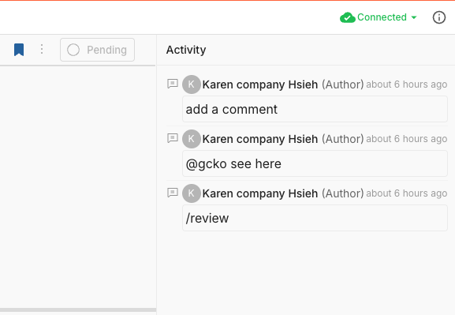
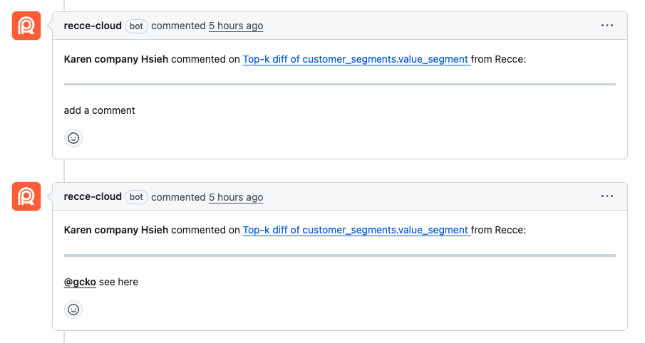
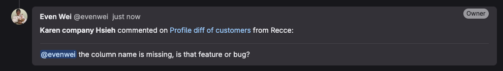

# Activity

Each check in your checklist has its own Activity panel. It records everything that happens to that specific check—approvals, comments, and updates—giving reviewers context on how the validation evolved.

## What Gets Recorded

Activity captures all events for a check:

- **Created**: When the check is added to the checklist
- **Approvals**: When the check is approved or unapproved
- **Comments**: Questions, discussions, and clarifications about the check
- **Description updates**: Changes to the check's description

{: .shadow}

## When to Use

- **Requesting context**: Ask the developer about unexpected results or ask reviewers about the acceptable thresholds
- **Documenting decisions**: Record the process of making a decision
- **Tracking history**: See who approved, what questions were asked, and how descriptions changed
- **Handoff scenarios**: Give the next reviewer context on past decisions

## Sync Comments to GitHub/GitLab

When your Git provider is connected to Recce, comments you post in Activity automatically sync to the PR or MR. Each comment appears as a new comment on GitHub or GitLab, with a link back to the specific check in Recce.

{: .shadow}

The comment appears on the PR/MR:

{: .shadow}

You can @mention teammates using their GitHub or GitLab username (e.g., `@john-doe`). They'll receive a notification through GitHub or GitLab. Use the exact username—Recce doesn't currently map display names to usernames.

This works the same way on GitLab:

{: .shadow}

## Related

- [Checklist](checklist.md) - Save and track validation checks
- [Share](share.md) - Share your session with reviewers
