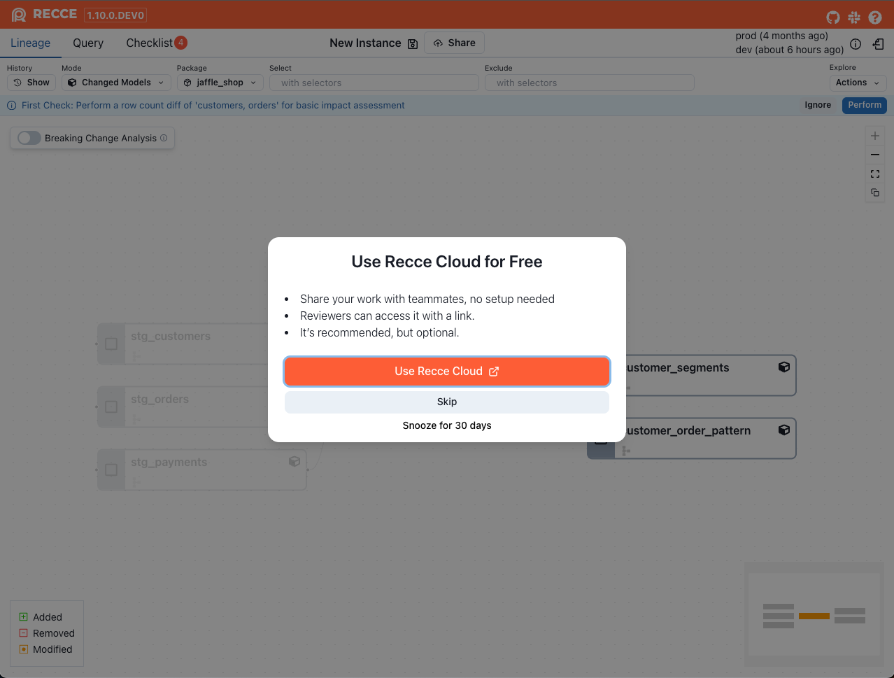
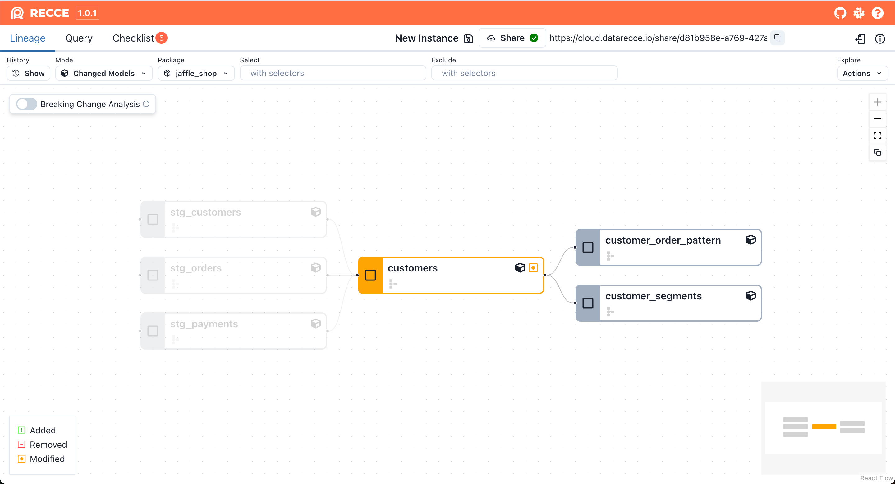
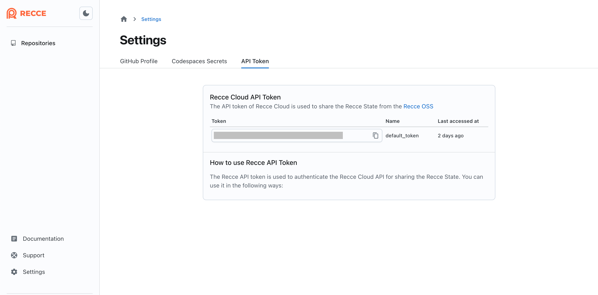

# Share

Share your validation results with team members and stakeholders.

**Goal:** Give reviewers access to your Recce session so they can explore validation results.

## Recce Cloud

Share your session by copying the URL directly from your browser. Team members with organization access can view any session immediately.

To invite team members to your organization, see [Admin Setup](../using-recce/admin-setup.md#5-invite-team-members).

### Command Line Sharing

For automated workflows or CI pipelines, use `recce share` to upload a state file directly:

```bash
recce share <your_state_file>

# With API token
recce share --api-token <your_api_token> <your_state_file>
```

{: .shadow}

## Recce OSS

For local Recce sessions, use these sharing methods:

| Method | Best For | Requires |
|--------|----------|----------|
| **Copy to Clipboard** | Quick screenshots in PR comments | Nothing |
| **Upload to Recce Cloud** | Full interactive session access | Recce Cloud account |

### Copy to Clipboard

For quick sharing of specific results, use **Copy to Clipboard** in any diff result. Paste the screenshot directly into PR comments, Slack, or other channels.

<figure markdown>
  {: .shadow}
  <figcaption>Copy diff result and paste to GitHub</figcaption>
</figure>

!!! note "Browser Compatibility"
    Firefox does not support copying images to the clipboard. Recce displays a modal where you can download or right-click to copy the image.

### Upload to Recce Cloud

When reviewers need full context, upload your session to Recce Cloud. This creates a shareable link with complete access to your validation results.

**Benefits:**

- No setup required for viewers
- Full lineage exploration, query results, and checklists
- Read-only access (secure viewing)
- Simple link sharing via any channel

!!! warning "Access Control"
    Anyone with the link can view your session after signing into Recce Cloud. For restricted access, [contact our team](https://cal.com/team/recce/chat).

#### Setting Up Cloud Connection

The first time you share via Cloud, you'll need to connect your local Recce to your cloud account. This one-time setup enables sharing.

**Step 1: Enable Cloud Connection**

Launch the Recce server and click the **Use Recce Cloud** button if your local installation isn't already connected to Cloud.

{: .shadow}

**Step 2: Sign In and Grant Access**

After successful login, authorize your local Recce to connect with Cloud. This authorization enables the sharing functionality and secure state file hosting.

{: .shadow}

**Step 3: Complete the Setup**

Refresh the Recce page to activate the cloud connection. Once connected, the **Share** button will be available, allowing you to generate shareable links.

{: .shadow}

!!! tip "Alternative Setup Method"
    You can also connect to Cloud using the command line:
    
    ```bash
    recce connect-to-cloud
    ```
    
    This command handles the sign-in and authorization process directly from your terminal.

#### Manual Configuration (Advanced)

For containerized environments or manual setup, configure the connection using your API token.

**Step 1: Retrieve Your API Token**

Sign in to Cloud and copy your API token from the [personal settings page](https://cloud.reccehq.com/settings#tokens).

{: .shadow}

**Step 2: Configure Local Connection**

Choose one of the following methods:

**Option A: Command Line Flag**

Launch Recce server with your API token. The token will be saved to your profile for future use:

```bash
recce server --api-token <your_api_token>
```

**Option B: Profile Configuration**

Edit your `~/.recce/profile.yml` file to include the API token:

```yaml
api_token: <your_api_token>
```

!!! info "Configuration File Location"
    **Mac/Linux:**
    ```shell
    cd ~/.recce
    ```
    
    **Windows:**
    ```powershell
    cd ~\.recce
    ```
    
    Navigate to `C:\Users\<your_username>\.recce` or use the PowerShell command above.


## Verification

Confirm sharing works:

1. Add a check to your checklist
2. Share via your preferred method (URL for Cloud, Share button for OSS)
3. Open the link in an incognito window
4. Verify you can view the session

## Related

- [Admin Setup](../using-recce/admin-setup.md) - Invite team members to your organization
- [Checklist](checklist.md) - Save validation checks to share
- [Preset Checks](preset-checks.md) - Automate recurring checks
