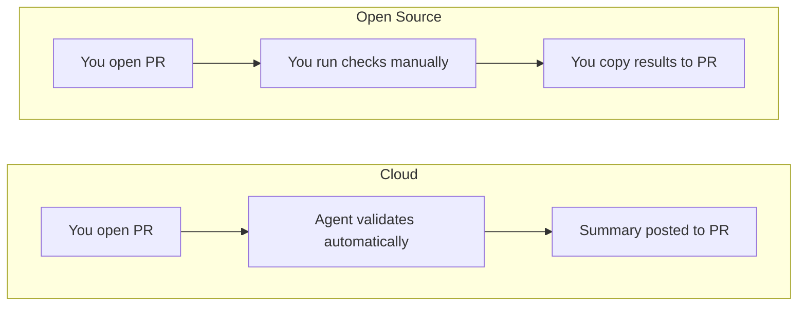

# Cloud vs Open Source

Validating data changes manually takes time and slows PR review. Recce is a data validation agent. Open Source gives you the core validation engine to run yourself, Cloud gives you the full Agent experience with automated validation on every PR.

## The Core Difference

| | Cloud | Open Source |
|--|-------|-------------|
| **Experience** | Recce Agent works alongside you | You run validation manually |
| **PR validation** | Agent validates automatically, posts summary | You run checks, copy results to PR |
| **During development** | CLI + Agent assistance | CLI tools only |
| **Learning curve** | Agent guides you through validation | Learn the tools, run them yourself |

## Cloud

Recce Cloud connects to your Git repository and data warehouse so the Recce Agent can validate your data changes automatically. When you open a PR, the Agent analyzes your changes, runs validation checks, and posts findings directly to your PR — no manual work required.

**On pull requests:**

The Agent runs automatically when you open a PR. It:

- Analyzes your data model changes
- Runs relevant validation checks
- Posts a summary to your PR with findings
- Updates as you push new commits

**During development:**

The Agent works with your CLI through MCP (Model Context Protocol, a standard for AI assistants to interact with tools):

- Answers questions about your changes
- Suggests validation approaches
- Helps interpret diff results

**For your team:**

- Define what "correct" means for your repo with preset checks that apply across all PRs
- Share validation standards as institutional knowledge — everyone validates the same way
- Developers and reviewers collaborate on validation, going back and forth until the change is verified

**Pricing:**

Recce Cloud is free to start. See [Pricing](https://www.reccehq.com/pricing) for plan details.

**Choose Cloud when:**
- You want automated validation on every PR
- You want Agent assistance during development
- Your team reviews data changes in PRs

## Open Source

Recce OSS is the core validation engine you run locally. You control when and how validation happens — run checks, explore results, and decide what to share. Everything stays on your machine unless you export it.

You get:

- Lineage Diff between branches
- Data comparison (row count, schema, profile, value, top-k, histogram diff)
- Query diff for custom validations
- Checklist to track your checks

**Choose OSS when:**
- Exploring Recce before adopting Cloud
- Working in environments without external connectivity
- Contributing to Recce development

## Feature Comparison

| Feature | Cloud | OSS |
|---------|-------|-----|
| Lineage Diff | :white_check_mark: | :white_check_mark: |
| Data diff (row count, schema, profile, value, top-k, histogram diff) | :white_check_mark: | :white_check_mark: |
| Query diff | :white_check_mark: | :white_check_mark: |
| Checklist | :white_check_mark: | :white_check_mark: |
| Recce Agent on PRs | :white_check_mark: | :x: |
| Agent CLI assistance | :white_check_mark: | Manual |
| Preset checks across PRs | :white_check_mark: | Manual |
| Shared validation standards | :white_check_mark: | Manual |
| Developer-reviewer collaboration | :white_check_mark: | Manual |
| PR comments & summaries | :white_check_mark: | :x: |
| LLM-powered insights | :white_check_mark: | :x: |

## FAQ

**Can I start with OSS and upgrade to Cloud later?**

Yes. OSS and Cloud use the same validation engine. Your existing checklists and workflows carry over when you connect to Cloud.

**Does Cloud require a different setup than OSS?**

Cloud connects to your Git repository and data warehouse directly. You don't need to generate artifacts locally — the Agent handles that automatically.

**What data does Recce Cloud access?**

Recce Cloud accesses your dbt artifacts (manifest.json, catalog.json) and runs queries against your data warehouse to perform validation. Your data stays in your warehouse.

## Getting Started

- **Cloud:** [Start Free with Cloud](../2-getting-started/start-free-with-cloud.md)
- **OSS:** [OSS Setup](../2-getting-started/oss-setup.md)

## Related

- [What the Agent Does](../5-what-the-agent-does/index.md) — How the Recce Agent validates your changes
- [Data Developer Workflow](../3-using-recce/data-developer.md) — Using Recce throughout development
