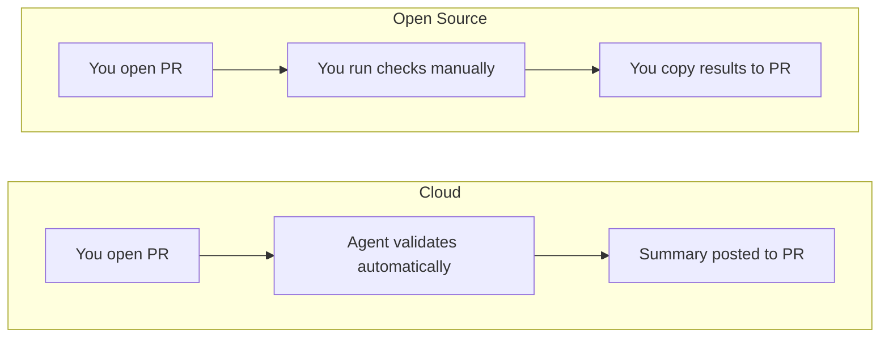

# Cloud vs Open Source

Validating data changes manually takes time and slows PR review. Recce is a data validation agent. Open Source gives you the core validation engine to run yourself, Cloud gives you the full Agent experience with automated validation on every PR.

## The Core Difference

| | Cloud | Open Source |
|--|-------|-------------|
| **Experience** | The agent works alongside you | You run validation manually |
| **PR validation** | Agent validates automatically, posts summary | You run checks, copy results to PR |
| **During development** | CLI + Agent assistance | CLI tools only |
| **Learning curve** | Agent guides you through validation | Learn the tools, run them yourself |

## Cloud

Recce Cloud connects to your Git repository and data warehouse so the Recce Agent can validate your data changes automatically. When you open a PR, the agent analyzes your changes, runs validation checks, and posts findings directly to your PR. No manual work required.

**On pull requests:**

The Agent runs automatically when you open a PR. It:

- Analyzes your data model changes
- Runs relevant validation checks
- Posts a summary to your PR with findings
- Updates as you push new commits

**During development:**

The agent works with your CLI using [Recce MCP](../5-data-diffing/mcp-server.md). MCP (Model Context Protocol) is an open standard that lets AI tools call Recce directly. With it, the agent can:

- Answers questions about your changes
- Suggests validation approaches
- Helps interpret diff results

**For your team:**

- Define what "correct" means for your repo with preset checks that apply across all PRs
- Share validation standards as institutional knowledge so everyone validates the same way
- Developers and reviewers collaborate on validation, going back and forth until the change is verified

**Pricing:**

Cloud is free to start. See [Pricing](https://www.reccehq.com/pricing) for plan details.

**Choose Cloud when:**

- You want automated validation on every PR
- You want Agent assistance during development
- Your team reviews data changes in PRs

## Open Source

The open source version is the core validation engine you run locally. You control when and how validation happens. Run checks, explore results, and decide what to share. Everything stays on your machine unless you export it.

You get:

- Lineage Diff between branches
- Data comparison (row count, schema, profile, value, top-k, histogram diff)
- Query diff for custom validations
- Checklist to track your checks
- [Recce MCP](../5-data-diffing/mcp-server.md) for AI-assisted validation with Claude, Cursor, and other AI clients

**Choose OSS when:**

- Exploring Recce before adopting Cloud
- Working in environments without external connectivity
- Contributing to Recce development

## Feature Comparison

| Feature | Cloud | OSS |
|---------|-------|-----|
| Lineage Diff | Yes | Yes |
| Data diff  (row count, schema, profile, value, top-k, histogram diff) | Yes | Yes |
| Query diff | Yes | Yes |
| Checklist | Yes | Yes |
| Agent on PRs | Yes | No |
| Agent CLI assistance (MCP) | Yes | Yes |
| Preset checks across PRs | Yes | Manual |
| Shared validation standards | Yes | Manual |
| Developer-reviewer collaboration | Yes | Manual |
| PR comments & summaries | Yes | No |
| LLM-powered insights | Yes | No |

## FAQ

**Can I start with OSS and upgrade to Cloud later?**

Yes. OSS and Cloud use the same validation engine. Your existing checklists and workflows carry over when you connect to Cloud.

**Does Cloud require a different setup than OSS?**

Cloud connects to your Git repository and data warehouse directly. You don't need to generate artifacts locally. The agent handles that automatically.

**What data does Cloud access?**

Cloud accesses your dbt artifacts (manifest.json, catalog.json) and runs queries against your data warehouse to perform validation. Your data stays in your warehouse.

## Getting Started

- **Cloud:** [Start Free with Cloud](../2-getting-started/start-free-with-cloud.md)
- **OSS:** [OSS Setup](../2-getting-started/oss-setup.md)

## Next Steps

- [What the Agent Does](../4-what-the-agent-does/index.md): How the agent validates your changes
- [Data Developer Workflow](../3-using-recce/data-developer.md): Using Recce throughout development
