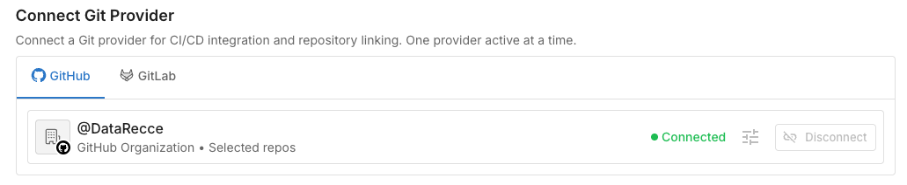

# Connect Your Repository

**Goal:** Connect your GitHub or GitLab repository to Recce Cloud for automated PR data review.

Cloud supports GitHub and GitLab. Using a different provider? Contact us at support@reccehq.com.

## Prerequisites

- [ ] Cloud account (free trial at cloud.reccehq.com)
- [ ] Repository admin access (required to authorize app installation)
- [ ] dbt project in the repository

## How It Works

When you connect a Git provider, Cloud maps your setup:

| Git Provider | Cloud |
|--------------|-------------|
| Organization | Organization |
| Repository | Project |

Every Cloud account starts with one organization and one project. When you connect your Git provider, you select which organization and repository to link.

**Monorepo support:** If you have multiple dbt projects in one repository, you can create multiple Cloud projects that connect to the same repo.

## Connect GitHub

### 1. Authorize the Recce GitHub App

Navigate to Settings → Git Provider in Cloud. Click **Connect GitHub**.

**Expected result:** GitHub authorization page opens.

### 2. Select Organization and Repository

Choose which GitHub organization to connect. This becomes your Cloud organization.

Then select the repository containing your dbt project. This becomes your Cloud project.

**Expected result:** Repository connected. Your Cloud project is ready to use.

{: .shadow}

## Connect GitLab

GitLab uses Personal Access Tokens (PAT) instead of OAuth.

### 1. Create a Personal Access Token

In GitLab: User Settings → Access Tokens → Add new token.

**Required scopes:**

- `api` - Full access (required for PR comments)
- `read_api` - Read-only alternative (limited functionality)

**Expected result:** Token string displayed (copy immediately).

### 2. Add Token to Cloud

Navigate to Settings → Git Provider. Select GitLab, paste token.

## Verify Success

In Cloud, navigate to your repository. You should see:

- Connection status: "Connected"
- Organization Project is linked to a git repository

{: .shadow}
{: .shadow}

## Troubleshooting

| Issue | Solution |
| --- | --- |
| Repository not found | Ensure proper permissions are granted (GitLab: token access, GitHub: app authorized) |
| Invalid token (GitLab) | Generate new token with `api` scope |
| Cannot post PR comments (GitLab) | Regenerate token with `api` scope instead of `read_api` |

## Next Steps

- [Connect Data Warehouse](connect-to-warehouse.md)
- [Add Recce to CI/CD](../7-cicd/ci-cd-getting-started.md)
