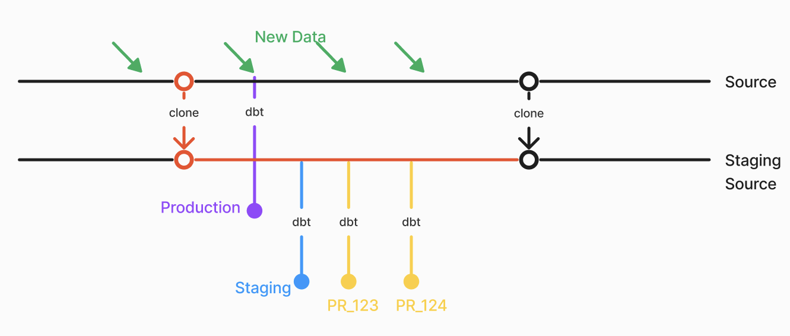
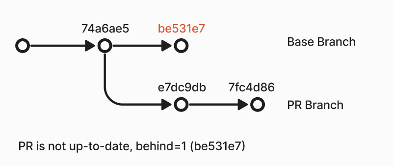

# Environment Best Practices

Strategies for preparing reliable, efficient environments for Recce data validation.

## Overview

Recce compares base and current environments to validate data changes. Several factors can affect comparison accuracy:

- Source data updates continuously
- Transformations take time to run
- Other PRs merge into the base branch
- Generated environments accumulate in the warehouse

This guide covers strategies to manage these challenges.

## Use per-PR schemas

Each PR should have its own isolated schema. This prevents interference between concurrent PRs and makes cleanup straightforward.

```yaml
# profiles.yml
ci:
  schema: "{{ env_var('CI_SCHEMA') }}"

# CI workflow
env:
  CI_SCHEMA: "pr_${{ github.event.pull_request.number }}"
```

Benefits:

- Complete isolation between PRs
- Parallel validation without conflicts
- Easy cleanup by dropping the schema

See [Environment Setup](environment-setup.md) for detailed configuration.

## Prepare a single base environment

Use one consistent base environment for all PRs to compare against. Options:

| Base Environment | Characteristics | Best For |
|------------------|-----------------|----------|
| Production | Latest merged code, full data | Accurate production comparison |
| Staging | Latest merged code, limited data | Faster comparisons, lower cost |

If using staging as base:

- Ensure transformed results reflect the latest commit of the base branch
- Use the same source data as PR environments
- Use the same transformation logic as PR environments

The staging environment should match PR environments as closely as possible, differing only in git commit.

## Limit source data range

Most data is temporal. Using only recent data reduces transformation time while still validating correctness.

**Strategy:** Use data from the last month, excluding the current week. This ensures consistent results regardless of when transformations run.

```sql
SELECT *
FROM {{ source('your_source_name', 'orders') }}

WHERE
    order_date >= DATEADD(month, -1, CURRENT_DATE)
    AND order_date < DATE_TRUNC('week', CURRENT_DATE)

```

Benefits:

- Faster transformation execution
- Consistent comparison results
- Reduced warehouse costs

## Reduce source data volatility

If source data updates frequently (hourly or more), comparison results can vary based on timing rather than code changes.

**Strategies:**

- **Zero-copy clone** (Snowflake, BigQuery, Databricks): Freeze source data at a specific point in time
- **Weekly snapshots**: Update source data weekly to reduce variability

{: .shadow}

## Keep base environment current

The base environment can become outdated in two scenarios:

1. **New source data**: If you update data weekly, update the base environment at least weekly
2. **PRs merged to main**: Trigger base environment update on merge events

Configure your CD workflow to run:

- On merge to main (immediate update)
- On schedule (e.g., daily at 2 AM UTC)

See [Setup CD](setup-cd.md) for workflow configuration.

## Keep PR branch in sync with base

If a PR runs after other PRs merge to main, the comparison mixes:

- Changes from the current PR
- Changes from other merged PRs

This produces comparison results that don't accurately reflect the current PR's impact.

{: .shadow}

**GitHub**: Enable [branch protection](https://docs.github.com/en/pull-requests/collaborating-with-pull-requests/proposing-changes-to-your-work-with-pull-requests/keeping-your-pull-request-in-sync-with-the-base-branch) to show when PRs are outdated.

**CI check**: Add a workflow step to verify the PR is up-to-date:

```yaml
- name: Check if PR is up-to-date
  if: github.event_name == 'pull_request'
  run: |
    git fetch origin main
    UPSTREAM=${GITHUB_BASE_REF:-'main'}
    HEAD=${GITHUB_HEAD_REF:-${GITHUB_REF#refs/heads/}}
    if [ "$(git rev-list --left-only --count ${HEAD}...origin/${UPSTREAM})" -eq 0 ]; then
      echo "Branch is up-to-date"
    else
      echo "Branch is not up-to-date"
      exit 1
    fi
```

## Clean up PR environments

As PRs accumulate, so do generated schemas. Implement cleanup to manage warehouse storage.

**On PR close**: Create a workflow that drops the PR schema when the PR closes.

```jinja




```

Run the cleanup:

```shell
dbt run-operation clear_schema --args "{'schema_name': 'pr_123'}"
```

**Scheduled cleanup**: Remove schemas not used for a week.

## Example configuration

| Environment | Schema | When to Run | Count | Data Range |
|-------------|--------|-------------|-------|------------|
| Production | `public` | Daily | 1 | All |
| Staging | `staging` | Daily + on merge | 1 | 1 month, excluding current week |
| PR | `pr_<number>` | On push | # of open PRs | 1 month, excluding current week |

## Related

- [Environment Setup](environment-setup.md) - Technical configuration for profiles.yml and CI/CD
- [Setup CD](setup-cd.md) - Configure automatic baseline updates
- [Setup CI](setup-ci.md) - Configure PR validation
