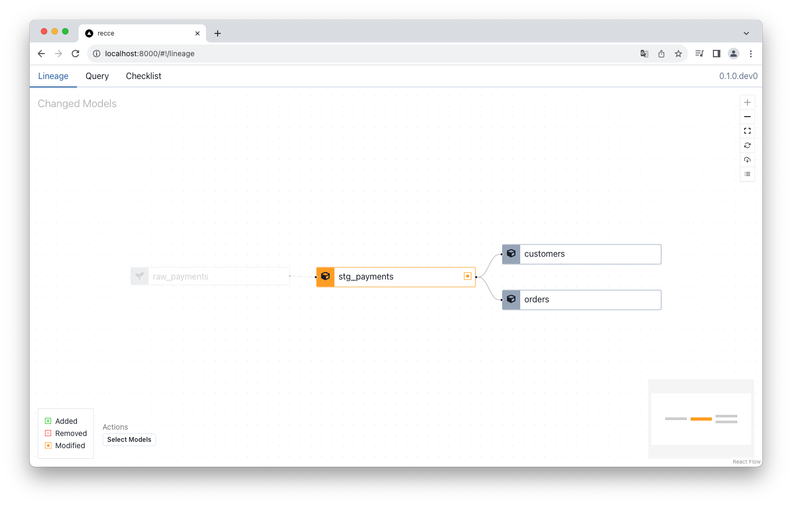
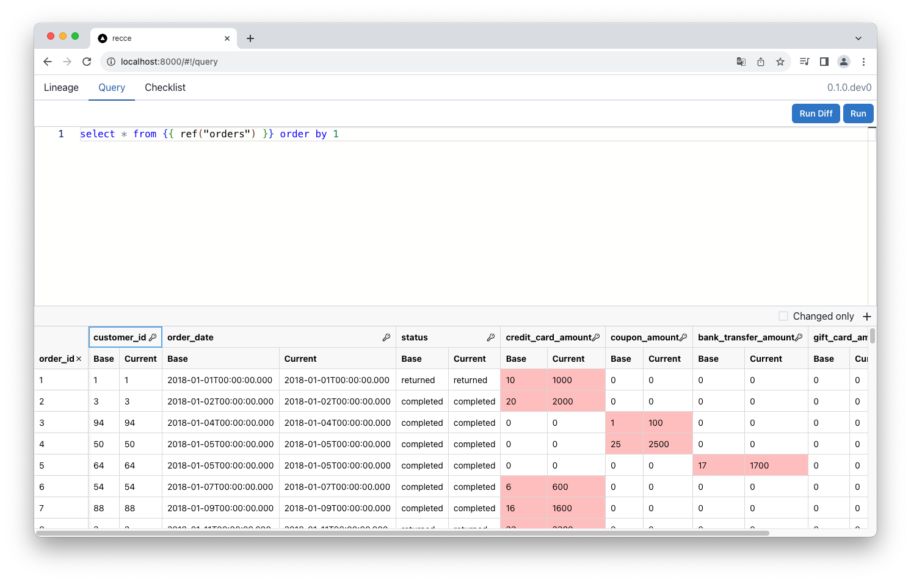
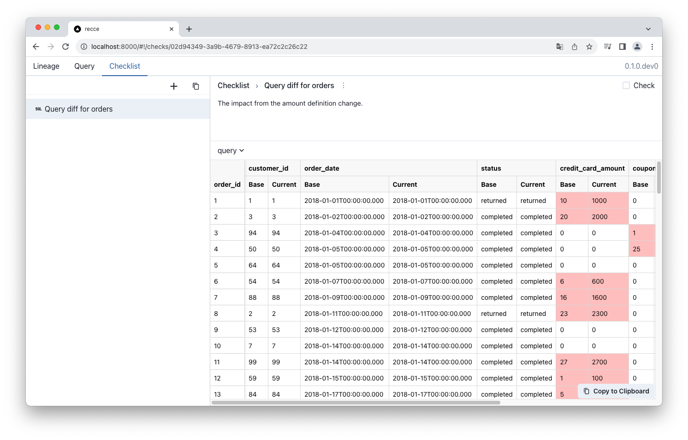

Jaffle Shop is an example project officially provided by [dbt Labs](https://www.getdbt.com). This document uses [jaffle_shop_duckdb](https://github.com/dbt-labs/jaffle_shop_duckdb) to enable you to start using Recce locally from scratch within five minutes.

!!! tip

      [DuckDB](https://duckdb.org/) projects like jaffle_shop_duckdb don’t use a server-based connection or cloud warehouse credentials. Be aware that a few setup steps differ from those for cloud-based warehouses.

## Step by Step

1. Clone the “Jaffle Shop” dbt data project
   ```shell
   git clone git@github.com:dbt-labs/jaffle_shop_duckdb.git
   cd jaffle_shop_duckdb
   ```
2. Prepare virtual env
   ```shell
   python -m venv venv
   source venv/bin/activate
   ```
3. Installation
   ```shell
   pip install -r requirements.txt
   pip install recce
   ```
4. Provide additional environment to compare<br>
   Edit `./profiles.yml` to add one more target to serve as the base environment for comparison.
   <br><br>Note: This step is only necessary for file-based engines like DuckDB. For cloud warehouses (e.g., Snowflake, BigQuery), Recce auto-detects your active dbt profile and schema, so no changes required.
   ```diff
   jaffle_shop:
     target: dev
     outputs:
     dev:
       type: duckdb
       path: 'jaffle_shop.duckdb'
       threads: 24
   + prod:
   +   type: duckdb
   +   path: 'jaffle_shop.duckdb'
   +   schema: prod
   +   threads: 24
   ```
5. Prepare production environment<br>
   Using DuckDB, you need to generate the artifacts for the base environment. Checkout the `main` branch of your project and generate the required artifacts into `target-base`. You can skip `dbt build` if this environment already exists.
   <br><br>Note: This step is only necessary for file-based engines like DuckDB. For most data warehouses, you don’t need to re-run production locally. You can download the dbt artifacts generated from the main branch, and save them to a `target-base/` folder.
   ```shell
   dbt seed --target prod
   dbt run --target prod
   dbt docs generate --target prod --target-path ./target-base
   ```
6. Prepare development environment. First, edit an existing model `./models/staging/stg_payments.sql`.
   ```diff
   ...

   renamed as (
            payment_method,

   -        -- `amount` is currently stored in cents, so we convert it to dollars
   -        amount / 100 as amount
   +        amount

            from source
   )
   ```
   run on development environment.
   ```shell
   dbt seed
   dbt run
   dbt docs generate
   ```
7. Run the recce server
   ```shell
   recce server
   ```
   Open the link http://0.0.0.0:8000, you can see the lineage diff
   
8. Switch to the **Query** tab, run this query
   ```sql
   select * from {{ ref("orders") }} order by 1
   ```
   Click the `Run Diff` or press `Cmd + Shift + Enter`
   Click on the 🔑 icon next to the `order_id` column to compare records that are uniquely identified by their `order_id`.
   
9.  Click the `+` to add the query result to checklist
   

## What’s Next
By following this DuckDB tutorial, you’ve seen how Recce works locally.
You can now return to the [Open Source Setup](./installation.md) to set up Recce with your cloud data warehouse.

Got questions? [Let us know](../1-whats-recce/community-support.md). We're happy to help!
