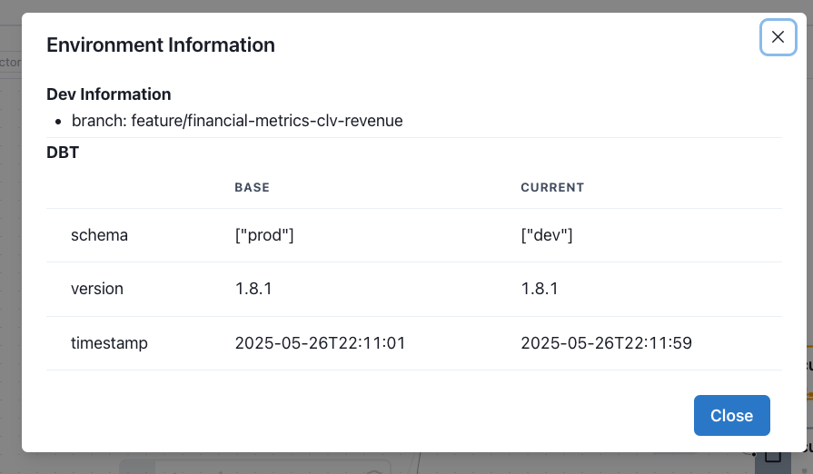
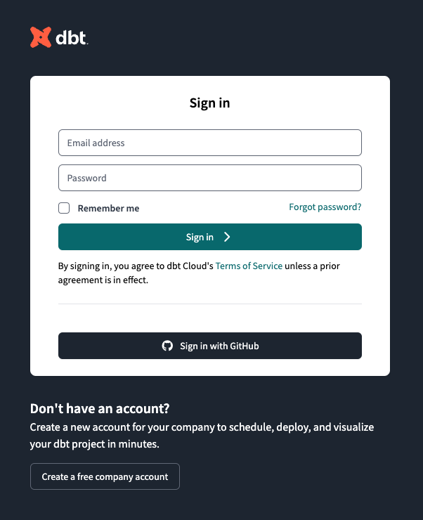
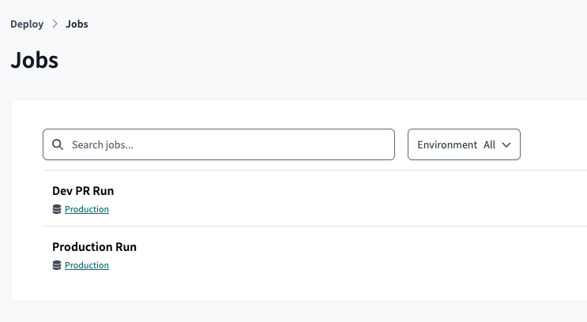
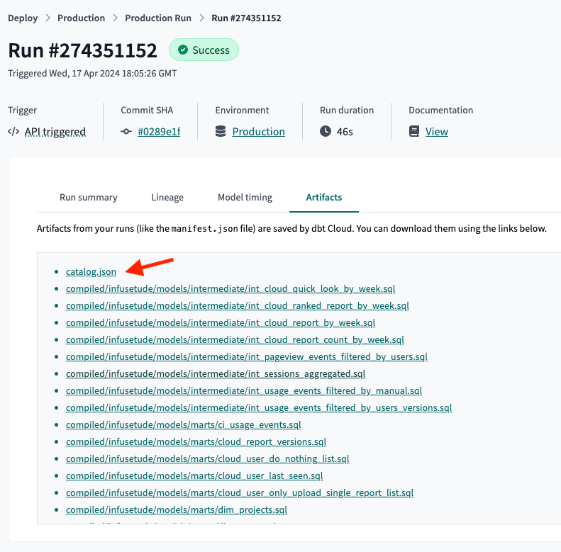

# Open Source Setup

## Install Open Source

From within a dbt project directory:
```shell
cd your-dbt-project/  # if you're not already there
pip install -U recce
```


## Launch
To start Recce in the current environment:
```shell
recce server
```
Launching Recce enables:

- **Lineage clarity**: Trace changes down to the column level

- **Query insights**: Explore logic and run custom queries

- **Live diffing**: Reload and inspect changes as you iterate

Best suited for quick exploration before moving to structured validation using Diff.

<!-- <insert the gif of sign in flow step 2>  -->


## Configure Diff

To compare changes, Recce needs a baseline. This guide explains the concept of Diff in Recce and how it fits into data validation workflows. Setup steps vary by environment, so this guide focuses on the core ideas rather than copy-paste instructions.

For a concrete example, refer to the [5-minute Jaffle Shop tutorial](./get-started-jaffle-shop.md).

To configure a comparison in Recce, two components are required:

### 1. Artifacts

Recce uses dbt [artifacts](https://docs.getdbt.com/reference/artifacts/dbt-artifacts) to perform diffs. These files are generated with each dbt run and typically saved in the `target/` folder.

In addition to the current artifacts, a second set is needed to serve as the baseline for comparison. Recce looks for these in the `target-base/` folder.

- `target/` – Artifacts from the current development environment
- `target-base/` – Artifacts from a baseline environment (e.g., production)

For most setups, retrieve the existing artifacts that generated from the main branch (usually from a CI run or build cache) and save them into a `target-base/` folder.

### 2. Schemas

Recce also compares the actual query results between two dbt [environments](https://docs.getdbt.com/docs/core/dbt-core-environments), each pointing to a different [schema](https://docs.getdbt.com/docs/core/connect-data-platform/connection-profiles#understanding-target-schemas). This allows validation beyond metadata by comparing the data itself.

For example:

- `prod` schema for production
- `dev` schema for development

These schemas represent where dbt builds its models.

!!! tip

    In dbt, an environment typically maps to a schema. To compare data results, separate schemas are required. Learn more in [dbt environments](https://docs.getdbt.com/docs/core/dbt-core-environments).

Schemas are typically configured in the `profiles.yml` file, which defines how dbt connects to the data platform. Both schemas must be accessible for Recce to perform environment-based comparisons.

Once both artifacts and schemas are configured, Recce can surface meaningful diffs across logic, metadata, and data.

## Verify your setup

There are two ways to check that your configuration is complete:

### 1. Debug Command (CLI)

Run `recce debug` from the command line to verify your setup before launching the server:

```bash
recce debug
```

This command checks artifacts, directories, and warehouse connection, providing detailed feedback on any missing components.

### 2. Environment Info (Web UI)

Use **Environment Info** in the top-right corner of the Recce web interface to verify your configuration.

A correctly configured setup will display two environments:

- **Base** – the reference schema used for comparison (e.g., production)
- **Current** – the schema for the environment under development (e.g., staging or dev)

This confirms that both the artifacts and schemas are properly connected for diffing.



## Start with dbt Cloud

dbt Cloud is a hosted service that provides a managed environment for running dbt projects by [dbt Labs](https://docs.getdbt.com/docs/cloud/about-cloud/dbt-cloud-features). This document provides a step-by-step guide to get started Recce with dbt Cloud.

### Prerequisites

Recce will compare the data models between two environments. That means you need to have two environments in your dbt Cloud project. For example, one for production and another for development.
Also, you need to provide the credentials profile for both environments in your `profiles.yml` file to let Recce access your data warehouse.

#### Suggestions for setting up dbt Cloud

To integrate the dbt Cloud with Recce, we suggest to set up two run jobs in your dbt Cloud project.

#### Production Run Job

The production run should be the main branch of your dbt project. You can trigger the dbt Cloud job on every merge to the main branch or schedule it to run at a daily specific time.

### Development Run Job

The development run should be a separate branch of your dbt project. You can trigger the dbt Cloud job on every merge to the pull-request branch.

### Set up dbt profiles with credentials

You need to provide the credentials profile for both environments in your `profiles.yml` file. Here is an example of how your `profiles.yml` file might look like:

```yaml
dbt-example-project:
  target: dev
  outputs:
    dev:
      type: snowflake
      account: "{{ env_var('SNOWFLAKE_ACCOUNT') }}"

      # User/password auth
      user: "{{ env_var('SNOWFLAKE_USER') | as_text }}"
      password: "{{ env_var('SNOWFLAKE_PASSWORD') | as_text }}"

      role: DEVELOPER
      database: cloud_database
      warehouse: LOAD_WH
      schema: "{{ env_var('SNOWFLAKE_SCHEMA') | as_text }}"
      threads: 4
    prod:
      type: snowflake
      account: "{{ env_var('SNOWFLAKE_ACCOUNT') }}"

      # User/password auth
      user: "{{ env_var('SNOWFLAKE_USER') | as_text }}"
      password: "{{ env_var('SNOWFLAKE_PASSWORD') | as_text }}"

      role: DEVELOPER
      database: cloud_database
      warehouse: LOAD_WH
      schema: PUBLIC
      threads: 4
```


### Execute Recce with dbt Cloud

To compare the data models between two environments, you need to download the dbt Cloud artifacts for both environments. The artifacts include the manifest.json file and the catalog.json file. You can download the artifacts from the dbt Cloud UI.

#### Login to your dbt Cloud account



#### Go to the project you want to compare



#### Download the dbt artifacts

Download the artifacts from the latest run of both run jobs. You can download the artifacts from the `Artifacts` tab.




### Set up the dbt artifacts folders

Extract the downloaded artifacts and keep them in a separate folder. The production artifacts should be in the `target-base` folder and the development artifacts should be in the `target` folder.

```bash
$ tree target target-base
target
├── catalog.json
└── manifest.json
target-base/
├── catalog.json
└── manifest.json
```

### Setup dbt project

Move the `target` and `target-base` folders to the root of your dbt project.
You should also have the `profiles.yml` file in the root of your dbt project with the credentials profile for both environments.

### Launch Recce

Run the command to compare the data models between the two environments.

```shell
recce server
```

