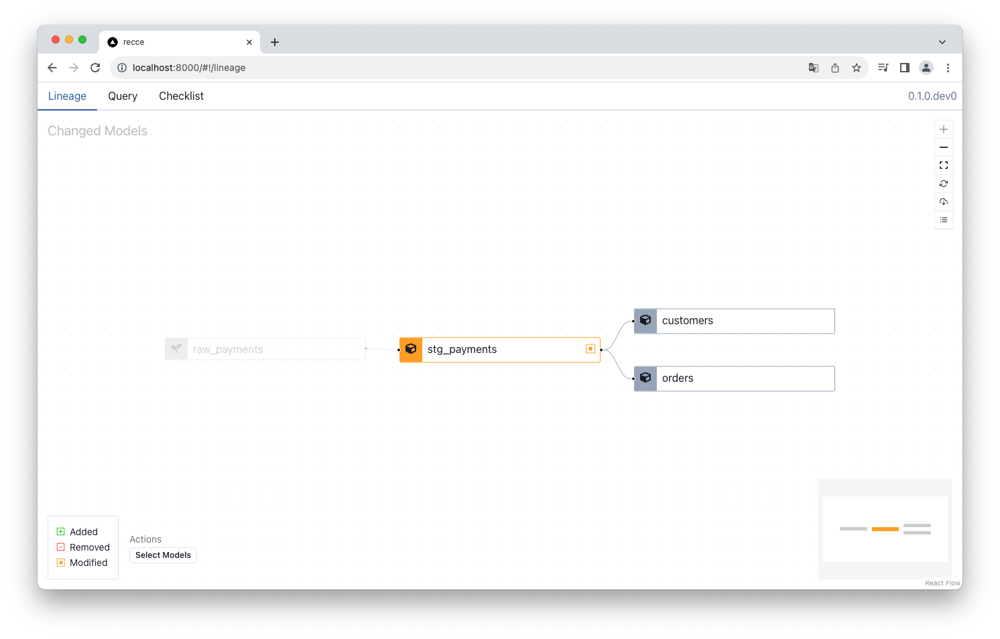
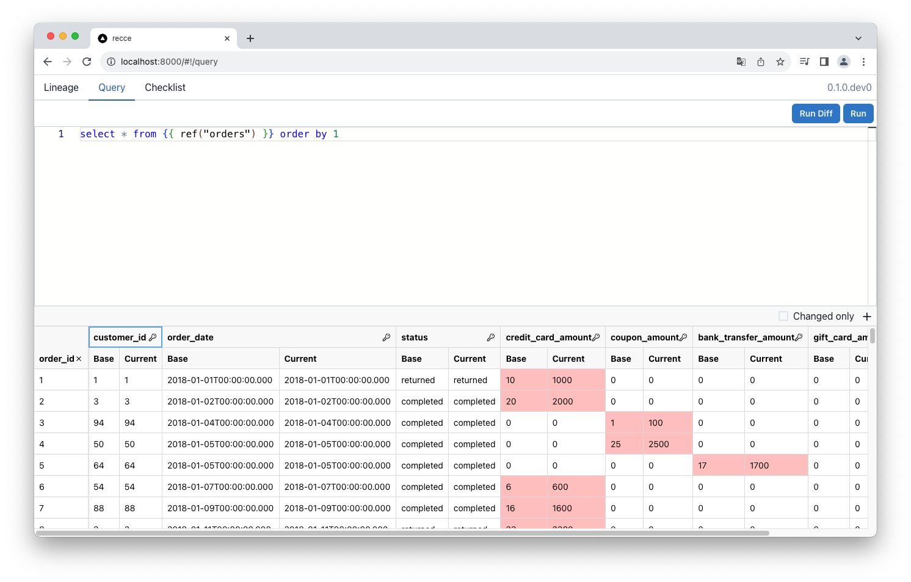
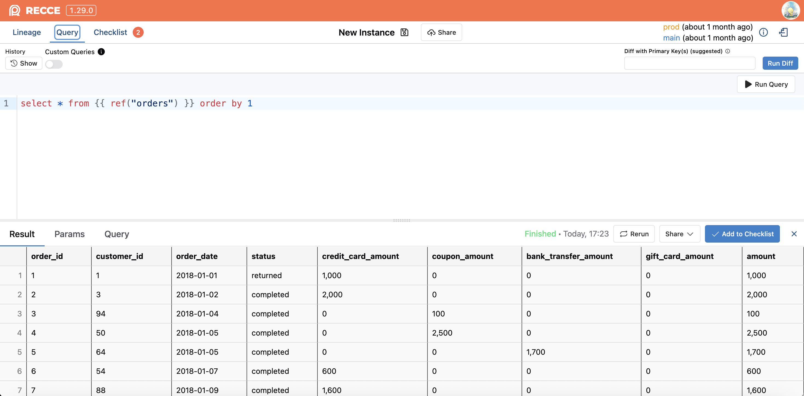

# Jaffle Shop Tutorial

When you change a dbt model, how do you know what data actually changed? Running your model isn't enough — you need to compare outputs against the previous version.

**Goal:** Make a model change and validate the data impact using Recce with the dbt Labs example project.

This tutorial uses [jaffle_shop_duckdb](https://github.com/dbt-labs/jaffle_shop_duckdb), a sample project from dbt Labs. You'll modify a model, see how the change affects downstream data, and add a validation to your checklist.

## Prerequisites

- [x] Python 3.9+ installed
- [x] Git installed

## Steps

### 1. Clone Jaffle Shop

```shell
git clone git@github.com:dbt-labs/jaffle_shop_duckdb.git
cd jaffle_shop_duckdb
```

**Expected result:** You're in the `jaffle_shop_duckdb` directory.

### 2. Set up virtual environment

```shell
python -m venv venv
source venv/bin/activate
```

**Expected result:** Your terminal prompt shows `(venv)`.

### 3. Install dependencies

```shell
pip install -r requirements.txt
pip install recce
```

**Expected result:** Both dbt and Recce install without errors.

### 4. Configure DuckDB profile for comparison

Recce compares two environments. Edit `./profiles.yml` to add a `prod` target for the base environment.

Add the following under `outputs:`:

```yaml
    prod:
      type: duckdb
      path: 'jaffle_shop.duckdb'
      schema: prod
      threads: 24
```

Your complete `profiles.yml` should look like:

```yaml
jaffle_shop:
  target: dev
  outputs:
    dev:
      type: duckdb
      path: 'jaffle_shop.duckdb'
      threads: 24
    prod:
      type: duckdb
      path: 'jaffle_shop.duckdb'
      schema: prod
      threads: 24
```

**Expected result:** `profiles.yml` has both `dev` and `prod` targets.

### 5. Build base environment

Generate the production data and artifacts that Recce uses as baseline.

```shell
dbt seed --target prod
dbt run --target prod
dbt docs generate --target prod --target-path ./target-base
```

**Expected result:** `target-base/` folder contains `manifest.json` and `catalog.json`.

### 6. Make a model change

Edit `./models/staging/stg_payments.sql` to introduce a data change:

```diff
renamed as (
         payment_method,

-        -- `amount` is currently stored in cents, so we convert it to dollars
-        amount / 100 as amount
+        amount

         from source
)
```

This removes the cents-to-dollars conversion — downstream models will now show values 100x larger.

**Expected result:** `stg_payments.sql` outputs `amount` in cents instead of dollars.

### 7. Build development environment

```shell
dbt seed
dbt run
dbt docs generate
```

**Expected result:** `target/` folder contains updated `manifest.json` and `catalog.json`.

### 8. Start Recce server

```shell
recce server
```

**Expected result:** Server starts at http://0.0.0.0:8000

Open http://localhost:8000 in your browser. The Lineage tab shows `stg_payments` and downstream models highlighted.



### 9. Run a Query Diff

Switch to the **Query** tab and run:

```sql
select * from {{ ref("orders") }} order by 1
```

Click **Run Diff** (or press `Cmd+Shift+Enter`).

**Expected result:** Query Diff shows the `amount` column with values 100x larger in the current environment.



### 10. Add to checklist

Click **Add to Checklist** (blue button, bottom right) to save this validation.

**Expected result:** Checklist tab shows your saved Query Diff.



## Verify Success

Confirm you completed the tutorial:

1. Lineage Diff shows `stg_payments` and downstream models highlighted
2. Query Diff on `orders` shows the amount change (100x difference)
3. Checklist contains your saved validation

## Troubleshooting

| Issue | Solution |
|-------|----------|
| "No artifacts found" error | Run `dbt docs generate` for both prod (`--target-path ./target-base`) and dev |
| Empty Lineage Diff | Ensure you made the model change in step 6 and ran `dbt run` + `dbt docs generate` |
| DuckDB lock error | Close any other processes using `jaffle_shop.duckdb` |

## Next Steps

- [OSS Setup](oss-setup.md) — Set up Recce with your own dbt project
- [Cloud vs Open Source](../1-whats-recce/cloud-vs-oss.md) — Compare OSS and Cloud features
