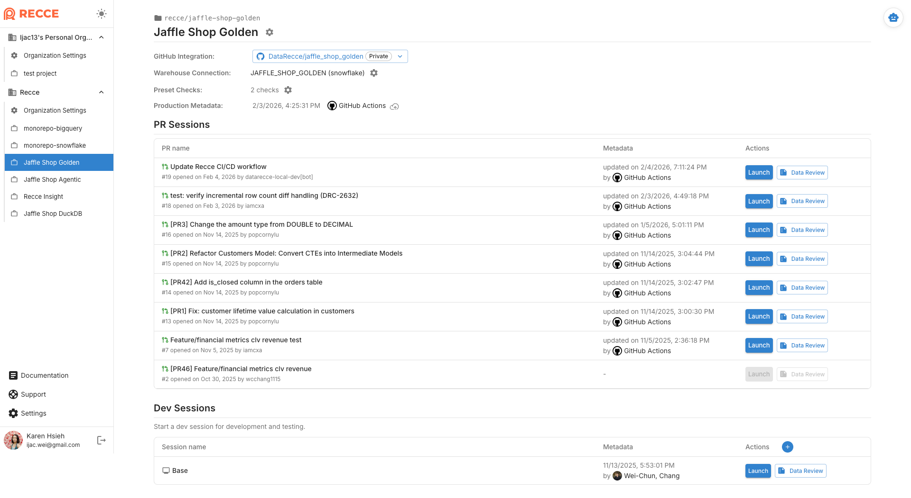

# Get Started with Recce Cloud

This tutorial helps analytics engineers and data engineers set up Recce Cloud to automate data review on pull requests.

## Goal

Reviewing data changes in PRs is error-prone without visibility into downstream impact. After setup, the Recce agent reviews your data changes on every PR—showing what changed and what it affects.

To validate changes, Recce compares **Base** vs **Current** environments:

- **Base**: models in the main branch (production)
- **Current**: models in the PR branch

Recce requires dbt artifacts from both environments. This guide covers:

- dbt profile configuration for Base and Current
- CI/CD workflow setup

For accurate comparisons, both environments should use consistent data ranges. See [Best Practices for Preparing Environments](../7-cicd/best-practices-prep-env.md) for environment strategies.

This guide uses Snowflake, GitHub, and GitHub Actions examples, but can be adapted to your configuration. The setup assumes:

- Production runs a full daily refresh
- No pre-configured per-PR environments exist yet
- Each developer has their own dev environment for local work

We'll configure CI to create isolated, per-PR schemas automatically.

## Prerequisites

- [x]  **Recce Cloud account**: free trial at [cloud.reccehq.com](https://cloud.reccehq.com)
- [x]  **dbt project in a git repository that runs successfully:** your environment can execute `dbt build` and `dbt docs generate`
- [x]  **Repository admin access for setup**: required to add workflows and secrets
- [x]  **Data warehouse**: read access to your warehouse for data diffing

## Onboarding Process Overview

After signing up, you'll enter the onboarding flow:

1. Connect data warehouse
2. Connect Git provider
3. Add Recce to CI/CD
4. Merge the CI/CD change

## Recce Web Agent Setup [Experimental]

You can use the Recce Web Agent to help automate your setup. Currently it handles **step 3** (Add Recce to CI/CD):

1. The agent analyzes your repository and CI/CD setup
2. You answer clarifying questions the agent asks about your environment strategy
3. The agent creates a PR with customized workflow files

The agent covers common setups and continues to expand coverage. If your setup isn't supported yet, the agent directs you to the Setup Guide below for manual configuration. Need help? Contact us at support@reccehq.com.

**Coming soon**: The agent will guide you through steps 1–3, including warehouse connection, Git connection, and CI/CD configuration.

---

## Setup Guide

This guide explains each onboarding step in detail.

First, go to [cloud.reccehq.com](https://cloud.reccehq.com) and create your free account.

### 1. Connect Data Warehouse

1. Select your data warehouse (e.g. Snowflake)
2. Provide your read-only warehouse credentials

> **Note**: This guide uses Snowflake. For supported warehouses, see [Connect to Warehouse](../5-data-diffing/connect-to-warehouse.md).

### 2. Connect Git Provider

1. Click **Connect GitHub**
2. Authorize the Recce app installation
3. Select the repositories you want to connect

> **Note**: This guide uses GitHub. For GitLab setup, see [GitLab Personal Access Token](gitlab-pat-guide.md).

### 3. Add Recce to CI/CD

This step adds CI/CD workflow files to your repository. The agent creates these automatically. For manual setup, create and merge a PR with the templates below.

> **Note**: This guide uses GitHub Actions. For other CI/CD platforms, see [Setup CD](../7-cicd/setup-cd.md) and [Setup CI](../7-cicd/setup-ci.md).

#### Set Up Profile.yml

The profile.yml file tells your system where to look for the "base" and "current" builds. We have a sample `profile.yml` file:

```yaml
<your-dbt-project-name>:
  target: dev
  outputs:
    dev:
      type: snowflake
      account: "{{ env_var('SNOWFLAKE_ACCOUNT') }}"
      user: "{{ env_var('SNOWFLAKE_USER') | as_text }}"
      password: "{{ env_var('SNOWFLAKE_PASSWORD') | as_text }}"
      role: DEVELOPER
      database: cloud_database
      warehouse: LOAD_WH
      schema: "{{ env_var('SNOWFLAKE_SCHEMA') | as_text }}"
      threads: 4

    ## Add a new target for CI
    ci:
      type: snowflake
      account: "{{ env_var('SNOWFLAKE_ACCOUNT') }}"
      user: "{{ env_var('SNOWFLAKE_USER') | as_text }}"
      password: "{{ env_var('SNOWFLAKE_PASSWORD') | as_text }}"
      role: DEVELOPER
      database: cloud_database
      warehouse: LOAD_WH
      schema: "{{ env_var('SNOWFLAKE_SCHEMA') | as_text }}"
      threads: 4

    prod:
      type: snowflake
      account: "{{ env_var('SNOWFLAKE_ACCOUNT') }}"
      user: "{{ env_var('SNOWFLAKE_USER') | as_text }}"
      password: "{{ env_var('SNOWFLAKE_PASSWORD') | as_text }}"
      role: DEVELOPER
      database: cloud_database
      warehouse: LOAD_WH
      schema: PUBLIC
      threads: 4
```

In this sample:

1. **Base** uses the `prod` target pointing to the `PUBLIC` schema (your production data)
2. **Current** uses the `ci` target with a dynamic schema via `env_var('SNOWFLAKE_SCHEMA')`

The `ci` target uses an environment variable for the schema name. In `pr-workflow.yml` below, we set `SNOWFLAKE_SCHEMA: "PR_${{ github.event.pull_request.number }}"` to create isolated environments per PR (e.g., `PR_123`, `PR_456`). This isolates each PR's data so multiple PRs can run without conflicts.

> NOTE: Ensure your data warehouse allows creating schemas dynamically. The CI runner needs write permissions to create PR-specific schemas (e.g., `PR_123`).

#### About Secrets

The workflows use two types of secrets:

- **`GITHUB_TOKEN`**: automatically provided by GitHub Actions, no configuration needed. This is used by the GitHub integration you just set up to connect the results of the call to Recce.
- **Warehouse credentials**: your existing secrets for dbt (e.g., `SNOWFLAKE_ACCOUNT`, `SNOWFLAKE_USER`, `SNOWFLAKE_PASSWORD`). If your dbt project already runs in CI, you have these configured.

#### Set Up Base Metadata Updates

The Base environment should reflect the dbt configuration in the main branch. Example workflow file: `base-workflow.yml`

```yaml
name: Update Base Metadata
on:
  push:
    branches: ["main"]
  schedule:
    - cron: "0 2 * * *"
  workflow_dispatch:

concurrency:
  group: ${{ github.workflow }}
  cancel-in-progress: true

jobs:
  update-base-session:
    runs-on: ubuntu-latest
    timeout-minutes: 30
    permissions:
      contents: read
    steps:
      - name: Checkout code
        uses: actions/checkout@v4

      - name: Setup Python
        uses: actions/setup-python@v5
        with:
          python-version: "3.11"
          cache: "pip"

      - name: Install dependencies
        run: pip install -r requirements.txt

      - name: Prepare dbt artifacts
        run: |
          dbt deps
          dbt build --target prod
          dbt docs generate --target prod
        env:
          DBT_ENV_SECRET_KEY: ${{ secrets.DBT_ENV_SECRET_KEY }}
          SNOWFLAKE_ACCOUNT: ${{ secrets.SNOWFLAKE_ACCOUNT }}
          SNOWFLAKE_USER: ${{ secrets.SNOWFLAKE_USER }}
          SNOWFLAKE_PASSWORD: ${{ secrets.SNOWFLAKE_PASSWORD }}
          SNOWFLAKE_DATABASE: ${{ secrets.SNOWFLAKE_DATABASE }}
          SNOWFLAKE_WAREHOUSE: ${{ secrets.SNOWFLAKE_WAREHOUSE }}

      ## Add this part
      - name: Upload to Recce Cloud
        run: |
          pip install recce-cloud
          recce-cloud upload --type prod
        env:
          GITHUB_TOKEN: ${{ secrets.GITHUB_TOKEN }}
```

This sample workflow:

- Runs once a day
- Installs Python 3.11 and the contents of `requirements.txt`, and recce-cloud
- **Calls `dbt docs generate`** to generate artifacts
- **Calls `recce-cloud upload --type prod`** to upload the Base metadata, using `GITHUB_TOKEN` for authentication

To integrate into your own configuration, ensure your workflow includes the bolded steps.

#### Set Up Current Metadata Updates

The Current environment should reflect the dbt configuration in the PR branch. Recce provides an example workflow file: `pr-workflow.yml`

```yaml
name: Validate PR Changes
on:
  pull_request:
    branches: ["main"]

concurrency:
  group: ${{ github.workflow }}-${{ github.ref }}
  cancel-in-progress: true

jobs:
  validate-changes:
    runs-on: ubuntu-latest
    timeout-minutes: 45
    permissions:
      contents: read
      pull-requests: write
    steps:
      - name: Checkout PR branch
        uses: actions/checkout@v4
        with:
          fetch-depth: 2

      - name: Setup Python
        uses: actions/setup-python@v5
        with:
          python-version: "3.11"
          cache: "pip"

      - name: Install dependencies
        run: pip install -r requirements.txt

      - name: Build current branch artifacts
        run: |
          dbt deps
          dbt build --target ci
          dbt docs generate --target ci
        env:
          DBT_ENV_SECRET_KEY: ${{ secrets.DBT_ENV_SECRET_KEY }}
          SNOWFLAKE_ACCOUNT: ${{ secrets.SNOWFLAKE_ACCOUNT }}
          SNOWFLAKE_USER: ${{ secrets.SNOWFLAKE_USER }}
          SNOWFLAKE_PASSWORD: ${{ secrets.SNOWFLAKE_PASSWORD }}
          SNOWFLAKE_DATABASE: ${{ secrets.SNOWFLAKE_DATABASE }}
          SNOWFLAKE_WAREHOUSE: ${{ secrets.SNOWFLAKE_WAREHOUSE }}
          SNOWFLAKE_SCHEMA: "PR_${{ github.event.pull_request.number }}"

      - name: Upload to Recce Cloud
        run: |
          pip install recce-cloud
          recce-cloud upload
        env:
          GITHUB_TOKEN: ${{ secrets.GITHUB_TOKEN }}
```

This sample workflow:

- Runs on every PR targeting main
- Installs Python 3.11, dependencies from `requirements.txt`, and recce-cloud
- **Creates a per-PR schema** (`PR_123`, `PR_456`, etc.) using the dynamic `SNOWFLAKE_SCHEMA` environment variable—this isolates each PR's data so multiple PRs can run simultaneously without conflicts
- **Calls `dbt docs generate --target ci`** to generate artifacts for the PR branch
- **Calls `recce-cloud upload`** to upload the Current metadata, using `GITHUB_TOKEN` for authentication

To integrate into your own configuration, ensure your workflow includes the bolded steps.

### 4. Merge the CI/CD change

Merge the PR containing the workflow files. After merging:

- The **Base workflow** automatically uploads your Base to Recce Cloud
- The **Current workflow** is ready to validate future PRs

In Recce Cloud, verify you see:

- GitHub Integration: Connected
- Warehouse Connection: Connected
- Production Metadata: Updated automatically
- PR Sessions: all open PRs appear in the list. Only PRs with uploaded metadata can be launched for review.

{: .shadow}

### 5. Final Steps

You can now:

- See data review summaries in PR comments
- Launch Recce instance to visualize changes
- Review downstream impacts before merging

---

## Verification Checklist

- [x]  **Base workflow**: Trigger manually, check Base metadata appears in Recce Cloud
- [x]  **Current workflow**: Create a test PR, verify PR session appears
- [x]  **Data diff**: Open PR session, run Row Count Diff

## Troubleshooting

| Issue | Solution |
| --- | --- |
| Authentication errors | Confirm repository is connected in Recce Cloud settings |
| Push to main blocked | Check branch protection rules |
| Secret names don't match | Update template to use your existing secret names |
| Workflow fails | Check secrets are configured correctly |
| Artifacts missing | Ensure `dbt docs generate` completes before upload |
| Warehouse connection fails | Check IP whitelisting; add GitHub Actions IP ranges |

## Related Resources

- [CI/CD Getting Started](../7-cicd/ci-cd-getting-started.md)
- [Setup CD](../7-cicd/setup-cd.md)
- [Setup CI](../7-cicd/setup-ci.md)
- [Best Practices for Preparing Environments](../7-cicd/best-practices-prep-env.md)
