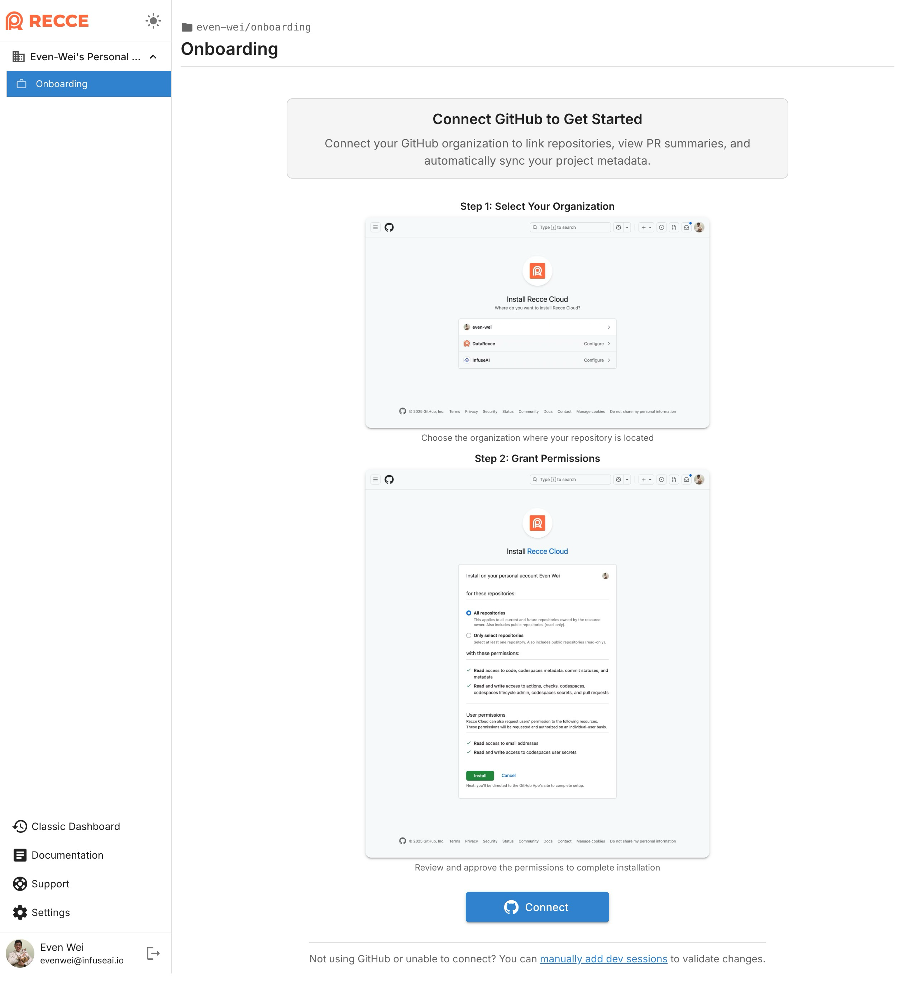
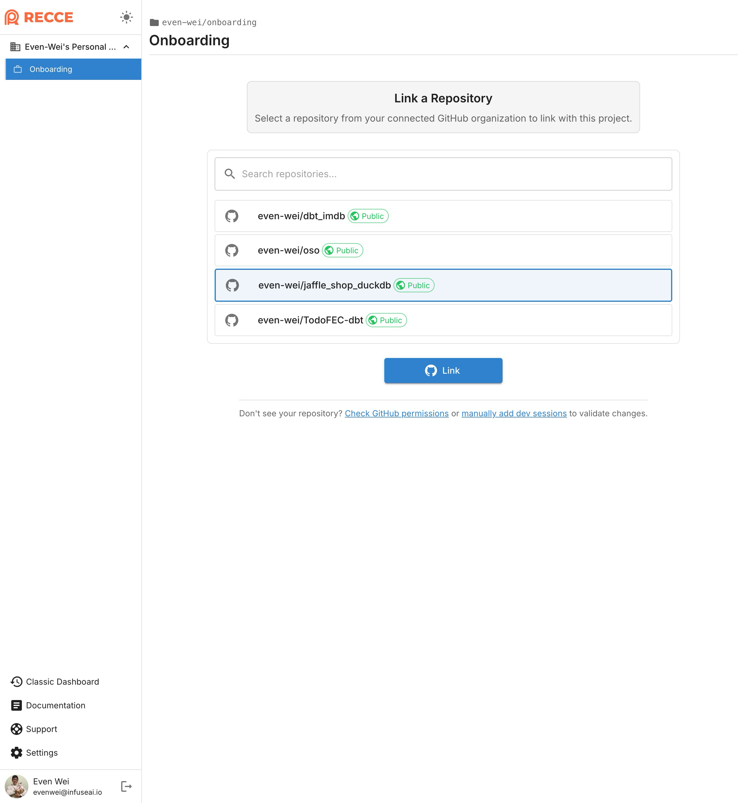
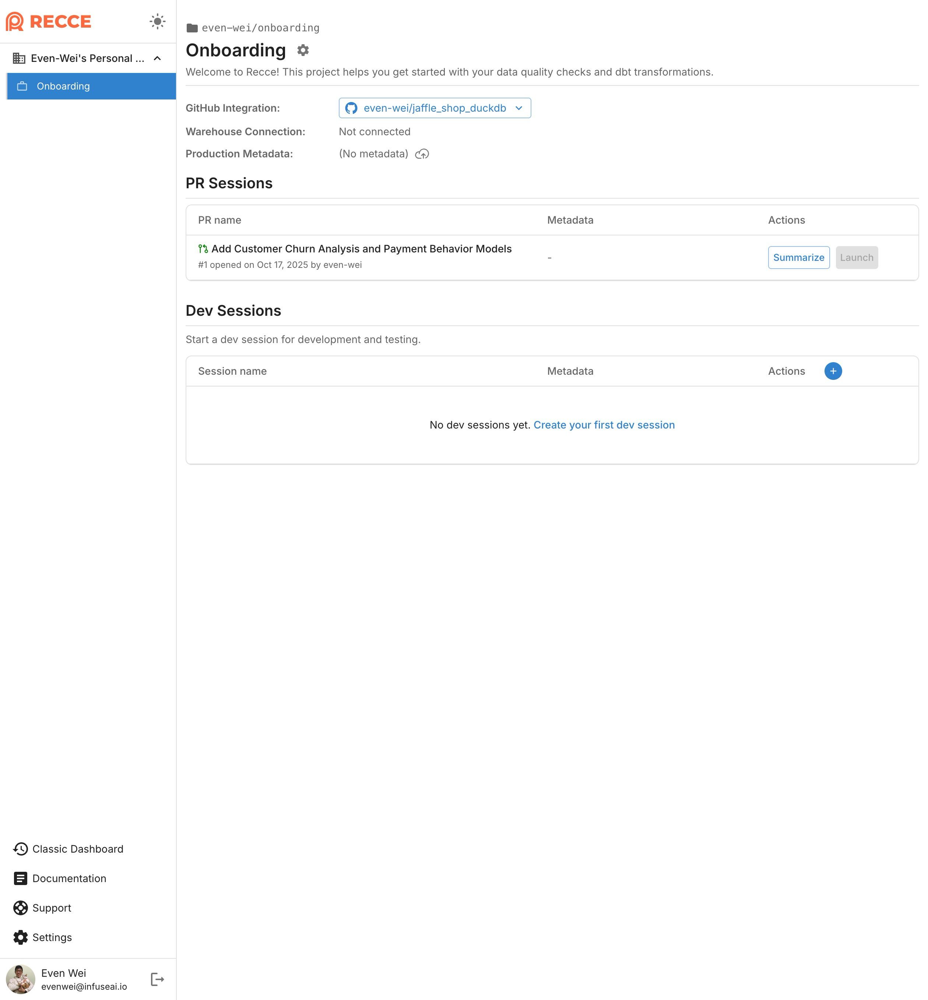

# Start Free with Recce Cloud

**Get started in 3 simple steps**. After signing up, you'll be guided through connecting your GitHub repository and automating your PR validation workflow.

👉 **[Start Free →](https://cloud.reccehq.com){target="\_blank"}**

## Step 1: Connect Your GitHub Repository {#github-integration}

After signing up, you'll enter your default project. The first step is connecting your GitHub organization and repository to enable PR tracking and validation.

### What You'll Get

Once connected, you can:

- View all open and draft PRs
- See PR summaries

### Setup Requirements

- GitHub repository with dbt project
- Permissions for GitHub App installations
- (Optional) Active PRs with model changes

### Connection Steps

Follow the guidance to connect your GitHub organization and link your repository:

{ width="49%" }
{ width="49%" }

Once connected, your PRs will appear in the dashboard with basic change summaries:

## Step 2: Automate Metadata with CI/CD {#cicd-automation}

To enable easy validation with Recce and enrich PR summaries, configure CI/CD automation to automatically prepare metadata for every PR.

### What You'll Get

With CI/CD configured, you get:

- Automatic metadata upload on every PR
- **One-click "Launch Recce"** to validate changes interactively
- **Enriched PR summaries** with comprehensive model impact analysis

### Setup Requirements

- GitHub integration completed (Step 1)
- CI/CD jobs that generate dbt docs

### How It Works

The CI/CD integration automates the metadata upload process:

1. **Automatic upload**: Metadata is uploaded to Recce Cloud for both base and current environments
2. **Ready to validate**: PR appears in your dashboard "Launch Recce" button
3. **Enriched summaries**: Enriched PR summaries with detailed model impact analysis

### Setup Guides

Follow the detailed setup guides for your CI/CD platform:

- [Setup CD](/7-cicd/setup-cd/) - Configure continuous deployment for base environment metadata
- [Setup CI](/7-cicd/setup-ci/) - Configure continuous integration for PR environment metadata

<!-- insert a video -->

## Advanced Features

### Data Warehouse Diffing {#data-diffing}

Go beyond metadata to see how changes affect your actual data. Configure your data warehouse connection to compare query results and catch issues before they impact production.

#### Why Use Data Diffing?

While metadata comparison shows structural changes, data diffing reveals:

- Unexpected changes in row counts or data distributions
- Breaking changes in downstream transformations
- Data quality issues before production deployment

#### Setup Requirements

- Data warehouse credentials with read access
- Network connectivity to your warehouse
- CI/CD automation configured (Step 2 recommended)

#### Supported Warehouses

- Snowflake
- Databricks
- Others coming in future releases

#### Configure Warehouse Connection

**Connection setup:**

1. Navigate to [organization settings](https://cloud.reccehq.com/settings#organization){target="\_blank"}
2. Click "Add Connection" and enter your warehouse credentials
3. Go to your [project home](https://cloud.reccehq.com/) and click the gear icon
4. Link the newly added connection to your project

Your connection credentials are secure. See our [security practices](https://reccehq.com/security/){target="\_blank"} for details.

For detailed connection settings, see [Connect to Warehouse](../5-data-diffing/connect-to-warehouse.md).

<!-- insert a video -->

#### Available Diffing Methods

Recce supports multiple data diffing approaches:

- [Row Count Diff](/5-data-diffing/row-count-diff) - Compare total row counts
- [Profile Diff](/5-data-diffing/profile-diff/) - Statistical profiling of columns
- [Value Diff](/5-data-diffing/value-diff/) - Detailed value-level comparison
- [Top-K Diff](/5-data-diffing/topK-diff/) - Compare top values and frequencies
- [Histogram Diff](/5-data-diffing/histogram-diff/) - Distribution analysis
- [Query](/5-data-diffing/query/) - Custom SQL queries for validation
