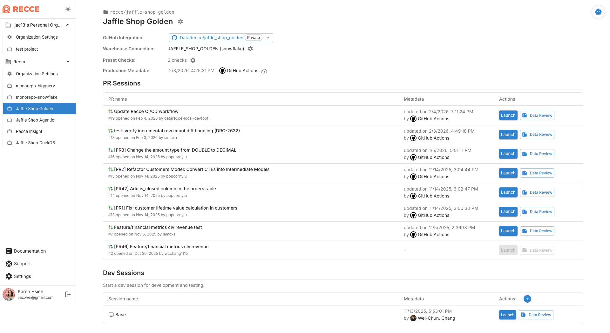

# Get Started with Recce Cloud

Set up Cloud to automate data review on every pull request. This guide walks you through each onboarding step.

[**Get Started**](https://cloud.reccehq.com/onboarding/get-started)

<iframe src="https://www.loom.com/embed/25aa05fb20b24da5bd5a744cf7d0b372" title="Recce Cloud Getting Started" allow="fullscreen" loading="lazy" style="width: 100%; height: 100%; border: 0;"></iframe>

## Goal

Recce compares **Base** vs **Current** environments to validate data changes in every PR:

- **Base**: your main branch (production)
- **Current**: your PR branch (development)
- **Per-PR schema**: an isolated database schema created for each pull request, so multiple PRs can validate simultaneously without conflicts

For accurate comparisons, both environments should use consistent data ranges. See [Best Practices for Preparing Environments](environment-best-practices.md) for environment strategies.

## Prerequisites

- [ ]  **Cloud account**: free trial at [cloud.reccehq.com](https://cloud.reccehq.com)
- [ ]  **dbt project in a git repository that runs successfully:** your environment can execute `dbt build` and `dbt docs generate`
- [ ]  **Repository admin access for setup**: required to add workflows and secrets
- [ ]  **Data warehouse**: read access to your warehouse for data diffing

## Onboarding Process Overview

After signing up, you'll enter the onboarding flow:

1. Connect data warehouse
2. Connect Git provider
3. Add Recce to CI/CD
4. Merge the CI/CD change

## Recce Web Agent Setup

You can use the Recce Web Agent to help automate your setup. Currently it handles **step 3** (Add Recce to CI/CD):

1. The agent analyzes your repository and CI/CD setup
2. You answer clarifying questions the agent asks about your environment strategy
3. The agent creates a PR with customized workflow files

The agent covers common setups and continues to expand coverage. If your setup isn't supported yet, the agent directs you to the Setup Guide below for manual configuration. Need help? Contact us at support@reccehq.com.

---

## Setup Guide

This guide explains each onboarding step in detail.

First, go to [cloud.reccehq.com](https://cloud.reccehq.com) and create your free account.

### 1. Connect Data Warehouse

Provide read-only credentials so Recce can run data diffs against your warehouse.

**[Connect Data Warehouse](connect-to-warehouse.md)**

### 2. Connect Git Provider

Authorize the Recce app and select the repositories you want to connect.

**[Connect Your Repository](connect-git.md)**

### 3. Add Recce to CI/CD

This step adds CI/CD workflow files to your repository. The web agent detects your setup and guides you through. For manual setup, follow the linked guides below.

#### Choose your setup

| Question | If this is you... | Then... |
|----------|-------------------|---------|
| **How do you run dbt?** | You own your dbt run (GitHub Actions, GitLab CI, CircleCI) | Continue reading below |
| | You run dbt on a platform (dbt Cloud, Paradime, etc.) | See [dbt Cloud Setup](dbt-cloud-setup.md) |
| **How complex is your environment?** | Simple (prod and dev targets) | Continue reading below. We use per-PR schemas for fast setup. See [Environment Setup](environment-setup.md) for why. |
| | Advanced (multiple schemas, staging environments) | See [Environment Setup](environment-setup.md) |
| **What's your CI/CD platform?** | GitHub Actions | Continue reading below |
| | Other (GitLab CI, CircleCI, etc.) | See [Setup CD](setup-cd.md) and [Setup CI](setup-ci.md) |

Configure in this order: profile, then CD, then CI. CD establishes the production baseline that CI compares against.

**a. Configure your dbt profile**

Add `ci` and `prod` targets to your `profiles.yml` so Recce can compare base and current environments.

**[Environment Setup](environment-setup.md)**

**b. Set up baseline updates (CD)**

Add a workflow that uploads production artifacts to Cloud after every merge to main.

**[Setup CD](setup-cd.md)**

**c. Set up PR validation (CI)**

Add a workflow that uploads PR branch artifacts so Recce can validate changes before merge.

**[Setup CI](setup-ci.md)**

Your workflows use `GITHUB_TOKEN` (automatically provided by GitHub Actions) and your existing warehouse credential secrets.

!!! note "recce vs recce-cloud"
    `pip install recce` is the open source CLI for local validation. `pip install recce-cloud` is the CI/CD uploader for Cloud.

### 4. Merge the CI/CD change

Merge the PR containing the workflow files. After merging:

- The **Base workflow** automatically uploads your Base to Cloud
- The **Current workflow** is ready to validate future PRs

In Cloud, verify you see:

- GitHub Integration: Connected
- Warehouse Connection: Connected
- Production Metadata: Updated automatically
- PR Sessions: all open PRs appear in the list. Only PRs with uploaded metadata can be launched for review.

{: .shadow}

### 5. Final Steps

You can now:

- See data review summaries in PR comments
- Launch Recce instance to visualize changes
- Review downstream impacts before merging

---

## Verification Checklist

- [ ]  **Base workflow**: Trigger manually, check Base metadata appears in Cloud
- [ ]  **Current workflow**: Create a test PR, verify PR session appears
- [ ]  **Data diff**: Open PR session, run Row Count Diff

## Troubleshooting

| Issue | Solution |
| --- | --- |
| Authentication errors | Confirm repository is connected in Cloud settings |
| Push to main blocked | Check branch protection rules |
| Secret names don't match | Update template to use your existing secret names |
| Workflow fails | Check secrets are configured correctly |
| Artifacts missing | Ensure `dbt docs generate` completes before upload |
| Warehouse connection fails | Check IP whitelisting; add GitHub Actions IP ranges |

## Next Steps

- [Environment Setup](environment-setup.md) - Configure dbt profiles and CI/CD variables
- [Setup CD](setup-cd.md) - Detailed CD workflow guide
- [Setup CI](setup-ci.md) - Detailed CI workflow guide
- [Environment Best Practices](environment-best-practices.md) - Strategies for source data and schema management
