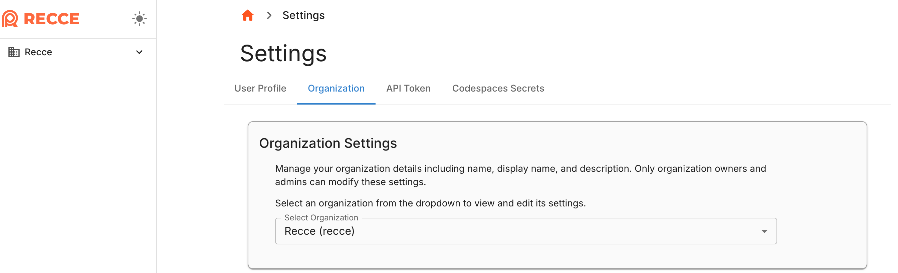
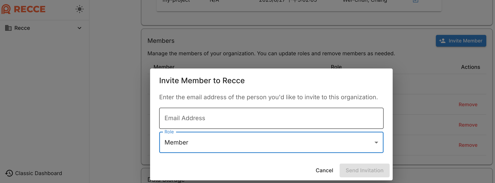
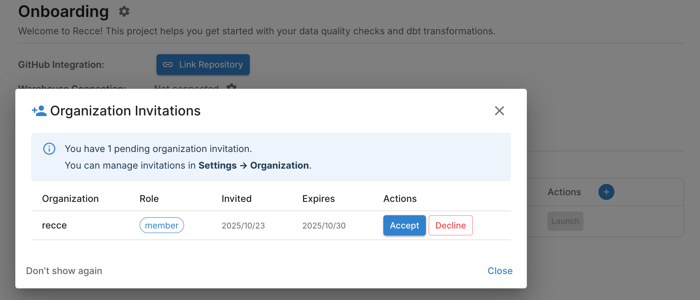

# Set Up Your Organization

After connecting your Git repo to Recce Cloud, you need to configure your organization so your team can collaborate on PR validation.

**Goal:** Configure your Cloud organization for team collaboration.

When you sign up for Cloud, you get one organization and one project. After connecting to Git, your organization and project names automatically map to your Git provider's names. You can rename them and invite team members.

## Prerequisites

- [ ] Cloud account with owner/admin access
- [ ] Git repository connected to Cloud
- [ ] Team members' email addresses

## Steps

### 1. Access organization settings

Navigate to your organization configuration.

1. Log in to [Cloud](https://cloud.reccehq.com)
2. Click **Settings** → **Organization** in the side panel

**Expected result:** Organization settings page displays your current organization.

{: .shadow}

### 2. Rename your organization (optional)

Update the organization name to match your company or team.

1. In Organization Settings, find the **Organization Name** field
2. Enter your preferred name
3. Click **Save**

**Expected result:** Organization name updates across all Cloud pages.

### 3. Set up additional projects (monorepo)

!!! note "For monorepo users"
    If your repository contains multiple dbt projects, set up additional projects before inviting team members. Skip this step if you have a single dbt project.

1. In Organization Settings, navigate to **Projects**
2. Click **Add Project**
3. Enter the project name and select the subdirectory path
4. Click **Create**

**Expected result:** New project appears in the project list and sidebar.

### 4. Rename your project (optional)

Update the project name if needed.

1. In Organization Settings, navigate to **Projects**
2. Click on the project you want to rename
3. Enter the new project name
4. Click **Save**

**Expected result:** Project name updates in the sidebar and project list.

### 5. Invite team members

Add collaborators to your organization.

1. In Organization Settings, find the **Members** section
2. Click **Invite Members**
3. Enter email addresses (use SSO email if members use SSO login)
4. Select a role for each invitee
5. Click **Send Invitation**
6. Tell invitees: when they log in, a modal appears asking them to accept the invitation. See [For Invited Users](#for-invited-users)

| Role | Permissions |
|------|-------------|
| **Owner** | The one who created this organization. Full organization management: update info, manage roles, remove members |
| **Admin** | Same permissions as Owner |
| **Member** | Upload metadata, launch Recce instances, view organization info |

!!! tip "SSO login requires Team plan or above"
    SSO login is available on the Team plan and above. See [Pricing](https://www.reccehq.com/pricing) for plan details.

**Expected result:** Invitees receive email invitations and see notifications when logged in.

{: .shadow}

## Verify Success

Confirm your setup by checking:

1. Organization name displays correctly in the sidebar
2. Invited members appear in the Members list (pending or active)
3. All projects are listed under Settings → Projects

## Troubleshooting

| Issue | Solution |
|-------|----------|
| Invitation not received | Check spam folder; verify email address matches SSO provider |
| Member sees their own org, not company org | They may have signed up with a different email than the one you invited; ask them to log in with the invited email |
| Cannot change organization name | Confirm you have Admin role |
| Project not appearing | Refresh the page; verify the subdirectory path is correct |

## For Invited Users

When you receive an invitation:

1. **Immediate response:** A notification modal appears on login. Accept or decline directly
2. **Later:** Navigate to **Settings** → **Organization** to view pending invitations

{: .shadow}

## Next Steps

- [Data Developer Workflow](data-developer.md): Learn how developers validate changes
- [Data Reviewer Workflow](data-reviewer.md): Learn how reviewers approve PRs
