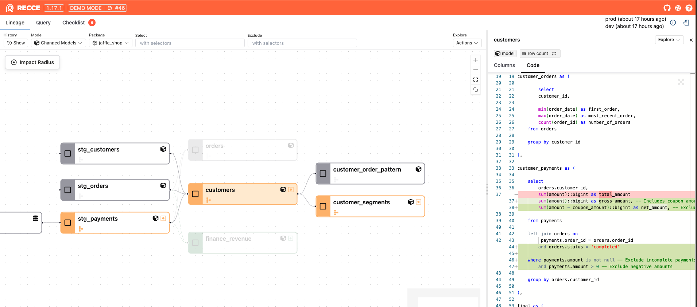
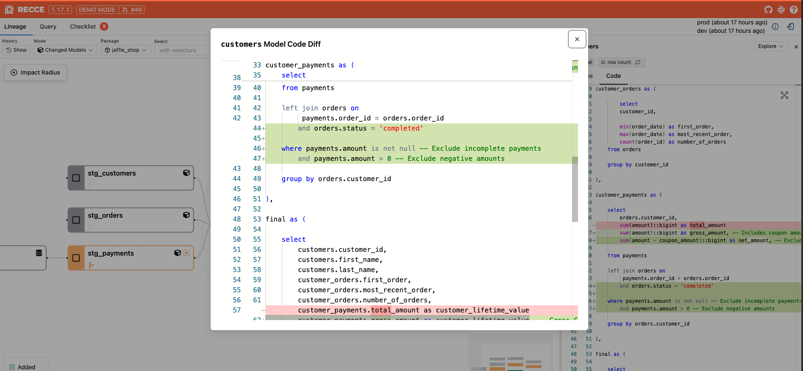

# Code Diff

The Code Diff feature allows you to compare the SQL code changes between your current branch and the base branch, helping you understand exactly what has been modified in your dbt models.

## Viewing Code Changes

When you identify a modified model in the [Lineage Diff](lineage.md), you can examine the specific code changes to understand the nature of the modifications.

### Opening Code Diff

To view the code changes for a model:

1. Click on any modified (orange) model node in the lineage view
2. In the node details panel that opens, navigate to the **Code** tab
3. The code diff will display showing the changes between branches

<figure markdown>
  {: .shadow}
  <figcaption>Viewing code changes for a modified model</figcaption>
</figure>

### Understanding the Code Diff

The code diff uses standard diff formatting to highlight changes:

- **Red lines** (with `-` prefix) show code that was removed
- **Green lines** (with `+` prefix) show code that was added  
- **Unchanged lines** appear in normal formatting for context

This visual comparison makes it easy to identify:
- New columns or transformations
- Modified business logic
- Changes to joins or filters
- Updated column names or data types

### Full Screen View

For complex changes or detailed review, you can expand the code diff to full screen:

1. Click the expand button in the top-right corner of the code diff panel
2. Review the changes in the larger view for better readability
3. Use this view when conducting thorough code reviews or sharing changes with team members

<figure markdown>
  {: .shadow}
  <figcaption>Full-screen view for detailed code review</figcaption>
</figure>

## Why Code Diff Matters

Understanding code changes is essential for:

- **Impact Assessment**: Determining if changes affect downstream models or reports
- **Code Review**: Validating that modifications align with business requirements  
- **Collaboration**: Clearly communicating what changed to stakeholders
- **Quality Assurance**: Ensuring changes don't introduce errors or break existing logic

## Next Steps

After reviewing code changes, you can:

- Examine the [impact radius](../4-downstream-impacts/impact-radius.md) to see which downstream models are affected
- Run [data diffs](../5-data-diffing/query.md) to validate that the changes produce expected results
- Add your findings to the [collaboration checklist](../6-collaboration/checklist.md) for team review

!!! tip "Best Practice"
    Always review code changes alongside data validation checks to ensure your modifications produce the expected results and don't break downstream dependencies.