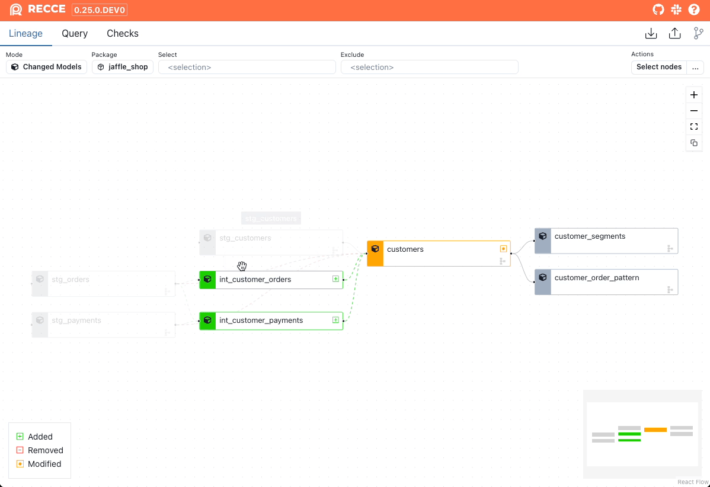
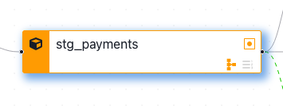
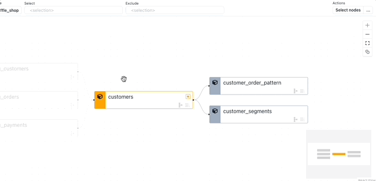

The Lineage Diff is the main interface to Recce and allows you to quickly see the potential area of impact from your dbt data modeling changes.

## Lineage Diff

It's from the Lineage Diff that you will determine which models to investigate further; and also perform the various data validation checks that will serve as proof-of-correctness of your work.

<figure markdown>
  {: .shadow}
  <figcaption>Lineage Diff</figcaption>
</figure>

### Node Summary

{: .shadow}

Models are color-coded to indicate their **status**:

- `Added` models are green.
- `Removed` models are red.
- `Modified` models are orange.

The two icons at the bottom right of each node indicate if a `row count` or `schema` change has been detected. Grayed out icons indicate no change.

<figure markdown>
  {: .shadow}
  <figcaption>Model with Schema Change detected</figcaption>
</figure>

**Note**: A row count changed icon is only shown if there is row count diff executed on this node.

<figure markdown>
  {: .shadow}
  <figcaption>Open the node details panel</figcaption>
</figure>

Click a model to open the [node details](#node-detail) panel and perform other data validation checks.

## Schema Diff

Schema Diff shows added, removed, and renamed columns. Click a model in the Lineage Diff to open the node details and view the Schema Diff.

!!! Note

    Schema Diff requires `catalog.json` in both environments.

<figure markdown>
  {: .shadow}
  <figcaption>Schema Diff</figcaption>
</figure>

<figure markdown>
  
  <figcaption>Schema Diff showing renamed column</figcaption>
</figure>

## Code Diff

Examine the specific code changes to understand the nature of the modifications.

Learn more [here](code-diff.md)

## Node Details

The node details panel shows information about a node, such as node type, schema and row count changes, and allows you to perform diffs on the node using the options accessed via the `Explore Change` button.

<figure markdown>
  {: .shadow}
  <figcaption>Explore the model</figcaption>
</figure>

You can click "Query" to jump to Query of this model. 
There are few pre-defied diff that saved your time on writing SQL snippets. 

1. Row Count Diff: shows the difference in row counts. [Learn more here](./5-data-diffing/row-count-diff.md)
2. Profile Diff
3. Value Diff
4. Top-K Diff
5. Histogram Diff

You can add the Lineage Diff of this model to the checklist. 

