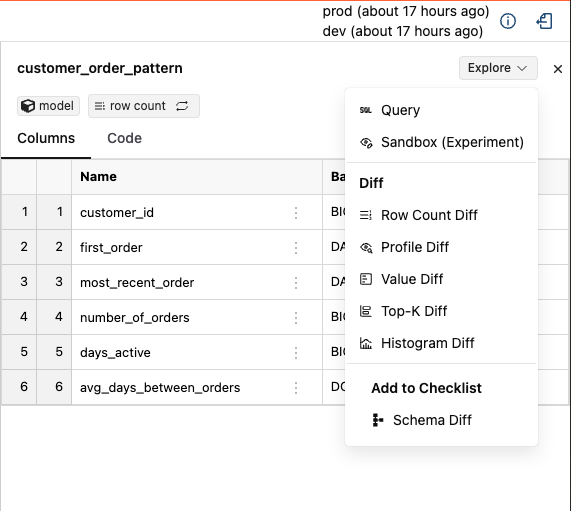

# Understanding Lineage Diff

The Lineage view is Recce's main interface for visualizing and analyzing how your dbt model changes impact your data pipeline. It shows you the potential area of impact from your modifications, helping you determine which models need further investigation and validation.

## What is Data Lineage?

Data lineage tracks the flow and transformation of data through your dbt project. In Recce, the lineage graph shows:

- **Dependencies**: Which models depend on others
- **Change Impact**: How modifications ripple through your pipeline
- **Data Flow**: The path data takes from sources to final outputs

## Viewing the Lineage Graph

From the Lineage view, you can determine which models to investigate further and perform various data validation checks that serve as proof-of-correctness of your work.

<figure markdown>
  {: .shadow}
  <figcaption>Interactive lineage graph showing modified models</figcaption>
</figure>

!!! tip "Getting Started"
    When you first open Recce, the lineage graph automatically loads showing only the models affected by your changes. This focused view helps you quickly understand the impact of your work.

## Understanding Model Nodes

### Visual Status Indicators

<figure markdown>
  {: .shadow}
  <figcaption>Example model node with status indicators</figcaption>
</figure>

Models in the lineage graph are **color-coded** to indicate their status:

- **Green**: Added models (new to your project)
- **Red**: Removed models (deleted from your project)
- **Orange**: Modified models (changed code or configuration)
- **Gray**: Unchanged models (shown for context)

### Change Detection Icons

Each model node displays two icons in the bottom-right corner that indicate detected changes:

- **Row Count Icon** : Shows when row count differences are detected
- **Schema Icon** : Shows when column or data type changes are detected

Grayed-out icons indicate no changes were detected in that category.

<figure markdown>
  {: .shadow}
  <figcaption>Model with Schema Change detected</figcaption>
</figure>

!!! note "Row Count Detection"
    The row count icon only appears after you've run a row count diff on that specific model. This helps you track which models you've already validated.

<figure markdown>
  {: .shadow}
  <figcaption>Open the node details panel</figcaption>
</figure>

## Investigating Model Changes

### Opening the Node Details Panel

Click on any model in the lineage graph to open the node details panel. This is your starting point for deeper analysis.

## Schema Diff

Schema diff helps you understand structural changes to your models.

!!! warning "Requirements"
    Schema diff requires `catalog.json` files in both your base and current environments. Make sure to run `dbt docs generate` in both environments before starting your Recce session.

### Viewing Schema Changes

Click on a model to view its schema diff in the node details panel.

<figure markdown>
  {: .shadow}
  <figcaption>Interactive schema diff showing column changes</figcaption>
</figure>

### Types of Schema Changes

Schema diff identifies:

- **Added columns**: New fields in your model (shown in green)
- **Removed columns**: Fields that no longer exist (shown in red)
- **Renamed columns**: Fields that have changed names (shown with arrows)
- **Data type changes**: Modifications to column types

<figure markdown>
  {: .shadow}
  <figcaption>Schema diff showing renamed column</figcaption>
</figure>

## Code Diff

Understanding the code changes helps you analyze the root cause of data differences.

From any model's node details panel, you can view the exact code changes that were made. This helps you understand:

- What SQL logic was modified
- How transformations changed
- Why data differences might be occurring

Learn more about viewing and analyzing code changes in the [Code Diff guide](code-diff.md).

## Node Details

### Node Details Overview

The node details panel provides comprehensive information about the selected model:

<figure markdown>
  {: .shadow}
  <figcaption>Node details panel with exploration options</figcaption>
</figure>

From this panel, you can:

- **View model information**: Node type, materialization, and basic metadata
- **Examine changes**: See what specifically changed in the model
- **Run validations**: Execute pre-built data diffs and custom queries
- **Add to checklist**: Document important findings for review

### Available Data Validation Checks

Click the "Explore Change" button to access pre-built validation checks that save time on writing SQL:

1. **[Row Count Diff](../5-data-diffing/row-count-diff.md)**: Compare the number of rows between environments
2. **[Profile Diff](../5-data-diffing/profile-diff.md)**: Analyze column-level statistics and distributions
3. **[Value Diff](../5-data-diffing/value-diff.md)**: Identify specific value changes between datasets
4. **[Top-K Diff](../5-data-diffing/topK-diff.md)**: Compare the most common values in your data
5. **[Histogram Diff](../5-data-diffing/histogram-diff.md)**: Visualize data distribution changes

### Custom Query Analysis

Click "Query" to open the query interface where you can:

- Write custom SQL to investigate changes
- Run ad-hoc comparisons between environments
- Validate specific business logic or data quality rules

## Building Your Validation Checklist

As you investigate changes, you can add important findings to your checklist for documentation and collaboration purposes.

!!! tip "Collaboration Best Practice"
    Use the checklist feature to document your validation process. This creates a clear record of what you've tested and verified, making it easier for teammates to review your changes.

## Next Steps

After reviewing the lineage changes:

1. **Validate**: Run data diffs on critical models to verify changes are correct
2. **Document**: Add key findings to your checklist with clear descriptions
3. **Collaborate**: Share your analysis with team members for review
4. **Integrate**: Use Recce's workflow integration to automate validation in your CI/CD process

Ready to dive deeper into specific validation techniques? Explore the [Data Diffing](../5-data-diffing/row-count-diff.md) section to learn about different ways to validate your changes. 

