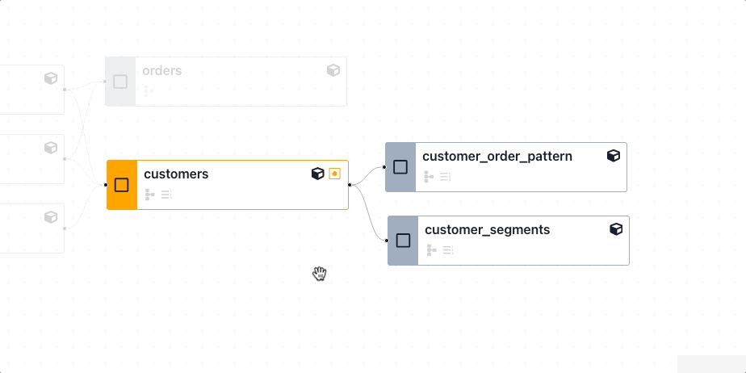

## Multi-Models Selection

Multiple models can be selected in the Lineage DAG. This enables actions to be performed on multiple models at the same time such as Row Count Diff, or Value Diff.

### Select Models Individually

To select multiple models individually, click the checkbox on the models you wish to select.

<figure markdown>
  {: .shadow}
  <figcaption>Select multiple models individually</figcaption>
</figure>

### Select Parent or Child models

To select a node and all of its parents or children:

1. Click the checkbox on the node.
2. Right-click the node.
3. Click to select either parent or child models.

<figure markdown>
  {: .shadow}
  <figcaption>Select a node and its parents or children</figcaption>
</figure>

### Perform actions on multiple models

After selecting the desired models, use the Actions menu at the top right of the screen to perform diffs or add checks.

<figure markdown>
  {: .shadow}
  <figcaption>Perform actions on multiple models</figcaption>
</figure>

### Example - Row Count Diff

An example of selecting multiple models to perform a multi-node row count diff:

<figure markdown>
  {: .shadow}
  <figcaption>Perform a Row Count Diff on multiple models</figcaption>
</figure>

### Example - Value Diff

An example of selecting multiple models to perform a multi-node Value Diff:

<figure markdown>
  {: .shadow}
  <figcaption>Perform a Value Diff on multiple models</figcaption>
</figure>

### Schema and Lineage Diff

From the Lineage DAG, click the Actions dropdown menu and click Lineage Diff or Schema Diff from the Add to Checklist section. This will add:

- Lineage Diff: The current Lineage view, dependent on your <a href="#select-models">model selection</a> options.
- Schema Diff: A diff of all models if none are selected, or specific <a href="#multi-node-selection">selected models</a>.

<figure markdown>
  {: .shadow}
  <figcaption>Add a Lineage Diff Check or Schema Check via the Actions dropdown menu</figcaption>
</figure>

Recce supports dbt [node selection](https://docs.getdbt.com/reference/node-selection/syntax) in the [lineage diff](./lineage.md#lineage-diff). This enables you to target specific resources with data checks by selecting or excluding models.

## Supported syntax and methods

Since Recce uses dbt's built-in node selector, it supports most of the selecting methods. Here are some examples:

- Select a node: `my_model`
- select by tag: `tag:nightly`
- Select by wildcard: `customer*`
- Select by graph operators:  `my_model+`, `+my_model`, `+my_model`, `1+my_model+`
- Select by union: `model1 model2`
- Select by intersection: `stg_invoices+,stg_accounts+`
- Select by state: `state:modified`, `state:modified+`

### Use `state` method

In dbt, you need to specify the `--state` option in the CLI. In Recce, we use the base environment as the state, allowing you to use the selector on the fly.

### Removed models
Another difference is that in dbt, you cannot select removed models. However, in Recce, you can select removed models and also find them using the graph operator. This is a notable distinction from dbt's node selection capabilities.

## Supported Diff

In addition to lineage diff, other types of diff also support node selection. You can find these features in the **...** button in the top right corner. Currently supported diffs include:

- Lineage diff
- Row count diff
- Schema diff

{: .shadow}

## Limitation

- ["result" method](https://docs.getdbt.com/reference/node-selection/syntax#the-result-status) not supported
- ["source_status" method](https://docs.getdbt.com/reference/node-selection/syntax#the-source_status-status) not supported.
- [YAML selectors](https://docs.getdbt.com/reference/node-selection/yaml-selectors) not supported.
