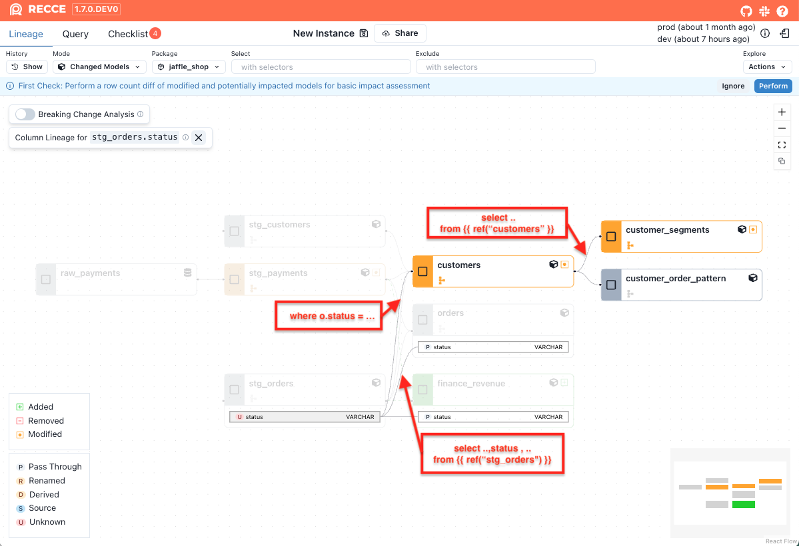

**Impact Radius** helps you analyze changes and identify downstream impacts at the column level.

While dbt provides a similar capability using the [state selector](https://docs.getdbt.com/reference/node-selection/methods#state) with `state:modified+` to identify modified nodes and their downstream dependencies, Recce goes further. By analyzing SQL code directly, Recce enables **fine-grained impact radius analysis**. It reveals how changes to specific columns can ripple through your data pipeline, helping you prioritize which models—and even which columns—deserve closer attention.


=== "state:modified+"
    
    {: .shadow}

=== "Impact Radius"
    
    {: .shadow}


## Usage

### Show impact radius

1. Click the **Impact Radius** button in the upper-left corner.

    {: .shadow}

1. The impact radius will be displayed.

    {: .shadow}

1. To exit impact radius view, click the close button in the upper-left corner.
    
    {: .shadow}

### Show impact radius for a single changed model

1. Hover over a changed model, then click the **target icon** or right-click the model and click the **Show Impact Radius**

    {: .shadow}

1. The impact radius for this model will be displayed.

    {: .shadow}

1. To exit impact radius view, click the close button in the upper-left corner.
    
    {: .shadow}

## Impact Radius of a Column

The **right side of the [Column-Level Lineage](../3-visualized-change/column-level-lineage.md) (CLL)** graph represents the **impact radius** of a selected column.
This view helps you quickly understand what will be affected if that column changes.

### What does the impact radius include?

- **Downstream columns** that directly reference the selected column
- **Downstream models** that directly depend on the selected column
- **All indirect downstream columns and models** that transitively depend on it

This helps you evaluate both the direct and downstream effects of a column change, making it easier to understand its overall impact.


### Example: Simplified Model Chain

Given the following models, here's how changes to `stg_orders.status` would impact downstream models:

```sql
-- stg_orders.sql
select
  order_id,
  customer_id,
  status,
  ...
from {{ ref("raw_orders") }}


-- orders.sql
select
  order_id,
  customer_id,
  status,
  ...
from {{ ref("stg_orders") }}


-- customers.sql
select
  c.customer_id,
  ...
from {{ ref("stg_customers") }} as c
join {{ ref("stg_orders") }} as o
  on c.customer_id = o.customer_id
where o.status = 'completed'
group by c.customer_id


-- customer_segments.sql
select
  customer_id,
  ...
from {{ ref("customers") }}
```

{: .shadow}

The following impact is detected:

- **orders**: This model is partially impacted, as it selects the `status` column directly from `stg_orders` but does not apply any transformation or filtering logic. The change is limited to the `status` column only.

- **customers**: This model is fully impacted, because it uses `status` in a WHERE clause (`where o.status = 'completed'`). Any change to the logic in `stg_orders.status` can affect the entire output of the model.

- **customer_segments**: This model is indirectly impacted, as it depends on the `customers` model, which itself is fully impacted. Even though `customer_segments` does not directly reference `status`, changes can still propagate downstream via its upstream dependency.


## How it works

Two core features power the impact radius analysis:

**[Breaking Change Analysis](./breaking-change-analysis.md)** classifies modified models into three categories:

- **Breaking changes**: Impact all downstream **models**
- **Non-breaking changes**: Do not impact any downstream **models**
- **Partial breaking changes**: Impact only downstream **models or columns** that depend on the modified columns

**[Column-level lineage](./column-level-lineage.md)** analyzes your model's SQL to identify column-level dependencies:

- Which upstream **columns** are used as filters or grouping keys. If those upstream **columns** change, the current **model** is impacted.
- Which upstream **columns** a specific column references. If those upstream **columns** change, the specific **column** is impacted.

## Putting It Together

With the insights from the two features above, Recce determines the impact radius:

1. If a model has a **breaking change**, include all downstream models in the impact radius.
1. If a model has a **non-breaking change**, include only the downstream columns and models of newly added columns.
1. If a model has a **partial breaking change**, include the downstream columns and models of added, removed, or modified columns.


