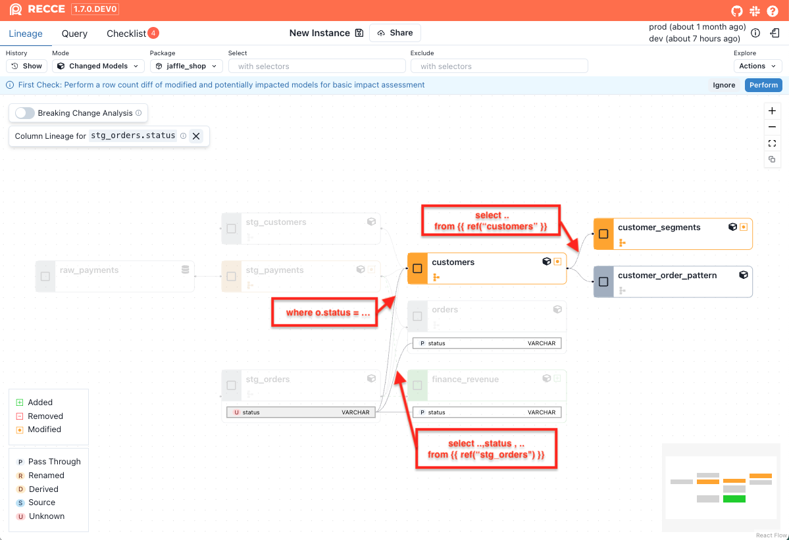

# Transformation Types

The transformation type is also displayed for each column, which will help you understand how the column was generated or modified.

| Type | Description  |
|------|--------------|
| Pass-through  |The column is directly selected from the upstream table. |
| Renamed | The column is selected from the upstream table but with a different name. |
| Derived | The column is created through transformations applied to upstream columns, such as calculations, conditions, functions, or aggregations. |
| Source | The column is not derived from any upstream data. It may originate from a seed/source node, literal value, or data generation function. |
| Unknown | We have no information about the transformation type. This could be due to a parse error, or other unknown reason. |


## Impact Radius of a Column

The **right side of the Column-Level Lineage (CLL)** graph represents the **impact radius** of a selected column.
This view helps you quickly understand what will be affected if that column changes.

### What does the impact radius include?

- **Downstream columns** that directly reference the selected column
- **Downstream models** that directly depend on the selected column
- **All indirect downstream columns and models** that transitively depend on it

This helps you evaluate both the direct and downstream effects of a column change, making it easier to understand its overall impact.


### Example: Simplified Model Chain

Given the following models, here's how changes to `stg_orders.status` would impact downstream models:

```sql
-- stg_orders.sql
select
  order_id,
  customer_id,
  status,
  ...
from {{ ref("raw_orders") }}


-- orders.sql
select
  order_id,
  customer_id,
  status,
  ...
from {{ ref("stg_orders") }}


-- customers.sql
select
  c.customer_id,
  ...
from {{ ref("stg_customers") }} as c
join {{ ref("stg_orders") }} as o
  on c.customer_id = o.customer_id
where o.status = 'completed'
group by c.customer_id


-- customer_segments.sql
select
  customer_id,
  ...
from {{ ref("customers") }}
```

{: .shadow}

The following impact is detected:

- **orders**: This model is partially impacted, as it selects the `status` column directly from `stg_orders` but does not apply any transformation or filtering logic. The change is limited to the `status` column only.

- **customers**: This model is fully impacted, because it uses `status` in a WHERE clause (`where o.status = 'completed'`). Any change to the logic in `stg_orders.status` can affect the entire output of the model.

- **customer_segments**: This model is indirectly impacted, as it depends on the `customers` model, which itself is fully impacted. Even though `customer_segments` does not directly reference `status`, changes can still propagate downstream via its upstream dependency.


