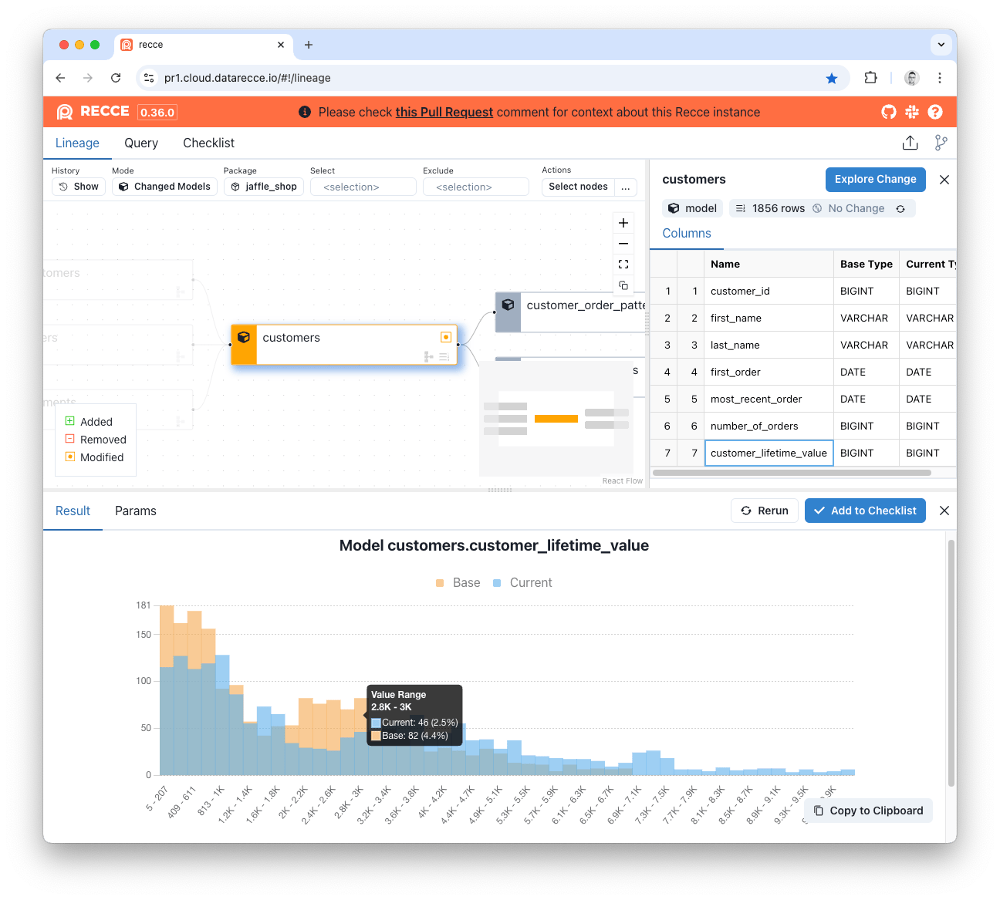
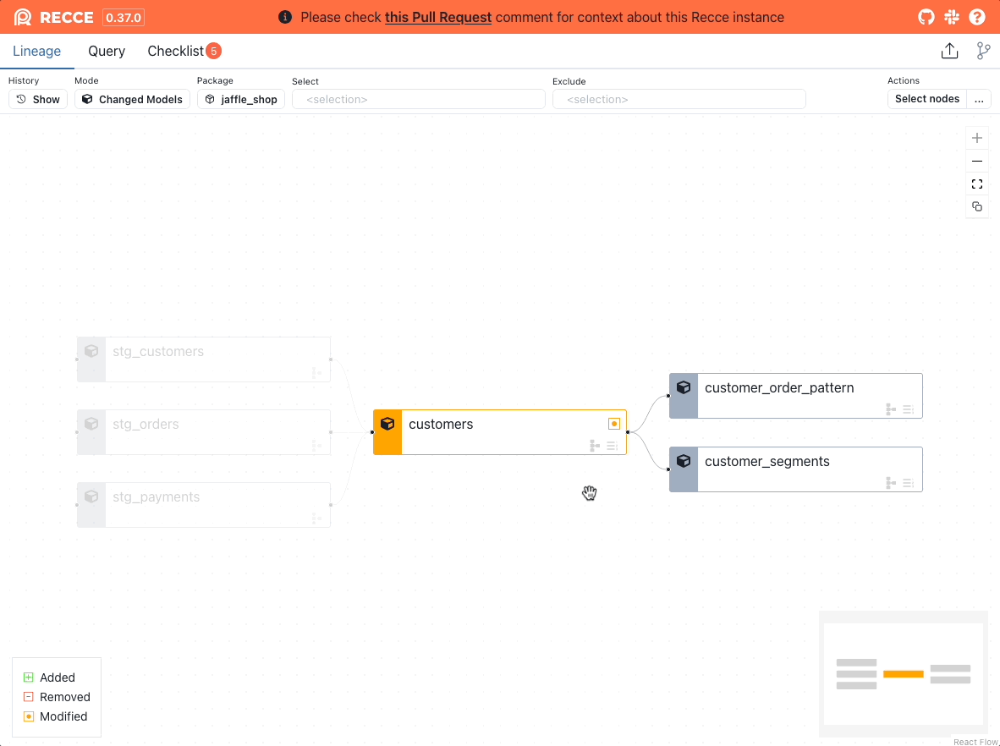

# Histogram Diff

Histogram Diff compares the distribution of a numeric column in an overlay histogram chart.

<figure markdown>
  
  <figcaption>Histogram Diff</figcaption>
</figure>

A Histogram Diff can be generated in two ways.

**Via the Explore Change button menu:**

1. Select the model from the Lineage DAG.
2. Click the `Explore Change` button.
3. Click `Histogram Diff`.
4. Select a column to diff.
5. Click `Execute`.

**Via the column options menu:**

1. Select the model from the Lineage DAG.
2. Hover over the column in the Node Details panel.
3. Click the vertical 3 dots `...`
4. Click `Histogram Diff`.

<figure markdown>
  {: .shadow}
  <figcaption>Generate a Recce Histogram Diff from the column options</figcaption>
</figure>

#### SQL Execution

Histogram Diff generates SQL queries to create distribution histograms for numeric and date columns. The queries use binning strategies to group values and count occurrences in each bin, supporting both integer and floating-point data types.

You can review the exact SQL generation functions in the [HistogramDiffTask class](https://github.com/DataRecce/recce/blob/main/recce/tasks/histogram.py#L160).
