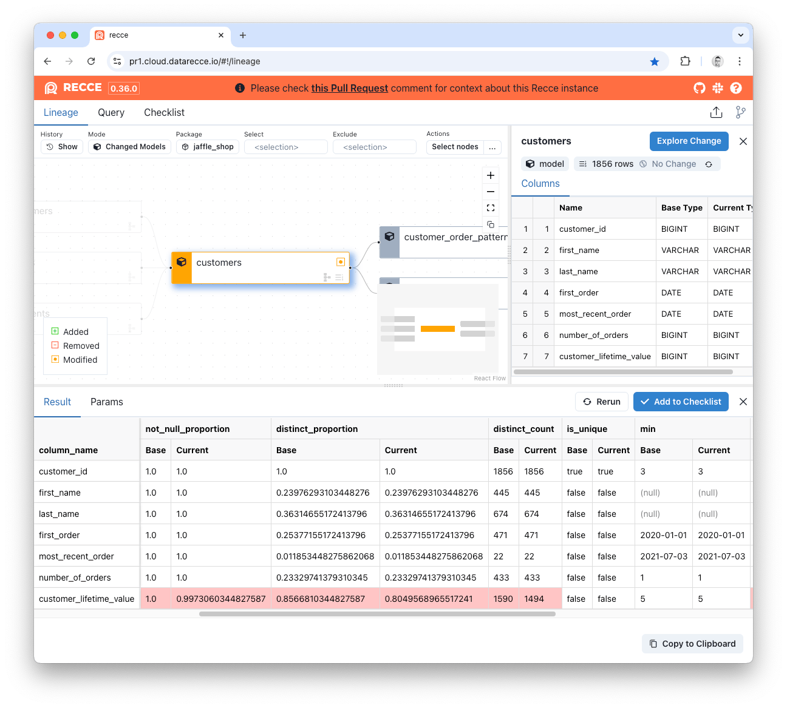

# Profile Diff

Profile Diff compares the basic statistic (e.g. count, distinct count, min, max, average) for each column in models between two environments.

1. Select the model from the Lineage DAG.
2. Click the `Expore Change` button.
3. Click `Profile Diff`.

#### SQL Execution

Profile Diff generates SQL queries using Jinja templates to calculate statistical measures for each column in your models. The queries analyze data distribution, null values, uniqueness, and numerical statistics.

You can review the exact [SQL templates](https://github.com/DataRecce/recce/blob/main/recce/tasks/profile.py#L14).

<figure markdown>
  
  <figcaption>Profile Diff</figcaption>
</figure>

The Statistics:

- Row count
- Not null proportion
- Distinct proportion
- Distinct count
- Is unique
- Minimum
- Maximum
- Average
- Median
