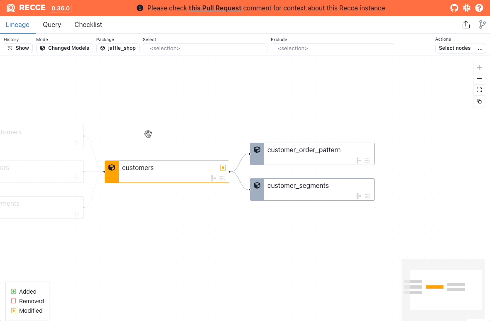

# Row Count Diff

Row Count Diff shows the difference in row count between the base and current environments.

1. Click the model in the Lineage DAG.
2. Click the `Explore Change` button in the node details panel.
3. Click `Row Count Diff`.

<figure markdown>
  {: .shadow}
  <figcaption>Row Count Diff - Single model</figcaption>
</figure>