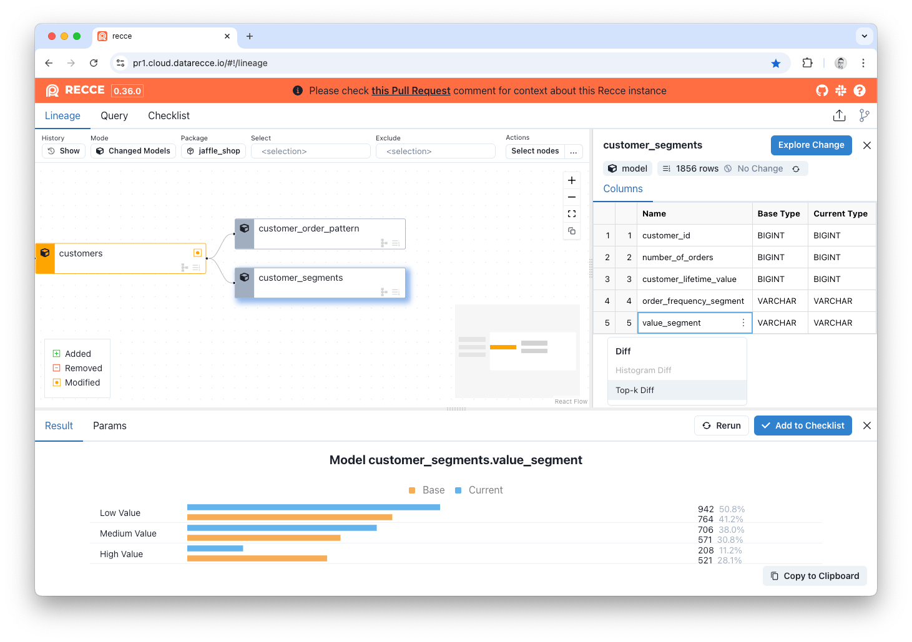
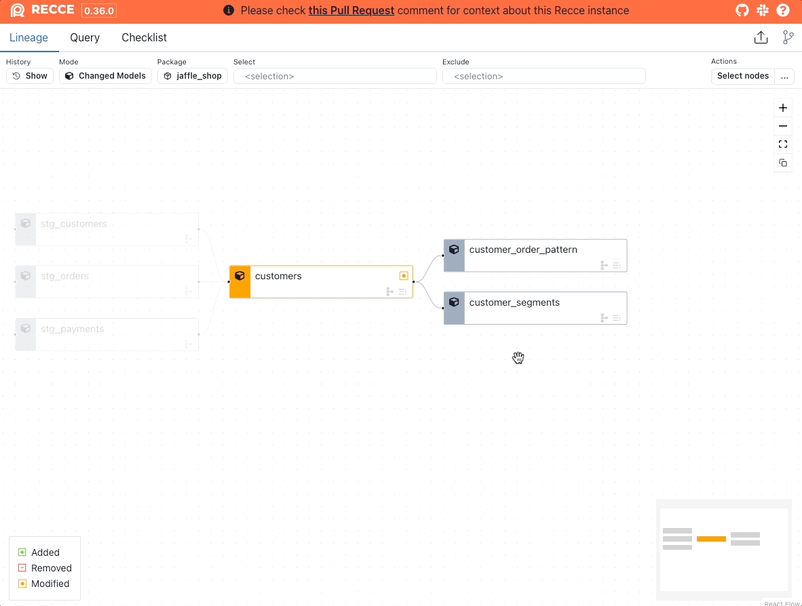

# Top-K Diff

Top-K Diff compares the distribution of a categorical column. The top 10 elements are shown by default, which can be expanded to the top 50 elements.

<figure markdown>
  
  <figcaption>Recce Top-K Diff</figcaption>
</figure>

A Top-K Diff can be generated in two ways.

**Via the Explore Change button menu:**

1. Select the model from the Lineage DAG.
2. Click the `Explore Change` button.
3. Click `Top-K Diff`.
4. Select a column to diff.
5. Click `Execute`.

**Via the column options menu:**

1. Select the model from the Lineage DAG.
2. Hover over the column in the Node Details panel.
3. Click the vertical 3 dots `...`
4. Click `Top-K Diff`.

<figure markdown>
  {: .shadow}
  <figcaption>Generate a Recce Top-K Diff </figcaption>
</figure>

#### SQL Execution

Top-K Diff generates SQL queries using FULL OUTER JOIN to compare the most frequent values in categorical columns between environments. The queries group by column values and count occurrences to identify the top K categories.

You can review the exact SQL templates in the [TopKDiffTask class](https://github.com/DataRecce/recce/blob/main/recce/tasks/top_k.py#L15).

