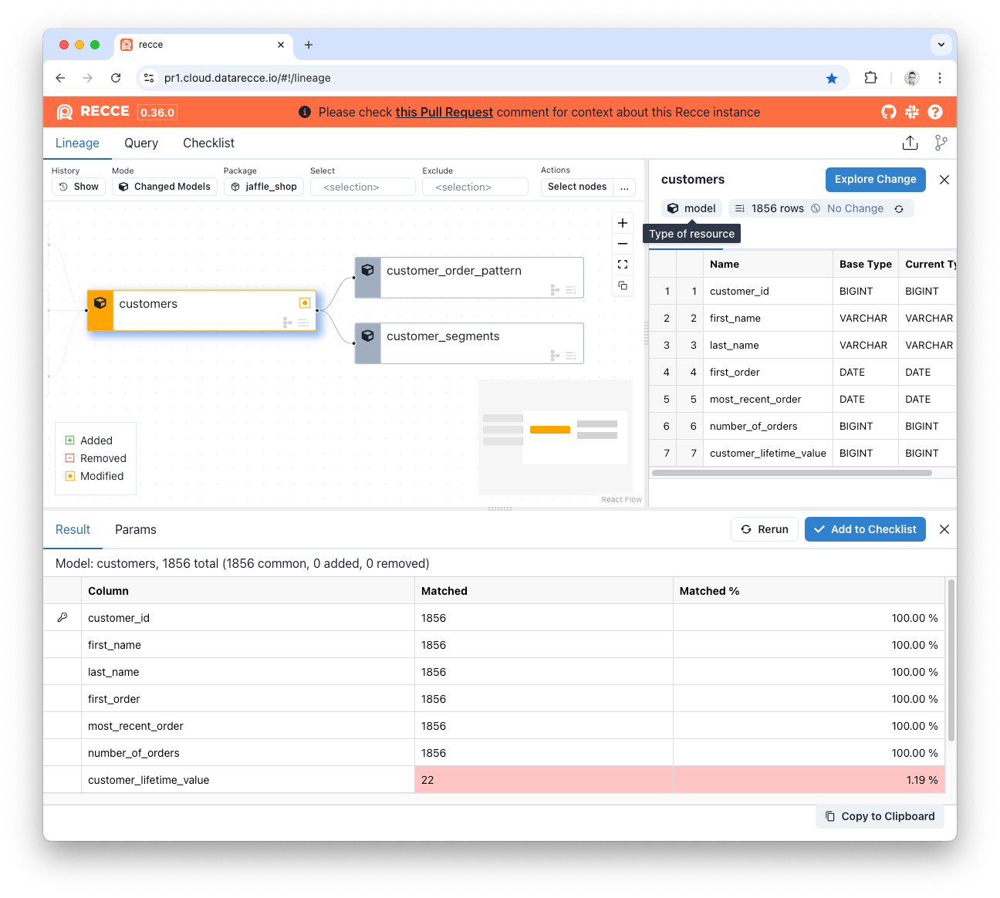
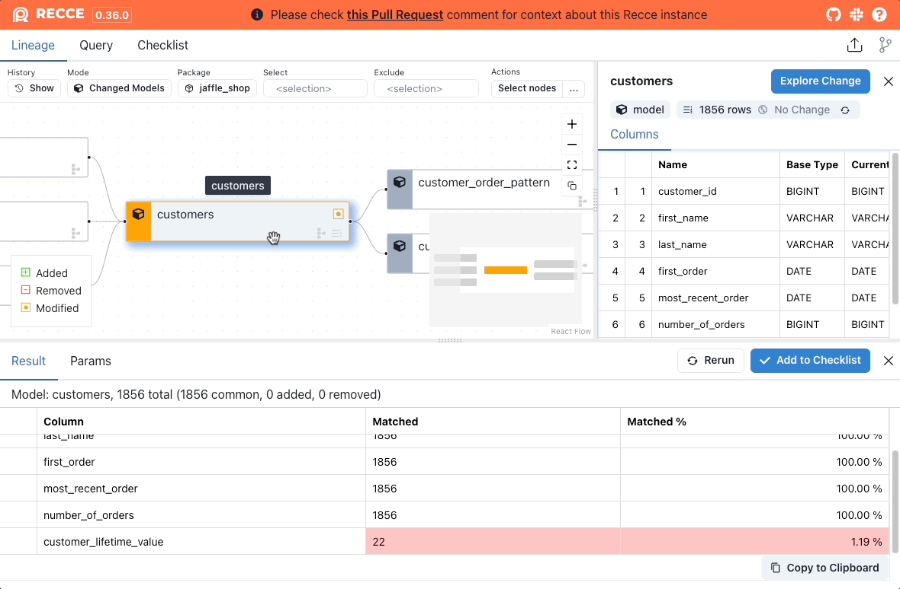

Value Diff shows the matched count and percentage for each column in the table. It uses the primary key(s) to uniquely identify the records between the model in both environments.

The primary key (PK) is automatically inferred by the first column with the [unique](https://docs.getdbt.com/reference/resource-properties/data-tests#unique) test. If no primary key is detected at least one column is required to be specified as the primary key.

<figure markdown>
  
  <figcaption>Value Diff</figcaption>
</figure>

- **Added**: Newly added PKs.
- **Removed**: Removed PKs.
- **Matched**: For a column, the count of matched value of common PKs.
- **Matched %**: For a column, the ratio of matched over common PKs.

View mismatched values at the row level by clicking the `show mismatched values` option on a column name:

{: .shadow}

## SQL Execution

Value Diff generates SQL queries using Jinja templates to compare data between your base and current environments. The queries perform a FULL OUTER JOIN on primary keys to identify added, removed, and mismatched records.

You can review the exact SQL templates in the [ValueDiffTask class](https://github.com/DataRecce/recce/blob/main/recce/tasks/valuediff.py#L80).