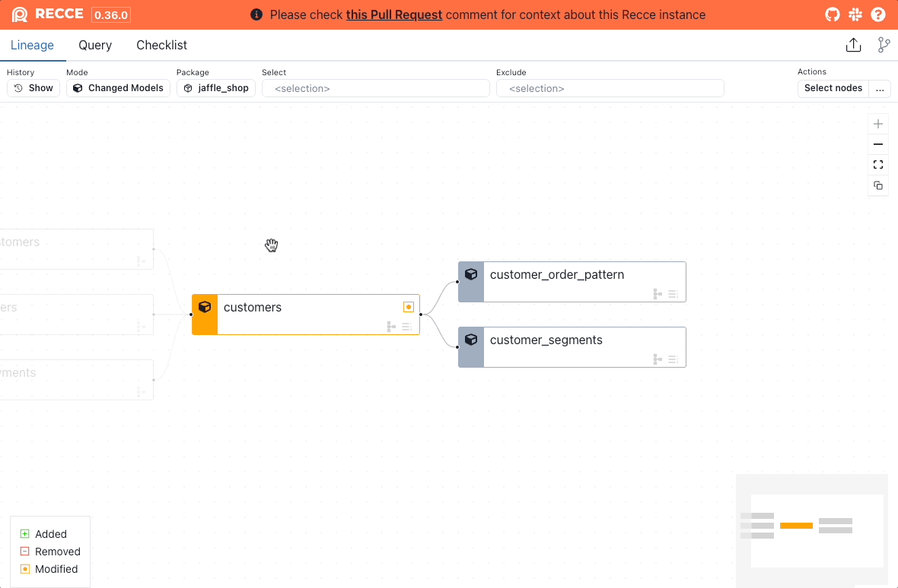
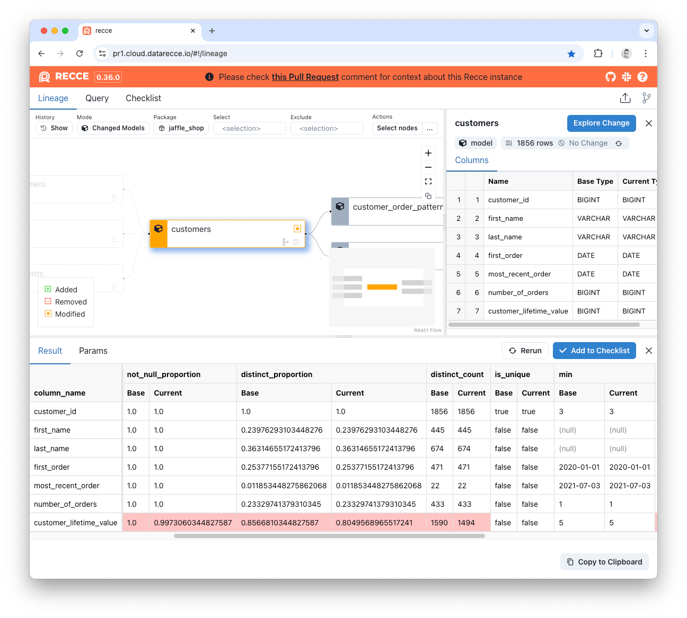
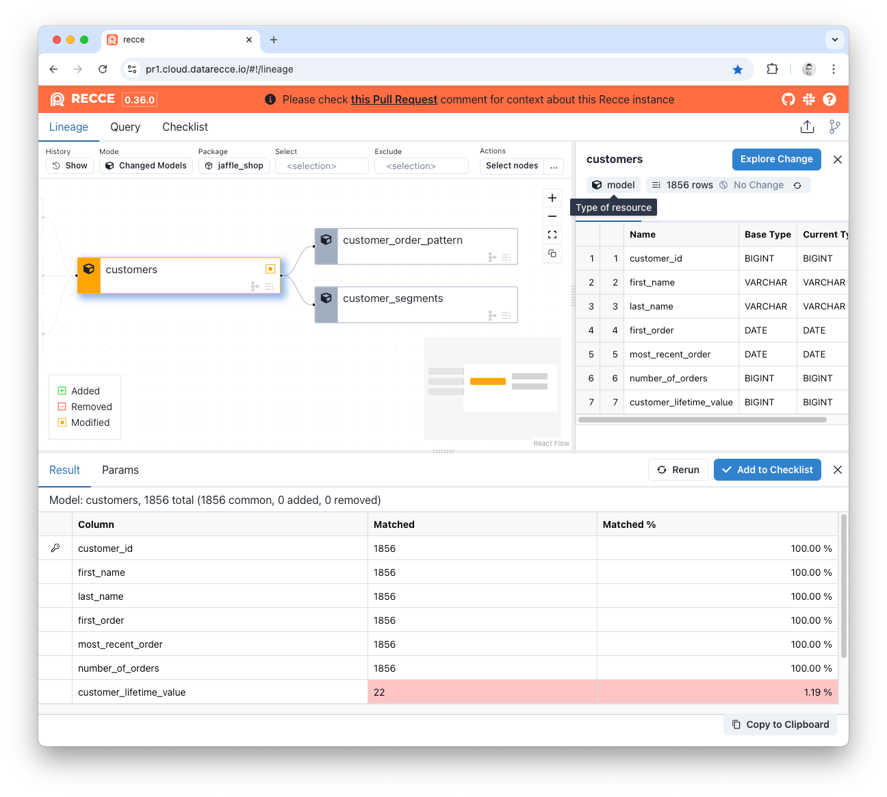
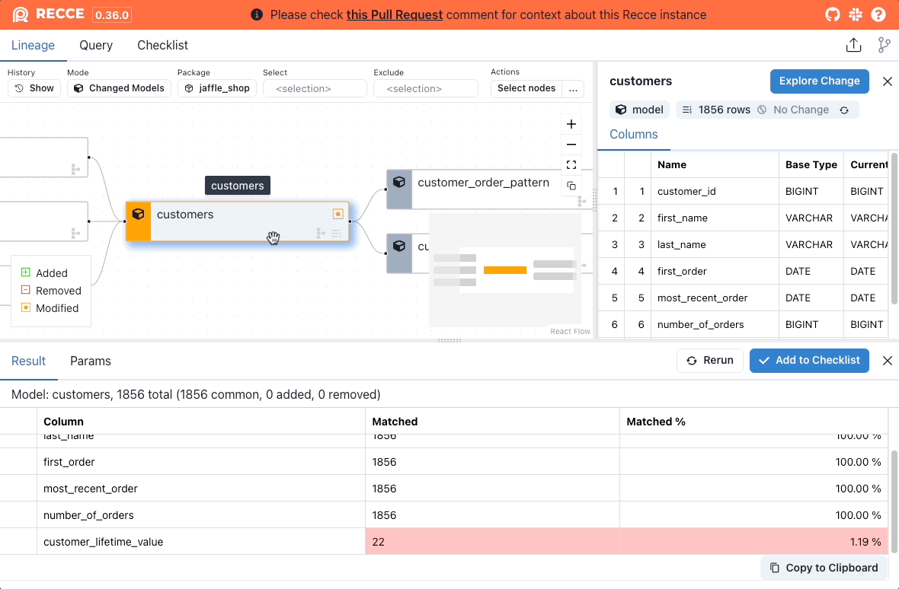
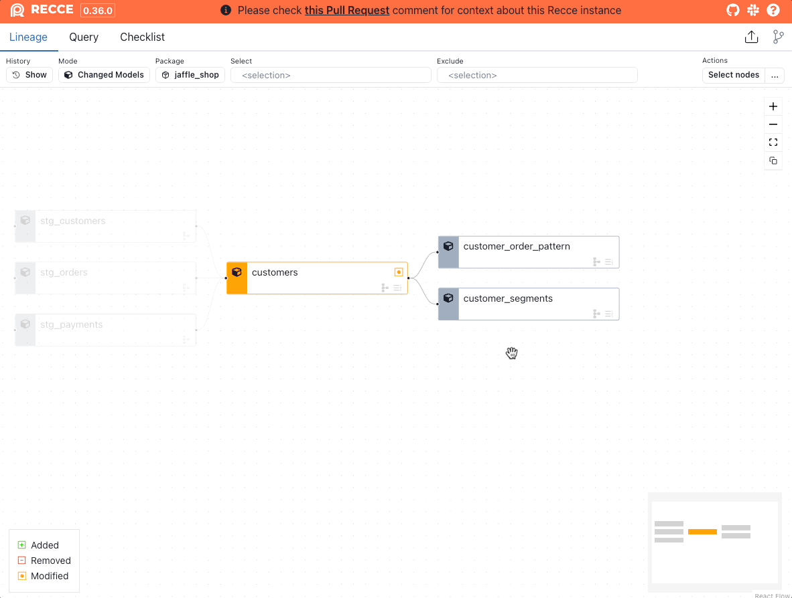
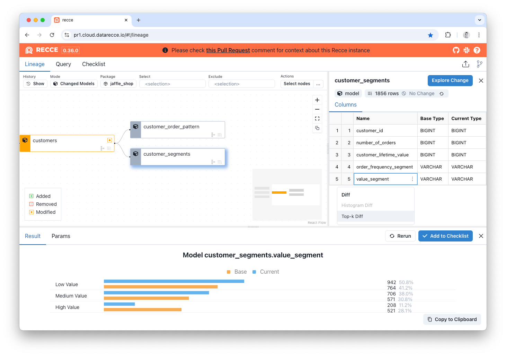
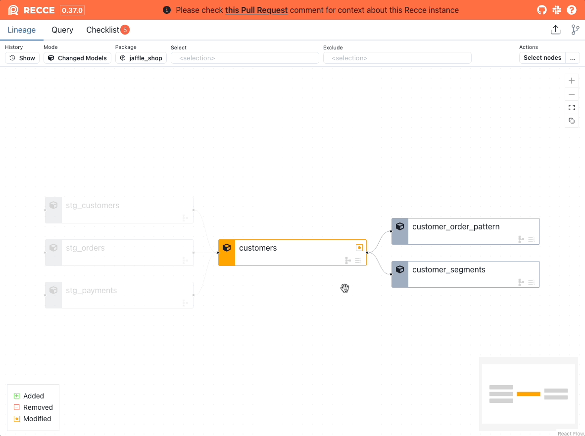
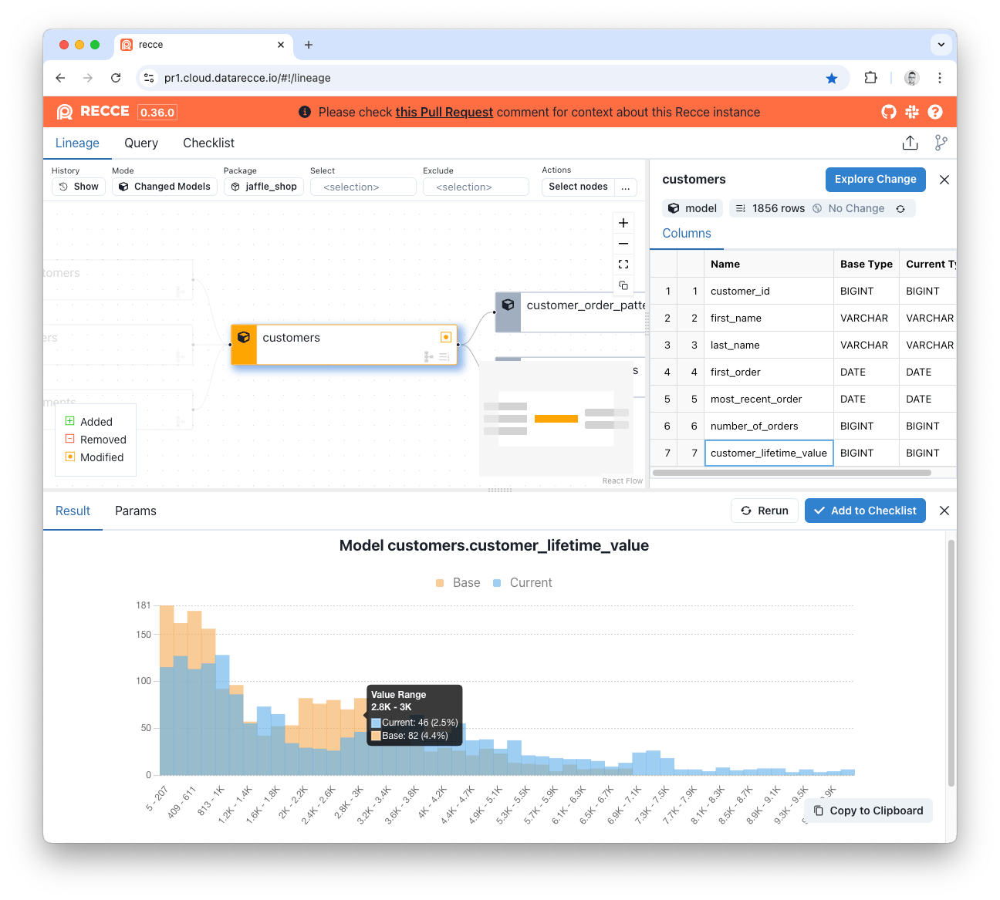
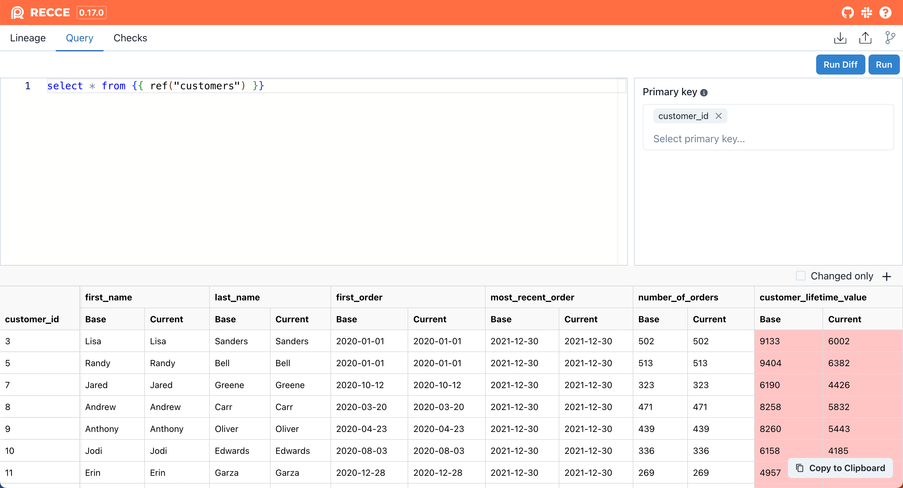
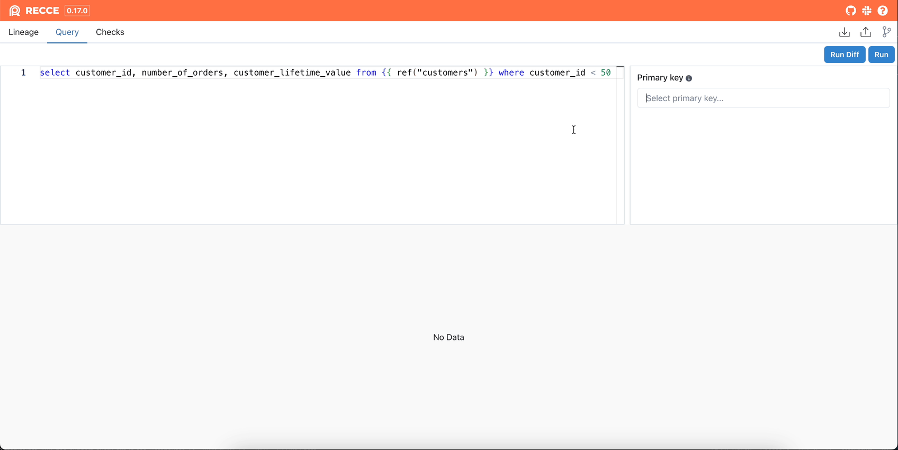

# Data Diffing

Data diffing validates that your model changes produce the expected results. Each diff type serves a different validation purpose, from quick row counts to detailed value comparisons.

## Overview

| Diff Type | Purpose | Query Cost | Best For |
|-----------|---------|------------|----------|
| [Row Count](#row-count-diff) | Compare record counts | Low | Quick sanity check |
| [Profile](#profile-diff) | Column-level statistics | Medium | Distribution analysis |
| [Value](#value-diff) | Row-by-row comparison | High | Exact match verification |
| [Top-K](#top-k-diff) | Categorical distribution | Medium | Categorical columns |
| [Histogram](#histogram-diff) | Numeric distribution | Medium | Numeric columns |
| [Query](#query-diff) | Custom SQL comparison | Varies | Flexible validation |

## Choosing the Right Diff

A common approach is to start with lightweight checks and progressively drill down as needed. This decision tree provides a suggested workflow:

```
Start with Row Count
    │
    ├─ Counts match? → Profile Diff for deeper stats
    │
    └─ Counts differ?
           │
           ├─ Expected? → Document in checklist
           │
           └─ Unexpected? → Value Diff to find specific changes
                              │
                              └─ For specific columns:
                                    • Categorical → Top-K Diff
                                    • Numeric → Histogram Diff
                                    • Custom logic → Query Diff
```


## Row Count Diff

Compare the number of rows between base and current environments.

**When to use:** Quick validation that filters or joins didn't unexpectedly add or remove records.

### Running Row Count Diff

1. Click a model in the Lineage DAG
2. Click **Explore Change** > **Row Count Diff**

<figure markdown>
  {: .shadow}
  <figcaption>Row Count Diff for a single model</figcaption>
</figure>

### Interpreting Results

| Result | Meaning |
|--------|---------|
| Count unchanged | No records added or removed |
| Count increased | New records added (check if expected) |
| Count decreased | Records removed (verify filters/joins) |

---

## Profile Diff

Compare column-level statistics between environments.

**When to use:** Validate that transformations didn't unexpectedly change data distributions.

### Statistics Compared

| Statistic | Description |
|-----------|-------------|
| Row count | Total records |
| Not null % | Proportion of non-null values |
| Distinct % | Proportion of unique values |
| Distinct count | Number of unique values |
| Is unique | Whether all values are unique |
| Min / Max | Range of values |
| Average / Median | Central tendency |

### Running Profile Diff

1. Select a model from the Lineage DAG
2. Click **Explore Change** > **Profile Diff**

<figure markdown>
  
  <figcaption>Profile Diff showing column statistics</figcaption>
</figure>

### Interpreting Results

Look for unexpected changes in:

- **Null rates** - Did a column become more/less nullable?
- **Distinct counts** - Did cardinality change unexpectedly?
- **Min/Max** - Did value ranges shift?

---

## Value Diff

Compare actual values row-by-row using primary keys.

**When to use:** Verify exact data matches when precision matters.

### How It Works

Value Diff uses primary keys to match records between environments, then compares each column value. Primary keys are auto-detected from columns with the `unique` test.

<figure markdown>
  
  <figcaption>Value Diff showing match percentages</figcaption>
</figure>

### Result Columns

| Column | Meaning |
|--------|---------|
| **Added** | New PKs in current (not in base) |
| **Removed** | PKs in base (not in current) |
| **Matched** | Count of matching values for common PKs |
| **Matched %** | Percentage match for common PKs |

### Viewing Mismatches

Click **show mismatched values** on a column to see row-level differences:

{: .shadow}

---

## Top-K Diff

Compare the distribution of categorical columns by showing the most frequent values.

**When to use:** Validate categorical data hasn't shifted unexpectedly (status codes, categories, regions).

### Running Top-K Diff

**Via Explore Change:**

1. Select model > **Explore Change** > **Top-K Diff**
2. Select a column
3. Click **Execute**

**Via Column Menu:**

1. Hover over a column in Node Details
2. Click **...** > **Top-K Diff**

<figure markdown>
  {: .shadow}
  <figcaption>Generate a Top-K Diff from the column menu</figcaption>
</figure>

### Options

| Option | Description |
|--------|-------------|
| Top 10 | Default view |
| Top 50 | Expanded view for more categories |

<figure markdown>
  
  <figcaption>Top-K Diff comparing category distributions</figcaption>
</figure>

---

## Histogram Diff

Compare the distribution of numeric columns using binned histograms.

**When to use:** Validate numeric distributions haven't shifted (amounts, scores, durations).

### Running Histogram Diff

**Via Explore Change:**

1. Select model > **Explore Change** > **Histogram Diff**
2. Select a numeric column
3. Click **Execute**

**Via Column Menu:**

1. Hover over a numeric column
2. Click **...** > **Histogram Diff**

<figure markdown>
  {: .shadow}
  <figcaption>Generate a Histogram Diff from column options</figcaption>
</figure>

<figure markdown>
  
  <figcaption>Histogram Diff showing overlaid distributions</figcaption>
</figure>

---

## Query Diff

Write custom SQL to compare any query results between environments.

**When to use:** Flexible validation for complex scenarios not covered by standard diffs.

### Running Query Diff

1. Open the Query page
2. Write SQL using dbt syntax:
   ```sql
   select * from {{ ref("mymodel") }}
   ```
3. Click **Run Diff**

<figure markdown>
  
  <figcaption>Query Diff interface</figcaption>
</figure>

### Comparison Modes

| Mode | When to Use | How It Works |
|------|-------------|--------------|
| **Client-side** | No primary key | Fetches first 2,000 rows, compares locally |
| **Warehouse** | Primary key specified | Compares in warehouse, shows only differences |

!!! tip "Keyboard Shortcuts (Mac)"
    - `⌘ Enter` - Run query
    - `⌘ ⇧ Enter` - Run query diff

### Result Options

| Option | Description |
|--------|-------------|
| **Primary Key** | Click key icon to set comparison key |
| **Pinned Column** | Show specific columns first |
| **Changed Only** | Hide unchanged rows and columns |

<figure markdown>
  {: .shadow}
  <figcaption>Query Diff with filtering options</figcaption>
</figure>

---

## Related

- [Lineage Diff](lineage-diff.md) - Visualize change impact
- [Checklist](../6-collaboration/checklist.md) - Save validation results
