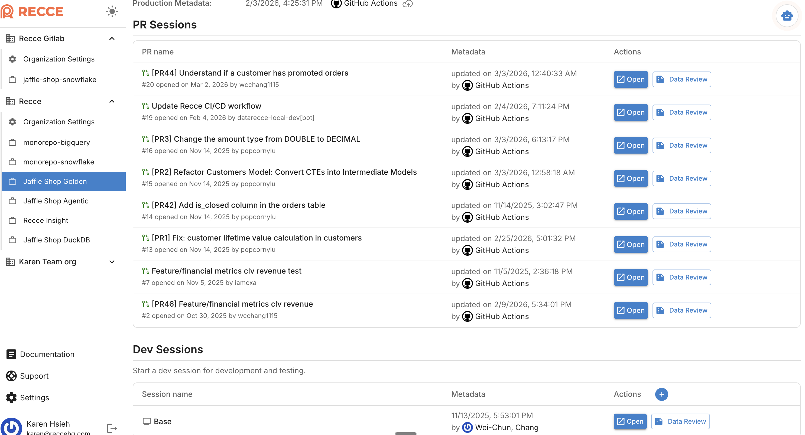
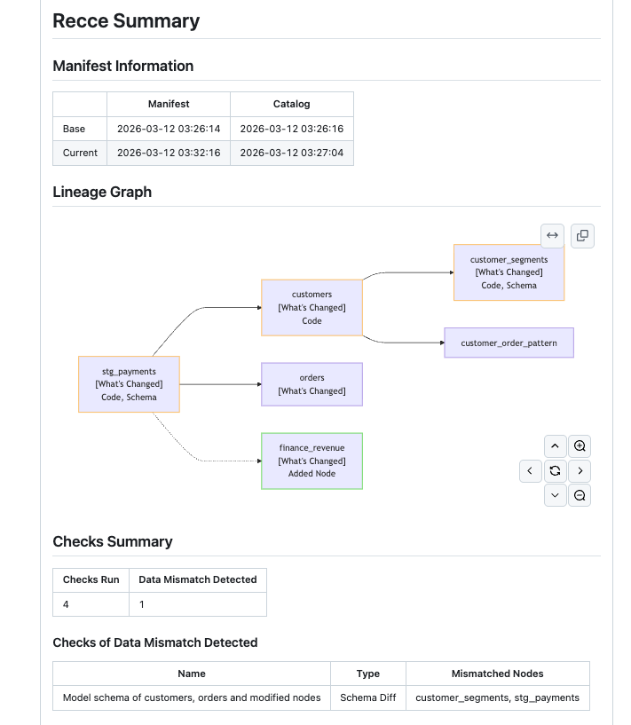

# Data Review Summary

The Data Review Summary provides an AI-powered analysis of your data changes and their impact. The Recce Agent examines your metadata, runs data diffing checks, and delivers insights to guide merge decisions.

## What It Does

- **Identifies what to validate** - Automatically determines which changes need data diffing
- **Runs checks** - Executes relevant validation checks and assesses impact
- **Explores changes** - Uses data diffing to surface meaningful differences
- **Generates insights** - Provides recommendations for informed decision-making

Example of Recce agent summary in a GitHub PR comment:


## How to Generate

### Automatic (CI/CD)

The summary also generates when session metadata is updated:

- Run `recce-cloud upload` in your CI workflow
- Update session metadata through the Cloud UI

### Automatic (PR)

The summary generates automatically when you push a new commit to your PR. Your CI workflow runs `recce-cloud upload`, which triggers the agent to analyze your changes.

#### View Agent Progress

When you push a commit to your PR, the Recce bot posts progress updates:

- 👀 Changes detected
- 🚀 Summary generating
- 👍 Summary complete

{: .shadow}

### Manual (Cloud UI)

Click **Data Review** in a session to generate a summary on demand.

{: .shadow}

## Reading the Summary

The validation summary includes these sections:

| Section | What It Shows |
|---------|---------------|
| **Summary** | Overview of PR changes and key impacts |
| **Key Changes** | Models modified, file changes, and specific value differences |
| **Impact Analysis** | Lineage diagram showing downstream dependencies affected |
| **Checklist** | Validation results with run status and impact analysis |
| **Suggested Actions** | Recommended next steps based on findings |

### Status Symbols

The agent uses these symbols for Impact Analysis:

| Symbol | Meaning |
|--------|---------|
| 🔴 | Critical - Issue requires attention before merge |
| ⚠️ | Warning - Review recommended but not blocking |
| ✅ | OK - Validation passed or change is acceptable |
| 📝 | Informational - Expected change, documented for context |

These differ from checklist status icons, which show Pass/Warning/Fail for individual checks.

## Static Summary

Recce OSS generates a static summary from your state file. Unlike the Cloud agent summary, this outputs a Markdown report of your checklist results.

```bash
recce summary recce_state.json
```

Save to a file for PR comments:

```bash
recce summary recce_state.json > recce_summary.md
```

<!--{: .shadow}--> 

## When to Use

- **Reviewing PRs** - Get a quick understanding of data changes before diving deeper
- **Validating impact** - See which downstream models are affected
- **Communicating changes** - Share findings with teammates and reviewers
- **Deciding to merge** - Use insights to make informed merge decisions

## Related

- [Data Developer Workflow](../3-using-recce/data-developer.md) - How developers use summaries during development
- [Data Reviewer Workflow](../3-using-recce/data-reviewer.md) - How reviewers use summaries for PR review
- [Data Diffing](data-diffing.md) - Validation techniques used by the agent
