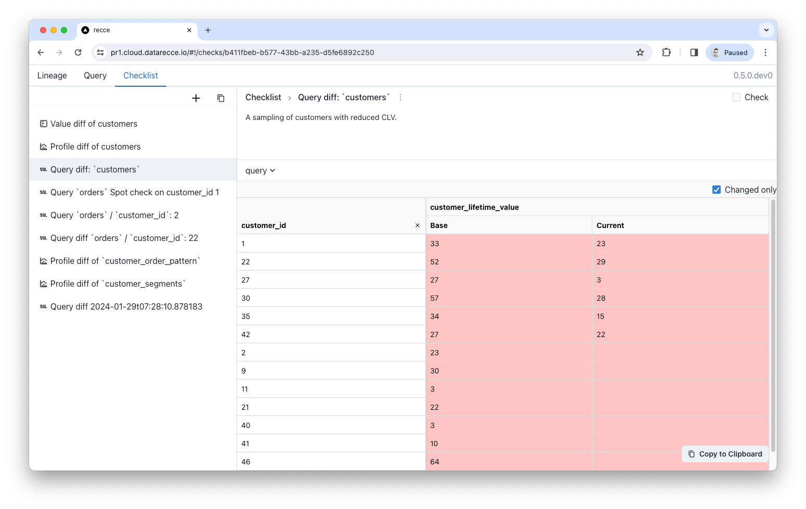
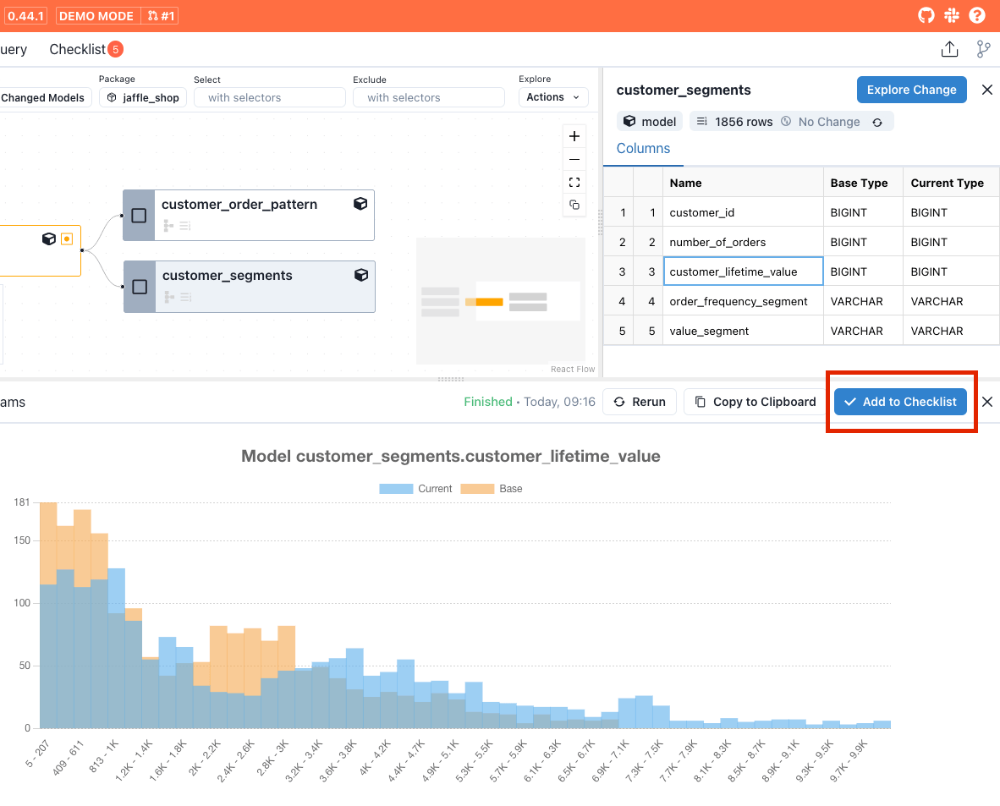
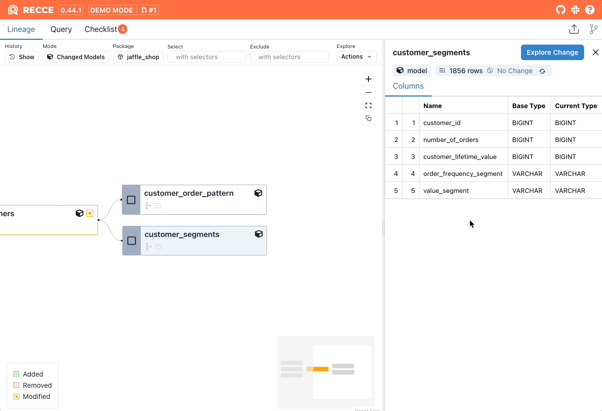

# Checklist

Save your validation checks to the Recce checklist with a description of your findings.

These checks can later be added to your pull request comment as proof-of-correctness for your modeling changes.

<figure markdown>
  
  <figcaption>Checklist</figcaption>
</figure>

## Add to Checklist

The Recce Checklist provides a way to record the results of a data check during change exploration. The purpose of adding Checks to the Checklist is to enable you to:

- Save Checks with notes of your interpretation of the data.
- Re-run checks following further data modeling changes.
- Share Checks as part of PR or stakeholder review.

### Diffs performed via the Explore Change dropdown menu

For the majority of diffs, which are performed via the Explore Change dropdown menu, the Check can be added by clicking the Add to Checklist button in the results panel:

<figure markdown>
  {: .shadow}
  <figcaption>Add a Check by clicking the Add to Checklist button in the diff results panel</figcaption>
</figure>

An example performing a Top-K diff and adding the results to the Checklist:

<figure markdown>
  {: .shadow}
  <figcaption>Example adding a Top-K Diff to the Checklist</figcaption>
</figure>

