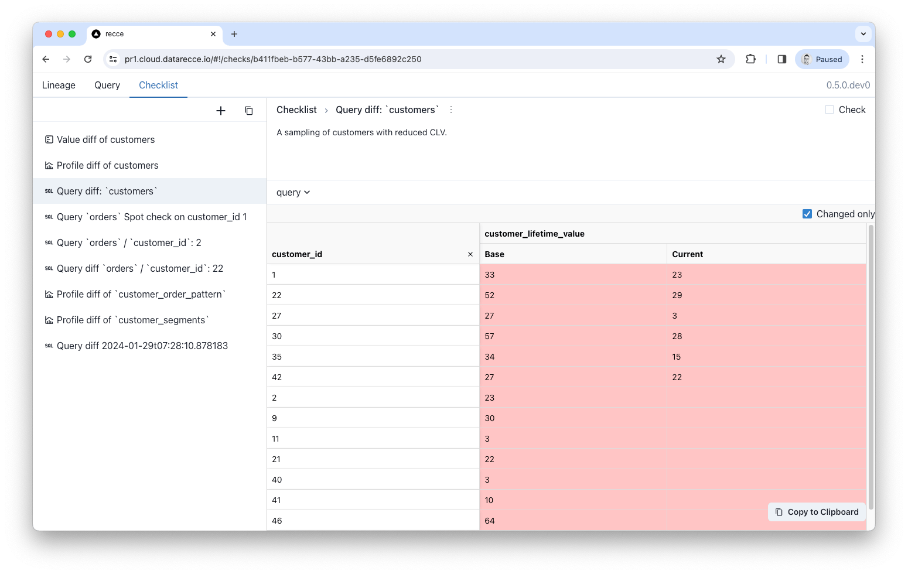
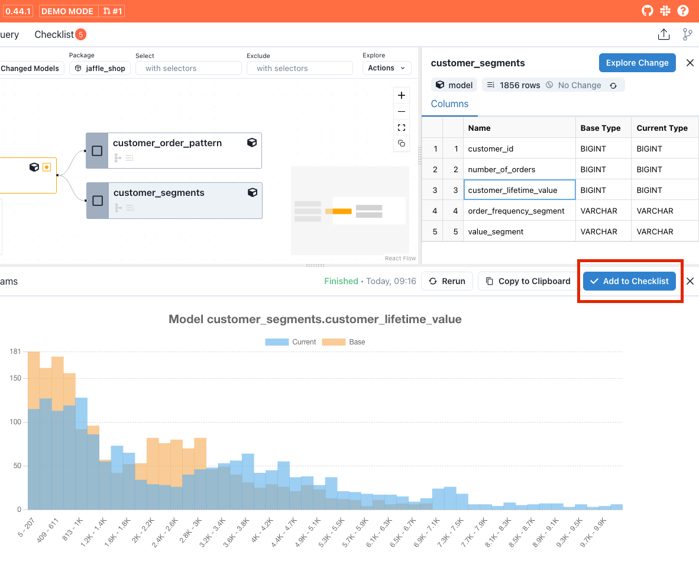
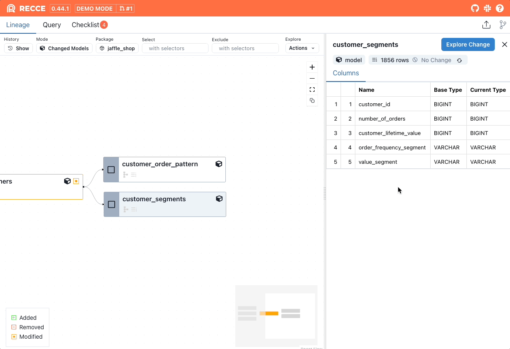

# Checklist

Save validation checks to track your findings and share them with reviewers. The checklist becomes your proof-of-correctness for modeling changes.

## How It Works

When you run a diff or query in Recce, you can add the result to your checklist. Each check captures:

- The validation type (schema diff, row count, query, etc.)
- The result at the time of capture
- Your notes explaining what the result means

<figure markdown>
  
  <figcaption>Checklist with saved validation checks</figcaption>
</figure>

### Adding Checks

For diffs performed via the Explore Change dropdown menu, click **Add to Checklist** in the results panel:

<figure markdown>
  {: .shadow}
  <figcaption>Add to Checklist button in diff results panel</figcaption>
</figure>

<figure markdown>
  {: .shadow}
  <figcaption>Example: Adding a Top-K Diff to the Checklist</figcaption>
</figure>

### Writing Descriptions

Add descriptions to help reviewers understand each check:

- **What changed** - The specific model or column being validated
- **Why it matters** - Business context or downstream impact
- **What to verify** - Expected behavior or acceptable thresholds

Good descriptions reduce back-and-forth and speed up PR approval.

### Approving Checks

Reviewers approve individual checks as they verify each validation. When configured as a required PR check, all checks must be approved before the PR can be merged.

This ensures:

- Every validation is reviewed, not just glanced at
- Multiple reviewers can collaborate on approval
- Clear audit trail of who verified what

### Re-running Checks

After making additional changes to your models, re-run checks from the checklist to verify your updates. This lets you iterate until all validations pass.

For checks you want to run on every PR automatically, see [Preset Checks](preset-checks.md).

## When to Use

- **During development** - Save checks as you validate each change, building evidence as you go
- **Before creating a PR** - Compile all validations that prove your changes are correct
- **For recurring validations** - Use [Preset Checks](preset-checks.md) to automate checks that should run on every PR
- **Stakeholder review** - [Share](share.md) your checklist to give reviewers full context

## Related

- [Preset Checks](preset-checks.md) - Automate recurring validation checks
- [Share](share.md) - Share your checklist with reviewers
