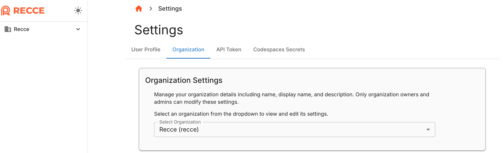
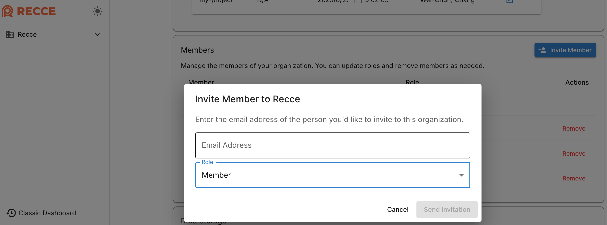
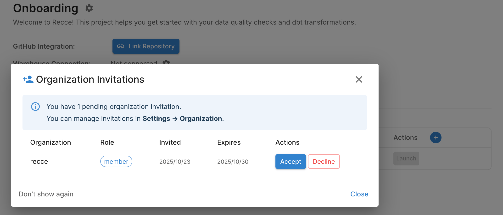
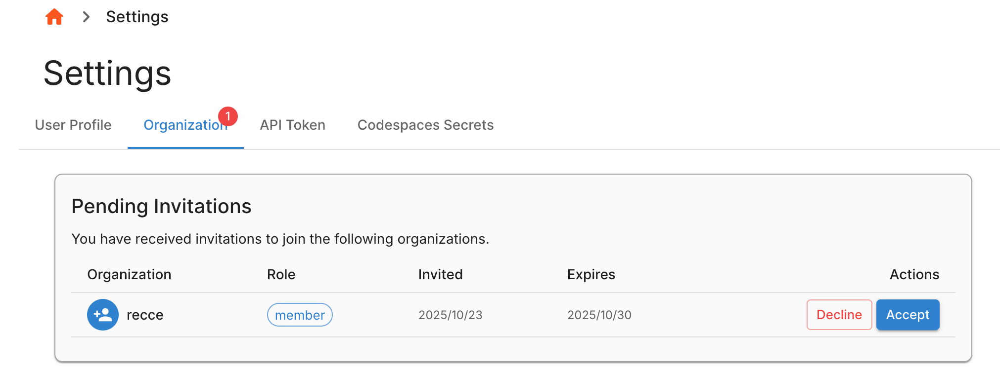

## Inviting Team Members to Your Recce Organization

To collaborate effectively within Recce Cloud, you can invite team members to join your organization. Team members will be able to share session metadata and launch Recce instances from shared sessions. Follow these steps to send invitations:

### Step 1: Access Organization Settings
- Log in to your Recce Cloud account
- Navigate to **Settings** → **Organization** from the side panel
- Alternatively, you can access directly via: `https://cloud.reccehq.com/settings#organization`
- In the Organization Settings section, select your desired organization

{: .shadow}

### Step 2: Invite Members

!!! Note
    Please use the SSO email address if your member uses SSO login.

- In the **Members** section, click the **Invite Members** button
- Enter the email addresses of the individuals you wish to invite
- Select the appropriate role for each invitee based on the roles below:

#### Organization Roles

| Role | Key Responsibilities | Permissions |
|------|---------------------|-------------|
| **ADMIN** | Full organization management | • Update organization info • Manage member roles • Remove members • Transfer storage regions |
| **MEMBER** | Upload metadata and launch instances | • Upload metadata • Launch Recce instances • View organization info and member list • Leave organization |
| **VIEWER** | Only instance launch | • Launch Recce instances • View organization info and member list • Leave organization |

{: .shadow}

### Step 3: Send Invitation
- Click the **Send Invitation** button to dispatch the invites
- Each invitee will receive an email with a link to join your organization
- Logged-in invitees will also see notifications on their home page or can view pending invitations in **Settings** → **Organization**

## For Invited Users

When you receive an invitation to join a Recce organization, you have several ways to respond:

### Immediate Response
- Upon login, you'll see a notification modal with the invitations
- You can immediately accept or decline the invitations directly from the notification without navigating elsewhere

{: .shadow}

### Managing Invitations Later
- Navigate to **Settings** → **Organization** in your account
- View all pending invitations in the "Pending Invitations" section
- Review the organization and role
- Accept or decline each invitation as needed

{: .shadow}
