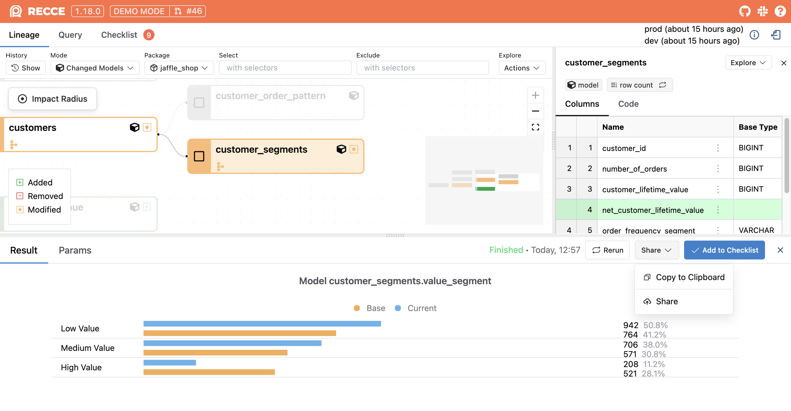

# Share Recce Sessions Securely

Recce provides two secure methods to share your validation results with team members and stakeholders, ensuring everyone can access the insights they need for informed decision-making.

## Sharing Methods Overview

<figure markdown>
  {: .shadow}
  <figcaption>Access sharing options from the Share button</figcaption>
</figure>

Choose the sharing method that best fits your collaboration needs:

1. **Copy to Clipboard** - Quick screenshot sharing for PR comments and discussions
2. **Recce Cloud Sharing** - Full interactive session sharing with complete context

## Method 1: Copy to Clipboard

For quick sharing of specific results, use the **Copy to Clipboard** button found in diff results. This feature captures a screenshot image that you can paste directly into PR comments, Slack messages, or other communication channels.

<figure markdown>
  {: .shadow}
  <figcaption>Copy a diff result screenshot to the clipboard and paste to GitHub</figcaption>
</figure>

!!! note "Browser Compatibility"
    Firefox does not support copying images to the clipboard. Instead, Recce displays a modal where you can download the image locally or right-click to copy the image.

## Method 2: Recce Cloud Sharing

When stakeholders need full context but don't have the environment to run Recce locally, use Recce Cloud sharing. This method creates a read-only link that provides complete access to your validation results.

### Benefits of Recce Cloud Sharing

- **No Setup Required** - Stakeholders access results instantly in their browser
- **Full Context** - Complete lineage exploration, query results, and validation checklists
- **Read-Only Access** - Secure viewing without ability to modify your work
- **Simple Link Sharing** - Share via any communication channel

!!! warning "Access Control"
    Anyone with the shared link can view your Recce session after signing into Recce Cloud. For restricted access requirements, [contact our team](https://cal.com/team/recce/chat).

## Setting Up Recce Cloud Sharing

The first time you share via Recce Cloud, you'll need to associate your local Recce with your cloud account. This one-time setup enables secure hosting of your state files.
### Step 1: Enable Recce Cloud Connection

Launch the Recce server and click the **Use Recce Cloud** button if your local installation isn't already connected to Recce Cloud.

{: .shadow}

### Step 2: Sign In and Grant Access

After successful login, authorize your local Recce to connect with Recce Cloud. This authorization enables the sharing functionality and secure state file hosting.

{: .shadow}

### Step 3: Complete the Setup

Refresh the Recce page to activate the cloud connection. Once connected, the **Share** button will be available, allowing you to generate shareable links.

{: .shadow}

!!! tip "Alternative Setup Method"
    You can also connect to Recce Cloud using the command line:
    
    ```bash
    recce connect-to-cloud
    ```
    
    This command handles the sign-in and authorization process directly from your terminal.


## Manual Configuration (Advanced)

For containerized environments or when you prefer manual setup, you can configure the Recce Cloud connection directly using your API token.

### Step 1: Retrieve Your API Token

Sign in to Recce Cloud and copy your API token from the [personal settings page](https://cloud.reccehq.com/settings#tokens).

{: .shadow}

### Step 2: Configure Local Connection

Choose one of the following methods to configure your local Recce:

#### Option A: Command Line Flag

Launch Recce server with your API token. The token will be saved to your profile for future use:

```bash
recce server --api-token <your_api_token>
```

#### Option B: Profile Configuration

Edit your `~/.recce/profile.yml` file to include the API token:

```yaml
api_token: <your_api_token>
```

!!! info "Configuration File Location"
    **Mac/Linux:**
    ```shell
    cd ~/.recce
    ```
    
    **Windows:**
    ```powershell
    cd ~\.recce
    ```
    
    Navigate to `C:\Users\<your_username>\.recce` or use the PowerShell command above.


## Command Line Sharing

For automated workflows or when working with existing state files, use the `recce share` command to generate shareable links directly from the terminal.

### Basic Sharing

If your Recce is already connected to Recce Cloud:

```bash
recce share <your_state_file>
```

### Sharing with API Token

For environments where Recce isn't pre-configured with cloud access:

```bash
recce share --api-token <your_api_token> <your_state_file>
```

{: .shadow}

## Security Best Practices

When sharing Recce sessions, consider these security guidelines:

- **Review Content**: Ensure shared sessions don't contain sensitive data before generating links
- **Access Control**: Be aware that anyone with the link can view your session after signing in
- **Token Security**: Keep your API tokens secure and rotate them periodically
- **Team Communication**: Share links through secure channels when possible

For additional security requirements or enterprise features, [contact our team](https://cal.com/team/recce/chat) to discuss custom access controls.
