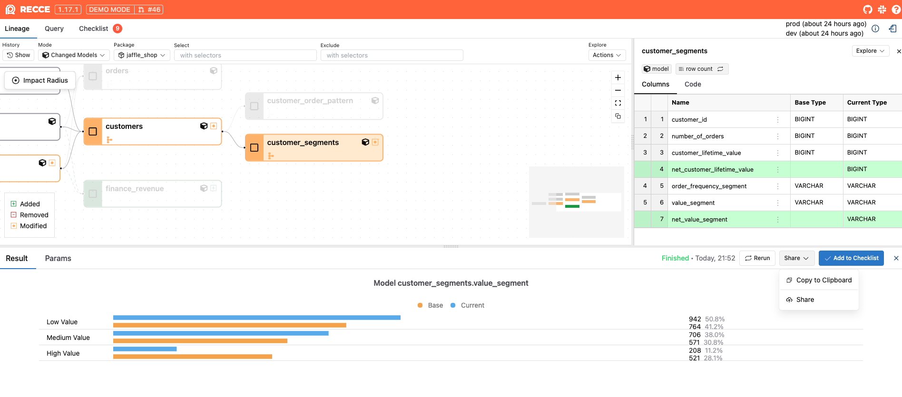
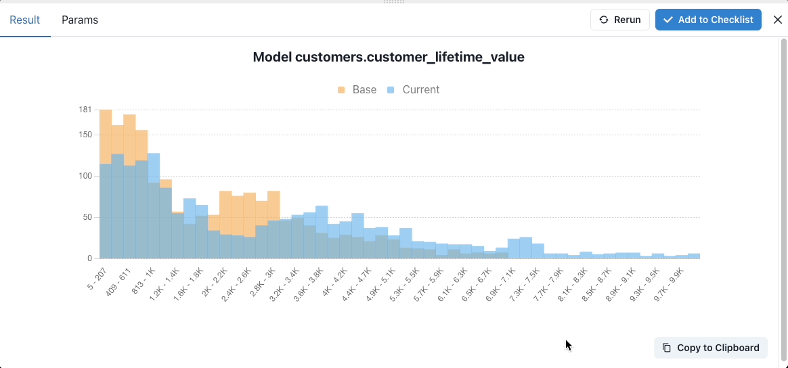
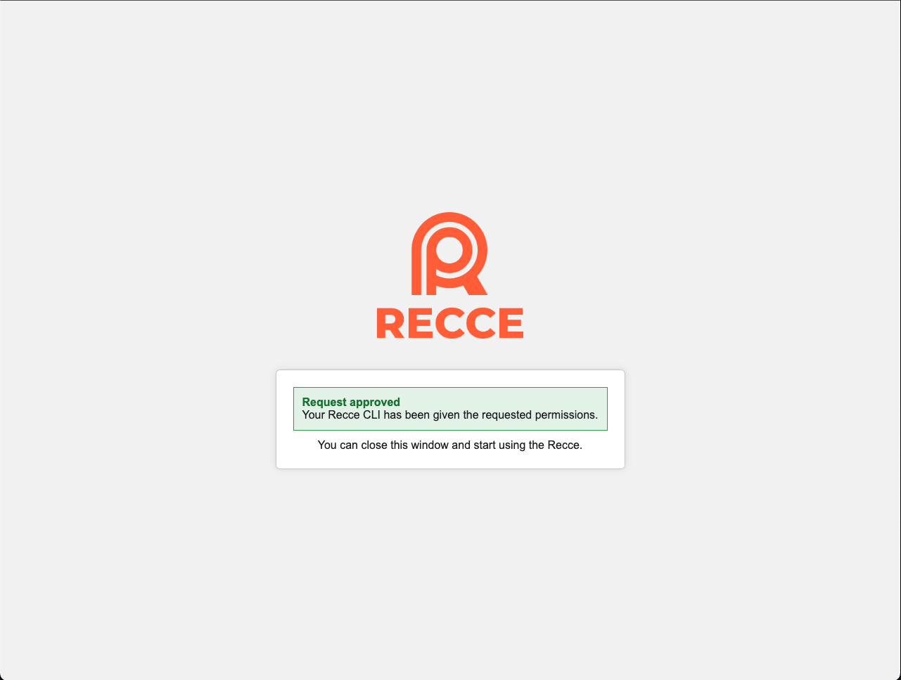
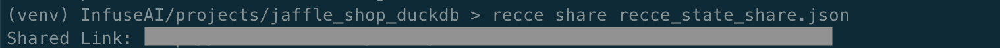

# Share

Share your validation results with team members and stakeholders.

**Goal:** Give reviewers access to your Recce session so they can explore validation results.

## Prerequisites

- [x] Recce session with checks in your checklist
- [x] Recce Cloud account (for full session sharing)

## Sharing Methods

Choose the method that fits your collaboration needs:

| Method | Best For | Requires |
|--------|----------|----------|
| **Copy to Clipboard** | Quick screenshots in PR comments | Nothing |
| **Recce Cloud Sharing** | Full interactive session access | Recce Cloud account |

<figure markdown>
  {: .shadow}
  <figcaption>Access sharing options from the Share button</figcaption>
</figure>

## Method 1: Copy to Clipboard

For quick sharing of specific results, use **Copy to Clipboard** in any diff result. Paste the screenshot directly into PR comments, Slack, or other channels.

<figure markdown>
  {: .shadow}
  <figcaption>Copy diff result and paste to GitHub</figcaption>
</figure>

!!! note "Browser Compatibility"
    Firefox does not support copying images to the clipboard. Recce displays a modal where you can download or right-click to copy the image.

## Method 2: Recce Cloud Sharing

When reviewers need full context, share via Recce Cloud. This creates a read-only link with complete access to your validation results.

**Benefits:**

- No setup required for viewers
- Full lineage exploration, query results, and checklists
- Read-only access (secure viewing)
- Simple link sharing via any channel

!!! warning "Access Control"
    Anyone with the link can view your session after signing into Recce Cloud. For restricted access, [contact our team](https://cal.com/team/recce/chat).

### First-Time Setup

1. Launch Recce server and click **Use Recce Cloud** if not already connected

    {: .shadow}

2. Sign in and authorize your local Recce to connect with Recce Cloud

    {: .shadow}

3. Refresh the page to activate the connection. The **Share** button is now available.

    {: .shadow}

!!! tip "Alternative: CLI Setup"
    ```bash
    recce connect-to-cloud
    ```

### Manual Configuration (Advanced)

For containerized environments or manual setup:

1. Get your API token from [Recce Cloud settings](https://cloud.reccehq.com/settings#tokens)

    {: .shadow}

2. Configure using one of these methods:

    **Option A: Command line flag**
    ```bash
    recce server --api-token <your_api_token>
    ```

    **Option B: Profile configuration**
    ```yaml
    # ~/.recce/profile.yml
    api_token: <your_api_token>
    ```

### Command Line Sharing

Share existing state files directly from the terminal:

```bash
# If already connected to Recce Cloud
recce share <your_state_file>

# With API token
recce share --api-token <your_api_token> <your_state_file>
```

{: .shadow}

## Verification

Confirm sharing works:

1. Add a check to your checklist
2. Click **Share** and select Recce Cloud
3. Copy the generated link
4. Open the link in an incognito window
5. Verify you can view the session after signing in

## Related

- [Checklist](checklist.md) - Save validation checks to share
- [Preset Checks](preset-checks.md) - Automate recurring checks
