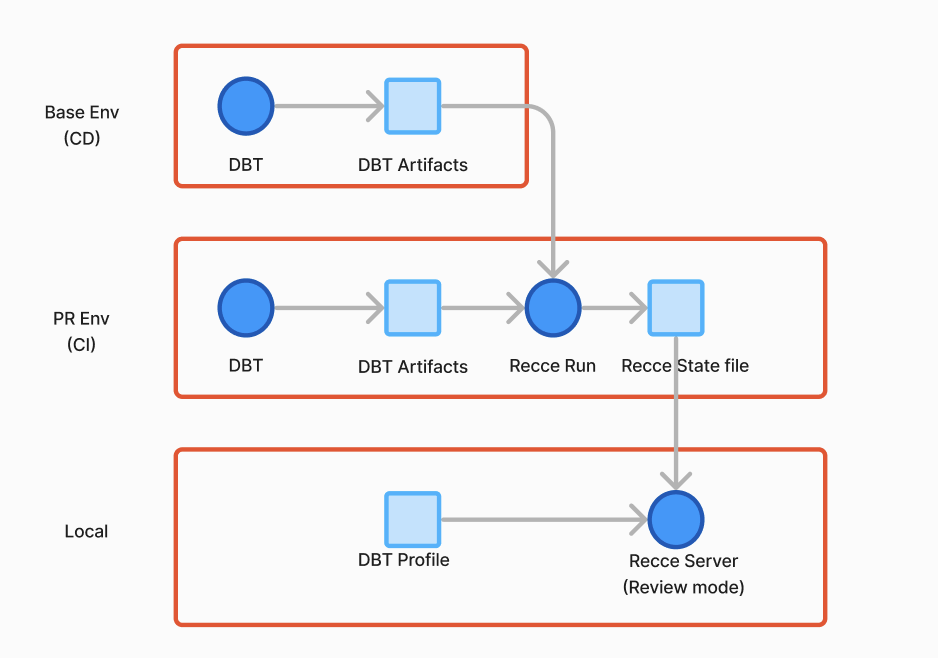

# CI/CD Getting Started

Automate data validation in your development workflow. Catch data issues before they reach production with continuous integration and delivery built specifically for dbt projects.

## What you'll achieve

Set up automated workflows that:

- **Maintain current baselines** - Auto-update comparison baselines on every merge to main
- **Validate every PR/MR** - Run data validation checks automatically when changes are proposed
- **Prevent regressions** - Catch data quality issues before they reach production
- **Save team time** - Eliminate manual validation steps for every change

!!!note
    CI/CD automation requires Recce Cloud Team plan. A free trial is available.

## Understanding CI vs CD

Recce uses both continuous integration and continuous delivery to automate data validation:

**Continuous Integration (CI)**

- **When**: Runs on every PR/MR update
- **Purpose**: Validates proposed changes against baseline
- **Benefit**: Catches issues before merge, with results in your PR/MR

**Continuous Delivery (CD)**

- **When**: Runs after merge to main branch
- **Purpose**: Updates your baseline Recce session with latest production state
- **Benefit**: Ensures future comparisons use current baseline

## Choose your platform

Recce integrates with both GitHub Actions and GitLab CI/CD.

Select your Git platform to get started:

### GitHub
If your dbt project uses GitHub:

1. [Setup CI](./github/setup-ci.md) - Auto-validate changes in every PR
2. [Setup CD](./github/setup-cd.md) - Auto-update baseline on merge to main

### GitLab
If your dbt project uses GitLab:

2. [Setup CI](./gitlab/setup-ci.md) - Auto-validate changes in every MR
1. [Setup CD](./gitlab/setup-cd.md) - Auto-update baseline on merge to main
3. [GitLab Personal Access Token Guide](./gitlab/gitlab-pat-guide.md) - Required for GitLab integration

## Prerequisites

Before setting up, ensure you have:

- **Recce Cloud account** with Team plan or free trial
- **Repository connected** to Recce Cloud ([setup guide](../2-getting-started/start-free-with-cloud.md#git-integration))
- **dbt artifacts** (`manifest.json` and `catalog.json`) from your project

## Architecture overview

Both CI and CD workflows follow the same pattern:

1. **Trigger event** (merge to main, or PR/MR opened/updated)
2. **Generate dbt artifacts** (`dbt docs generate` or external source)
3. **Upload to Recce Cloud** (automatic via workflow action)
4. **Validation results** appear in Recce dashboard and PR/MR

<figure markdown>
  {: .shadow}
  <figcaption>Automated validation workflow for pull requests</figcaption>
</figure>

## Next steps

1. Choose your platform (GitHub or GitLab)
2. Start with CD setup to establish baseline updates
3. Add CI setup to enable PR/MR validation
4. Review [best practices](./best-practices-prep-env.md) for environment preparation

## Related workflows

After setting up CI/CD automation, explore these workflow guides:

- [Development workflow](./scenario-dev.md) - Validate changes during development
- [PR/MR review workflow](./scenario-pr-review.md) - Collaborate on validation results
- [Preset checks](./preset-checks.md) - Configure automatic validation checks
