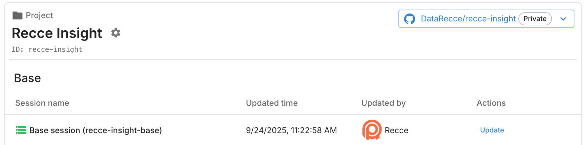

# Setup CD

Set up automatic updates for your Recce Cloud base sessions. Keep your data comparison baseline current every time you merge to main, with no manual work required.

## Purpose

**Automated Base Session Management** eliminates manual baseline maintenance.

- **Triggers**: MR merge to main + scheduled updates
- **Action**: Auto-update base Recce session
- **Benefit**: Current comparison baseline for future MRs

## Prerequisites

You need `manifest.json` and `catalog.json` files (dbt artifacts) for Recce Cloud. See [Start Free with Cloud](../../2-getting-started/start-free-with-cloud.md) for instructions on preparing these files.

## Implementation

### 1. Core Workflow

GitLab's CD setup uses the same Recce Cloud component as CI, but with different trigger rules. Add to your `.gitlab-ci.yml`:
```yaml
include:
  - component: gitlab.com/recce/recce-cloud-cicd-component/recce-cloud@1.2.0
    inputs:
      stage: upload

stages:
  - build
  - upload

variables:
  DBT_TARGET_PROD: "prod"

# Disable the default component job
recce-cloud-upload:
  rules:
    - when: never

# Production build - runs on schedule or manual trigger
prod-build:
  stage: build
  image: python:3.11-slim
  script:
    - pip install -r requirements.txt
    - dbt deps

    # Optional: Build tables to ensure they're materialized and updated
    # - dbt build --target $DBT_TARGET_PROD

    # Required: Generate artifacts
    - dbt docs generate --target $DBT_TARGET_PROD
  artifacts:
    paths:
      - target/
    expire_in: 7 days
  rules:
    - if: $CI_PIPELINE_SOURCE == "schedule"
    - if: $CI_PIPELINE_SOURCE == "push" && $CI_COMMIT_BRANCH == $CI_DEFAULT_BRANCH
    - if: $CI_PIPELINE_SOURCE == "web"
      when: manual

# Production Recce upload
recce-cloud-upload-prod:
  extends: recce-cloud-upload
  needs:
    - job: prod-build
      artifacts: true
  rules:
    - if: $CI_PIPELINE_SOURCE == "schedule"
    - if: $CI_PIPELINE_SOURCE == "push" && $CI_COMMIT_BRANCH == $CI_DEFAULT_BRANCH
    - if: $CI_PIPELINE_SOURCE == "web"
      when: manual
```

This configuration:

- **Scheduled updates**: Runs automatically on schedule (configure in CI/CD → Schedules)
- **Post-merge updates**: Runs when commits are pushed to main branch
- **Manual triggers**: Available via web UI for on-demand updates

### 2. Unified CI/CD Configuration

The Recce Cloud component can handle both CI (MR validation) and CD (base session updates) in a single configuration. Here's the combined approach:
```yaml
include:
  - component: gitlab.com/recce/recce-cloud-cicd-component/recce-cloud@1.2.0
    inputs:
      stage: upload

stages:
  - build
  - upload

# Disable the default component job
recce-cloud-upload:
  rules:
    - when: never

# MR build - runs on merge requests
mr-build:
  stage: build
  image: python:3.11-slim
  script:
    - pip install -r requirements.txt
    - dbt deps
    - dbt build --target dev
    - dbt docs generate --target dev
  artifacts:
    paths:
      - target/
    expire_in: 7 days
  rules:
    - if: $CI_PIPELINE_SOURCE == "merge_request_event"

# Production build - runs on schedule or main branch
prod-build:
  stage: build
  image: python:3.11-slim
  script:
    - pip install -r requirements.txt
    - dbt deps
    - dbt build --target prod
    - dbt docs generate --target prod
  artifacts:
    paths:
      - target/
    expire_in: 7 days
  rules:
    - if: $CI_PIPELINE_SOURCE == "schedule"
    - if: $CI_PIPELINE_SOURCE == "push" && $CI_COMMIT_BRANCH == $CI_DEFAULT_BRANCH

# MR Recce upload
recce-cloud-upload-mr:
  extends: recce-cloud-upload
  needs:
    - job: mr-build
      artifacts: true
  rules:
    - if: $CI_PIPELINE_SOURCE == "merge_request_event"

# Production Recce upload
recce-cloud-upload-prod:
  extends: recce-cloud-upload
  needs:
    - job: prod-build
      artifacts: true
  rules:
    - if: $CI_PIPELINE_SOURCE == "schedule"
    - if: $CI_PIPELINE_SOURCE == "push" && $CI_COMMIT_BRANCH == $CI_DEFAULT_BRANCH
```

This unified approach:

- Uses the same component for both CI and CD
- Separates MR validation from production updates via `rules`
- Maintains different dbt targets for each environment
- Reduces configuration duplication

### 3. Schedule Configuration

To enable automatic baseline updates:

1. Go to **CI/CD → Schedules** in your GitLab project
2. Click **New schedule**
3. Configure schedule:
  - **Description**: "Daily Recce Base Session Update"
  - **Interval Pattern**: `0 2 * * *` (Daily at 2 AM UTC)
  - **Target Branch**: `main`
4. Save schedule

### 4. Artifact Preparation Options

**Default: Fresh Build** (shown in examples above)

- `dbt docs generate` is required and provides needed `manifest.json` and `catalog.json` artifacts
- `dbt build` is optional but ensures tables are materialized and updated

**Alternative Methods:**

- **External Download**: Download from dbt Cloud, Paradime, or other platforms
- **Pipeline Integration**: Use existing dbt build workflows

### 5. Verification

#### Manual Trigger Test

1. Go to **CI/CD → Pipelines** in your project
2. Click **Run pipeline**
3. Select **main** branch
4. Click **Run pipeline** button
5. Monitor the pipeline for successful completion

#### Verify Success

- ✅ **Pipeline completes** without errors in CI/CD → Pipelines
- ✅ **Base session updated** in Recce Cloud

{: .shadow}

#### Verify Scheduled Runs

1. Go to **CI/CD → Schedules**
2. Check **Last pipeline** status for your schedule
3. Verify regular updates appear in pipeline history

## Troubleshooting

### Schedule not triggering

**Issue**: Scheduled pipeline doesn't run

**Solutions**:

1. Verify schedule is **Active** in CI/CD → Schedules
2. Check schedule timezone settings (UTC by default)
3. Ensure target branch exists and is protected if required
4. Review project's CI/CD minutes quota

### Branch protection issues

**Error**: Pipeline fails on protected branch

**Solutions**:

1. Configure protected branch settings to allow scheduled pipelines
2. Ensure CI/CD variables are available to protected branches
3. Verify schedule owner has push permissions

### Artifact conflicts

**Issue**: Wrong artifacts uploaded for production

**Solutions**:

1. Ensure `needs` dependencies are correct in upload jobs
2. Verify artifact paths match between build and upload jobs:
```yaml
prod-build:
  artifacts:
    paths:
      - target/ # Must match component's dbt_target_path

recce-cloud-upload-prod:
  needs:
    - job: prod-build
      artifacts: true # Required
```

## Complete Example

See the [complete working example](https://gitlab.com/recce/jaffle-shop-snowflake/-/blob/main/.gitlab-ci.yml) showing unified CI/CD configuration with the Recce Cloud component.

## Next Steps

If you haven't already, **[Setup CI](./setup-ci.md)** to automatically validate MR changes. The unified configuration above handles both CI and CD together, giving you a complete automated validation pipeline.
