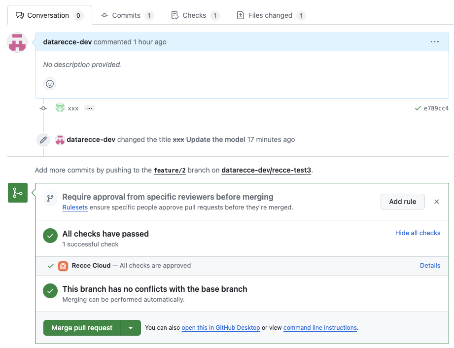

## What is Recce Cloud?
Recce Cloud is a data collaboration platform for teams doing data validation, impact analysis, and pull requests reviews. It helps data teams catch issues early, understand downstream impacts, and communicate changes clearly in one shared workspace. Instead of working in an isolated local environment, teams can explore lineage, run custom queries, and validate metrics together in a cloud-hosted environment.

- [Learn more about different plans](https://reccehq.com/pricing)
- Follow the [Getting Started](/get-started/) guide

## Integration with GitHub
Recce Cloud integrates with GitHub to support validation in your PR workflow. The following instructions provide an overview of the setup. For a hands-on walkthrough, check out the [Jaffle Shop Tutorial for Cloud](./getting-started-recce-cloud.md).

### Prerequisite
1. Sign in [Recce cloud](https://cloud.reccehq.com/)
2. Click **Install** button to install Recce Cloud GitHub app to your personal or organization account
3. Authorize the repositories to the GitHub app
4. Prepare the GitHub personal access token with the `repo` permission. Please see the [GitHub document](https://docs.github.com/en/authentication/keeping-your-account-and-data-secure/managing-your-personal-access-tokens). And set it to your environment variable
   ```
   export GITHUB_TOKEN=<token>
   ```
    Or you can set the `--cloud-token <GITHUB_TOKEN>` command option.
5. Prepare the Recce state password. The Recce state password is used to encrypt/decrypt the state file before uploading/downloading. The password is not stored in Recce Cloud, so you need to keep it safe.
   ```
   export RECCE_STATE_PASSWORD=<password>
   ```
   Or you can set the `--password <password>` or `-p <password>` command option.


### Launch the `recce server` in the cloud mode

1. Create a branch for developing.
   ```
   git checkout -b <my-awesome-feature>
   ```
1. Develop your features and prepare the dbt artifacts for the base (`target-base/`) and current (`target/`) environments.
2. Create a pull request for this branch. Recce Cloud requires an open pull request in your GitHub repository. It also stores the latest Recce state for each pull request.
3. Launch the Recce instance in the cloud mode. It will use the dbt artifacts in the local `target` and `target-base` and initiate a new review state if necessary.
   ```
   recce server --cloud
   ```

!!! Note

    Here we assume the you have set the `GITHUB_TOKEN` and `RECCE_STATE_PASSWORD` in your environment variables.


### Review in the cloud mode
If the review state is already available for this PR, you can open the Recce instance to review.

1. Checkout the branch for the reviewed PR.
2. Launch the Recce instance to review this PR
    ```
    recce server --review --cloud
    ```

## Usage

All the commands requires the following settings.

Name           | Environment Variables | CLI Options     | Description
---------------|-----------------------|-----------------|--------------------------------------------------
Cloud token    | `GITHUB_TOKEN`        | `--cloud-token` | Used for  <br>1. Get the pull request from GitHub<br>2. Used as the **access token** to the recce cloud
State password | `RECCE_STATE_PASSWORD`| `--password`    | Used to encrypt/decrypt the state in the recce cloud

Recce Cloud is used for pull request reviews. Before interacting with the cloud state, you should switch to a branch that has an open PR on the remote.

### Recce server

Initiate the review session of the PR. It would use the local dbt artifacts in the `target/` and `target-base/` directories to sync the state with the cloud.

```shell
git checkout <pr-branch>
recce sever --cloud
```

### Recce server (Review mode)

Review a PR with the remote state.

```shell
git checkout <pr-branch>
recce sever --cloud --review
```

### Recce run

Run or rerun the PR's checks and sync the state with cloud.

```shell
git checkout <pr-branch>
recce run --cloud
```

### Recce summary

Generate the summary markdown

```shell
git checkout <pr-check>
recce summary --cloud > summary.md
```

### Recce cloud

The cloud subcommand in Recce provides functionality for managing state files in cloud storage.

#### purge

You can purge the state from your current PR. It is useful when

1. You forgot the password
1. You would like to reset the state of this PR

```shell
git checkout <pr-branch>
recce cloud purge
```

#### upload

If you already have the state file for the PR, you can upload it to the cloud.

```shell
git checkout <pr-branch>
recce cloud upload <recce-state-file>
```

#### download

You can download the recce state file of the PR from cloud as well.

```shell
git checkout <pr-branch>
recce cloud download
```

## GitHub Pull Request Status Check

Recce Cloud integrate with the [GitHub Pull Request Status Check](https://docs.github.com/en/pull-requests/collaborating-with-pull-requests/collaborating-on-repositories-with-code-quality-features/about-status-checks). If there is Recce review state synced to a PR, the PR would have a Recce cloud check status. Once all checks in Recce are approved, the check status would change to passed and ready to be merged.

{: .shadow}
