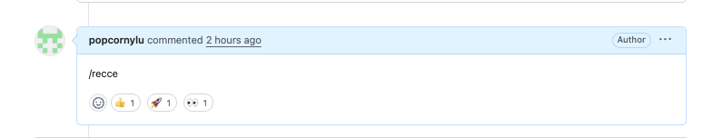
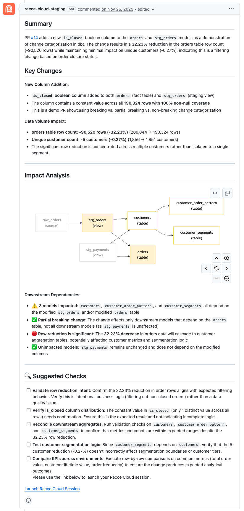

Recce provides a data review summary for each PR to help you understand changes and their impact. Using state-of-the-art AI agents, it analyzes your PR information and metadata updates to determine what should be validated through data diffing in your data warehouse, then delivers comprehensive insights for informed decision-making.

**Features**

- Identify what to validate automatically
- Run checks and assess their impact
- Explore changes through data diffing
- Generate insights to guide merge decisions

### How to generate

1. **Generate automatically whenever metadata is updated**: The data review summary is generated automatically whenever a session’s metadata is updated. You can update metadata in two ways:
    - Run `recce-cloud upload` (commonly used in CI workflows for pull requests)
    - Update a session's metadata through the web UI

2. **Manually generate from PR/MR Session UI**: Click the **Data Review** button in a PR/MR session.

3. **Generate via GitHub PR Comment (GitHub only)**: Comment `/recce` on your GitHub PR to generate a new data review summary. The Recce bot responds with status updates.

    {: .shadow}

    **Progress Indicators:**

    - 👀 Request received
    - 🚀 Summary generating
    - 👍 Summary complete

### Example

{: .shadow}