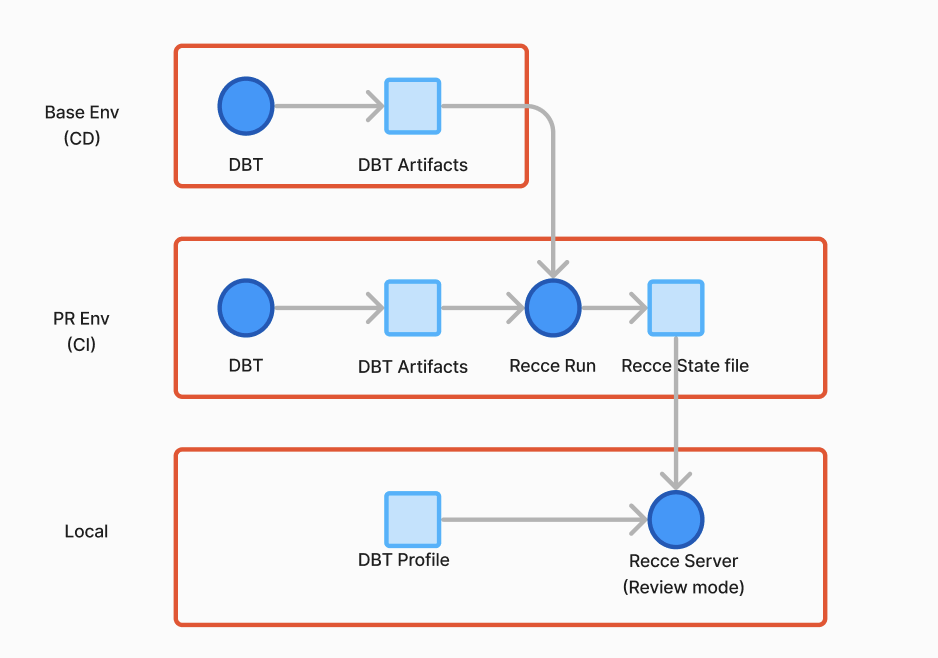

# Recce CI integration with GitHub Action

Recce provides the `recce run` command for CI/CD pipeline. You can integrate Recce with GitHub Actions (or other CI tools) to compare the data models between two environments when a new pull-request is created. The below image describes the basic architecture.

{: .shadow}

The following guide demonstrates how to configure Recce in GitHub Actions.

## Prerequisites

Before integrating Recce with GitHub Actions, you will need to configure the following items:

- Set up **two environments** in your data warehouse. For example, one for base and another for pull request.

- Provide the **credentials profile** for both environments in your `profiles.yml` so that Recce can access your data warehouse. You can put the credentials in a `profiles.yml` file, or use environment variables.

- Set up the **data warehouse credentials** in your [GitHub repository secrets](https://docs.github.com/en/actions/reference/encrypted-secrets).

## Set up Recce with GitHub Actions

We suggest setting up two GitHub Actions workflows in your GitHub repository. One for the base environment and another for the PR environment.

- **Base environment workflow**: Triggered on every merge to the `main branch`. This ensures that base artifacts are readily available for use when a PR is opened.

- **PR environment workflow**: Triggered on every push to the `pull-request branch`. This workflow will compare base models with the current PR environment.

### Base Workflow (Main Branch)

This workflow will perform the following actions:

1. Run dbt on the base environment.
2. Upload the generated DBT artifacts to [GitHub workflow artifacts](https://docs.github.com/en/actions/using-workflows/storing-workflow-data-as-artifacts) for later use.

```yaml
name: Recce CI Base Branch

on:
  workflow_dispatch:
  push:
    branches:
      - main

concurrency:
  group: recce-ci-base
  cancel-in-progress: true

jobs:
  build:
    runs-on: ubuntu-latest

    steps:
      - uses: actions/checkout@v3

      - name: Set up Python
        uses: actions/setup-python@v2
        with:
          python-version: "3.10.x"

      - name: Install dependencies
        run: |
          pip install -r requirements.txt

      - name: Run DBT
        run: |
          dbt deps
          dbt seed --target ${{ env.DBT_BASE_TARGET }}
          dbt run --target ${{ env.DBT_BASE_TARGET }}
          dbt docs generate --target ${{ env.DBT_BASE_TARGET }}
        env:
          DBT_BASE_TARGET: "prod"

      - name: Upload DBT Artifacts
        uses: actions/upload-artifact@v4
        with:
          name: target
          path: target/
```

!!! note

    Please place the above file in `.github/workflows/dbt_base.yml`. This workflow path will also be used in the next PR workflow. If you place it in a different location, please remember to make the corresponding changes in the next step.

### PR Workflow (Pull Request Branch)

This workflow will perform the following actions:

1. Run dbt on the PR environment.
2. Download previously generated base artifacts from base workflow.
3. Use Recce to compare the PR environment with the downloaded base artifacts.
4. Use Recce to generate the summary of the current changes and post it as a comment on the pull request. Please refer to the [Recce Summary](./recce-summary.md) for more information.

````yaml
name: Recce CI PR Branch

on:
  pull_request:
    branches: [main]

jobs:
  check-pull-request:
    name: Check pull request by Recce CI
    runs-on: ubuntu-latest
    steps:
      - name: Checkout repository
        uses: actions/checkout@v3
        with:
          fetch-depth: 0
      - name: Merge Base Branch into PR
        uses: DataRecce/PR-Update@v1
        with:
          baseBranch: ${{ github.event.pull_request.base.ref }}
          autoMerge: false
      - name: Set up Python
        uses: actions/setup-python@v4
        with:
          python-version: "3.10.x"
      - name: Install dependencies
        run: |
          pip install -r requirements.txt
          pip install recce
      - name: Prepare dbt Base environment
        run: |
          gh repo set-default ${{ github.repository }}
          base_branch=${{ github.base_ref }}
          run_id=$(gh run list --workflow ${WORKFLOW_BASE} --branch ${base_branch} --status success --limit 1 --json databaseId --jq '.[0].databaseId')
          echo "Download artifacts from run $run_id"
          gh run download ${run_id} -n target -D target-base
        env:
          GH_TOKEN: ${{ secrets.GITHUB_TOKEN }}
          WORKFLOW_BASE: ".github/workflows/dbt_base.yml"
      - name: Prepare dbt Current environment
        run: |
          git checkout ${{ github.event.pull_request.head.sha }}
          dbt deps
          dbt seed --target ${{ env.DBT_CURRENT_TARGET}}
          dbt run --target ${{ env.DBT_CURRENT_TARGET}}
          dbt docs generate --target ${{ env.DBT_CURRENT_TARGET}}
        env:
          DBT_CURRENT_TARGET: "dev"

      - name: Run Recce CI
        run: |
          recce run --github-pull-request-url ${{ github.event.pull_request.html_url }}

      - name: Upload DBT Artifacts
        uses: actions/upload-artifact@v4
        with:
          name: target
          path: target/

      - name: Upload Recce State File
        uses: actions/upload-artifact@v4
        id: recce-artifact-uploader
        with:
          name: recce-state-file
          path: recce_state.json

      - name: Prepare Recce Summary
        id: recce-summary
        run: |
          recce summary recce_state.json > recce_summary.md
          cat recce_summary.md >> $GITHUB_STEP_SUMMARY
          echo '${{ env.NEXT_STEP_MESSAGE }}' >> recce_summary.md

          # Handle the case when the recce summary is too long to be displayed in the GitHub PR comment
          if [[ `wc -c recce_summary.md | awk '{print $1}'` -ge '65535' ]]; then
            echo '# Recce Summary
          The recce summary is too long to be displayed in the GitHub PR comment.
          Please check the summary detail in the [Job Summary](${{github.server_url}}/${{github.repository}}/actions/runs/${{github.run_id}}) page.
          ${{ env.NEXT_STEP_MESSAGE }}' > recce_summary.md
          fi

        env:
          NEXT_STEP_MESSAGE: |
            ## Next Steps
            If you want to check more detail information about the recce result, please download the [artifact](${{ steps.recce-artifact-uploader.outputs.artifact-url }}) file and open it by [Recce](https://pypi.org/project/recce/) CLI.

            ### How to check the recce result
            ```bash
            # Unzip the downloaded artifact file
            tar -xf recce-state-file.zip

            # Launch the recce server based on the state file
            recce server --review recce_state.json

            # Open the recce server http://localhost:8000 by your browser
            ```

      - name: Comment on pull request
        uses: thollander/actions-comment-pull-request@v2
        with:
          filePath: recce_summary.md
          comment_tag: recce
````

## Review the Recce State File

Review the downloaded Recce [state file](../8-technical-concepts/state-file.md) with the following command:

```bash
recce server --review recce_state.json
```

In the Recce server `--review` mode, you can review the comparison results of the data models between the base and current environments. It will contain the row counts of modified data models, and the results of any Recce [Preset Checks](./preset-checks.md).
