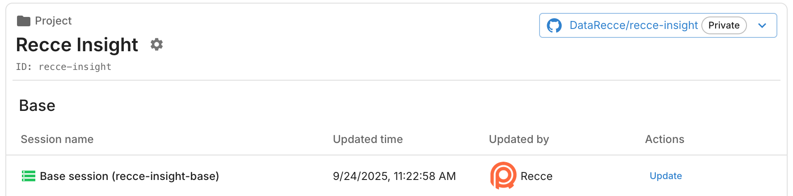

# Setup CD

Automated continuous deployment (CD) for Recce Cloud base session updates. Ensures your comparison baseline stays current without manual intervention.

> **Note**: This guide uses `recce-cloud-cicd-action` which is specifically designed for Recce Cloud integration.

## Purpose

**Automated Base Session Management** → Eliminates manual baseline maintenance

- **Triggers**: PR merge to main + scheduled updates
- **Action**: Auto-update base Recce session
- **Benefit**: Current comparison baseline for future PRs

## Implementation

### 1. Core Workflow

Create `.github/workflows/cd-workflow.yml`:

```yaml
name: Update Base Recce Session

on:
  push:
    branches: ["main"]
  schedule:
    - cron: "0 2 * * *" # Daily at 2 AM UTC
  workflow_dispatch:

concurrency:
  group: ${{ github.workflow }}
  cancel-in-progress: true

jobs:
  update-base-session:
    runs-on: ubuntu-latest
    timeout-minutes: 30

    steps:
      - name: Checkout code
        uses: actions/checkout@v4

      - name: Setup Python
        uses: actions/setup-python@v5
        with:
          python-version: "3.11"
          cache: "pip"

      - name: Install dependencies
        run: |
          pip install -r requirements.txt

      - name: Prepare dbt artifacts
        run: |
          # Install dbt packages
          dbt deps

          # Optional: Build tables to ensure they're materialized and updated
          # dbt build --target prod

          # Required: Generate artifacts (provides all we need)
          dbt docs generate --target prod
        env:
          DBT_ENV_SECRET_KEY: ${{ secrets.DBT_ENV_SECRET_KEY }}

      - name: Update Recce Cloud Base Session
        uses: DataRecce/recce-cloud-cicd-action@v0.1
        # This action automatically uploads artifacts to Recce Cloud
```

### 2. Artifact Preparation Options

**Default: Fresh Build** (shown in example above)

- `dbt docs generate` → Required (provides all needed artifacts)
- `dbt build` → Optional (ensures tables are materialized and updated)

**Alternative Methods:**

- **External Download**: Download from dbt Cloud, Paradime, or other platforms
- **Pipeline Integration**: Use existing dbt build workflows

**Key Requirement**: `manifest.json` and `catalog.json` available for Recce Cloud upload.

### 3. Verification

#### Manual Trigger Test

1. Go to **Actions** tab in your repository
2. Select "Update Base Recce Session" workflow
3. Click **Run workflow** button
4. Monitor the run for successful completion

#### Verify Success

- ✅ **Workflow completes** without errors in Actions tab
- ✅ **Base session updated** in Recce Cloud dashboard

{: .shadow}

## Next Steps

- ✅ **CD Setup Complete** → Base sessions auto-update on merge + schedule
- 🔄 **Add CI**: [Setup CI](./setup-ci.md) for PR validation
