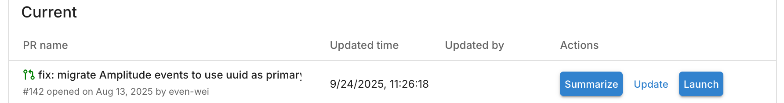

# Setup CI

Automated data validation for pull requests using Recce Cloud. Catch data issues before merging to main.

> **Note**: This guide shows CI integration with Recce Cloud for centralized validation management.

## Purpose

**Automated PR Validation** → Prevent data regressions before merge

- **Triggers**: PR opened/updated against main
- **Action**: Auto-update Recce session for PR validation
- **Benefit**: Automated data validation and comparison

## Implementation

### 1. Core Workflow

Create `.github/workflows/ci-workflow.yml`:

```yaml
name: Validate PR Changes

on:
  pull_request:
    branches: ["main"]

concurrency:
  group: ${{ github.workflow }}-${{ github.ref }}
  cancel-in-progress: true

jobs:
  validate-changes:
    runs-on: ubuntu-latest
    timeout-minutes: 45

    steps:
      - name: Checkout PR branch
        uses: actions/checkout@v4
        with:
          fetch-depth: 2

      - name: Setup Python
        uses: actions/setup-python@v5
        with:
          python-version: "3.11"
          cache: "pip"

      - name: Install dependencies
        run: |
          pip install -r requirements.txt

      # Step 1: Prepare current branch artifacts
      - name: Build current branch artifacts
        run: |
          # Install dbt packages
          dbt deps

          # Optional: Build tables to ensure they're materialized
          # dbt build --target ci

          # Required: Generate artifacts for comparison
          dbt docs generate --target ci
        env:
          DBT_ENV_SECRET_KEY: ${{ secrets.DBT_ENV_SECRET_KEY }}

      - name: Update Recce PR Session
        uses: DataRecce/recce-cloud-cicd-action@v0.1
        # This action automatically creates a PR session in Recce Cloud
```

### 2. Artifact Preparation Options

**Default: Fresh Build** (shown in example above)

- `dbt docs generate` → Required (provides all needed artifacts)
- `dbt build` → Optional (ensures tables are materialized and updated)

**Alternative Methods:**

- **External Download**: Download from dbt Cloud, Paradime, or other platforms
- **Pipeline Integration**: Use existing dbt build workflows

**Key Requirement**: `manifest.json` and `catalog.json` available for Recce Cloud action.

### 3. Verification

#### Test with a PR

1. Create a test PR with small data changes
2. Check **Actions** tab for CI workflow execution
3. Verify validation runs successfully

#### Verify Success

- ✅ **Workflow completes** without errors in Actions tab
- ✅ **PR session updated** in Recce Cloud dashboard

{: .shadow}

#### Review PR Session

To analyze the PR changes in detail:

- Go to your Recce Cloud dashboard
- Find the PR session that was created
- Launch Recce instance to explore data differences
