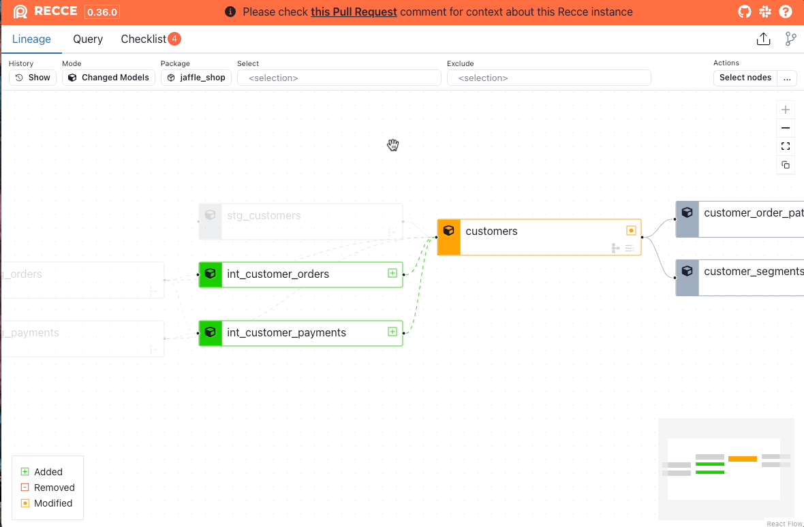
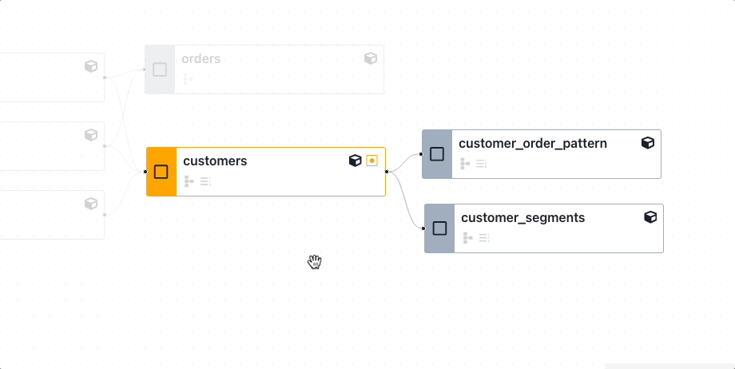
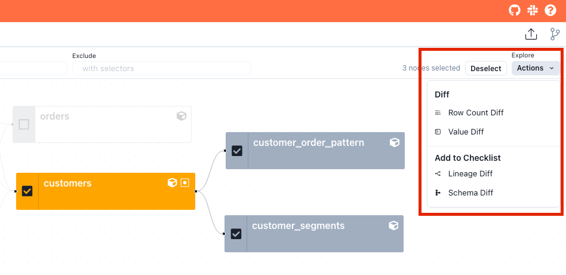
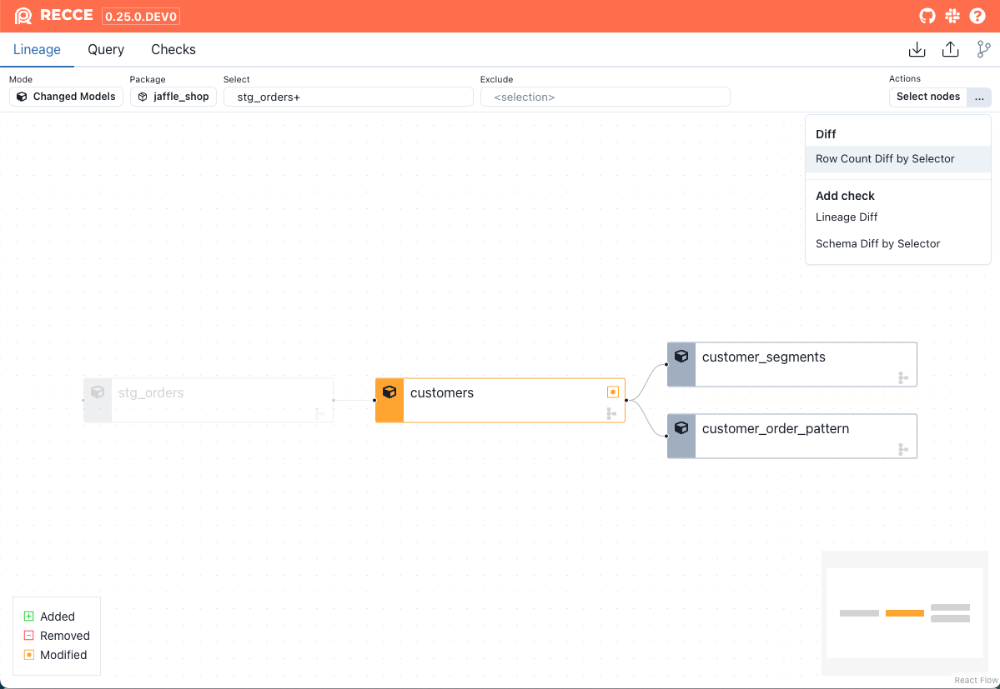

### Filter Nodes

In the top control bar, you can change the rule to filter the nodes:

1. **Mode:**
   - **Changed Models:** Modified nodes and their downstream + 1st degree of their parents.
   - **All:** Show all nodes.
1. **Package:** Filter by dbt package names.
1. **Select:** Select nodes by [node selection](./node-selection.md).
1. **Exclude:** Exclude nodes by [node selection](./node-selection.md).

### Select Nodes

Click a node to select it, or click the **Select nodes** button in the top-right corner to select multiple nodes for further operations. For detail, see the [Multi Nodes Selections](#multi-nodes-selection) section

### Row Count Diff

A row count diff can be performed on nodes selected using the `select` and `exclude` options:

{: .shadow}

After selecting nodes, run the row count diff by:

1. Clicking the 3 dots (**...**) button in the top-right corner.
2. Clicking **Row Count Diff by Selector**.

## Multi-Node Selection

Multiple nodes can be selected in the Lineage DAG. This enables actions to be performed on multiple nodes at the same time such as Row Count Diff, or Value Diff.

### Select Nodes Individually

To select multiple nodes individually, click the checkbox on the nodes you wish to select.

<figure markdown>
  {: .shadow}
  <figcaption>Select multiple nodes individually</figcaption>
</figure>

### Select Parent or Child nodes

To select a node and all of its parents or children:

1. Click the checkbox on the node.
2. Right-click the node.
3. Click to select either parent or child nodes.

<figure markdown>
  {: .shadow}
  <figcaption>Select a node and its parents or children</figcaption>
</figure>

### Perform actions on multiple nodes

After selecting the desired nodes, use the Actions menu at the top right of the screen to perform diffs or add checks.

<figure markdown>
  {: .shadow}
  <figcaption>Perform actions on multiple nodes</figcaption>
</figure>

### Example - Row Count Diff

An example of selecting multiple nodes to perform a multi-node row count diff:

<figure markdown>
  {: .shadow}
  <figcaption>Perform a Row Count Diff on multiple nodes</figcaption>
</figure>

### Example - Value Diff

An example of selecting multiple nodes to perform a multi-node Value Diff:

<figure markdown>
  {: .shadow}
  <figcaption>Perform a Value Diff on multiple nodes</figcaption>
</figure>

### Schema and Lineage Diff

From the Lineage DAG, click the Actions dropdown menu and click Lineage Diff or Schema Diff from the Add to Checklist section. This will add:

- Lineage Diff: The current Lineage view, dependent on your <a href="#select-nodes">node selection</a> options.
- Schema Diff: A diff of all nodes if none are selected, or specific <a href="#multi-node-selection">selected nodes</a>.

<figure markdown>
  {: .shadow}
  <figcaption>Add a Lineage Diff Check or Schema Check via the Actions dropdown menu</figcaption>
</figure>

Recce supports dbt [node selection](https://docs.getdbt.com/reference/node-selection/syntax) in the [lineage diff](./lineage.md#lineage-diff). This enables you to target specific resources with data checks by selecting or excluding nodes.

## Supported syntax and methods

Since Recce uses dbt's built-in node selector, it supports most of the selecting methods. Here are some examples:

- Select a node: `my_model`
- select by tag: `tag:nightly`
- Select by wildcard: `customer*`
- Select by graph operators:  `my_model+`, `+my_model`, `+my_model`, `1+my_model+`
- Select by union: `model1 model2`
- Select by intersection: `stg_invoices+,stg_accounts+`
- Select by state: `state:modified`, `state:modified+`

### Use `state` method

In dbt, you need to specify the `--state` option in the CLI. In Recce, we use the base environment as the state, allowing you to use the selector on the fly.

### Removed nodes
Another difference is that in dbt, you cannot select removed nodes. However, in Recce, you can select removed nodes and also find them using the graph operator. This is a notable distinction from dbt's node selection capabilities.

## Supported Diff

In addition to lineage diff, other types of diff also support node selection. You can find these features in the **...** button in the top right corner. Currently supported diffs include:

- Lineage diff
- Row count diff
- Schema diff

{: .shadow}

## Limitation

- ["result" method](https://docs.getdbt.com/reference/node-selection/syntax#the-result-status) not supported
- ["source_status" method](https://docs.getdbt.com/reference/node-selection/syntax#the-source_status-status) not supported.
- [YAML selectors](https://docs.getdbt.com/reference/node-selection/yaml-selectors) not supported.
