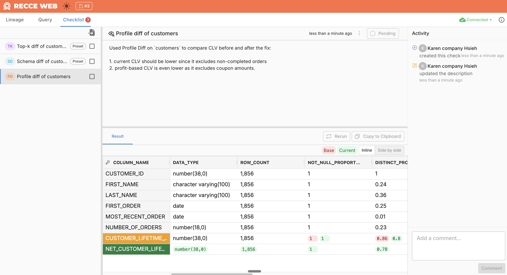

# Activity

Each check in your checklist has its own Activity panel. It records everything that happens to that specific check—approvals, comments, and updates—giving reviewers context on how the validation evolved.

## What Gets Recorded

Activity captures all events for a check:

- **Created** - When the check is added to the checklist
- **Approvals** - When the check is approved or unapproved
- **Comments** - Questions, discussions, and clarifications about the check
- **Description updates** - Changes to the check's description

{: .shadow}

## Using Activity

### Discuss a Specific Check

Use Activity to have focused conversations about a validation:

- Ask why a particular diff result is expected
- Request clarification on acceptable thresholds
- Discuss edge cases the check might miss
- Document why a check was approved despite warnings

### Track Check History

Activity shows the lifecycle of each check:

- Who approved it and when
- What questions were asked before approval
- How the description changed over time
- Whether it was re-run after updates

This history helps new reviewers understand past decisions.

## When to Use

- **Requesting context** - Ask the developer about unexpected results
- **Documenting decisions** - Explain why you approved despite a warning
- **Iterating on checks** - Track changes as the developer updates code
- **Handoff scenarios** - Give the next reviewer context on your findings

## Related

- [Checklist](checklist.md) - Save and track validation checks
- [Share](share.md) - Share your session with reviewers
