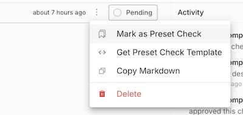
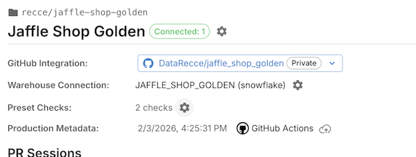
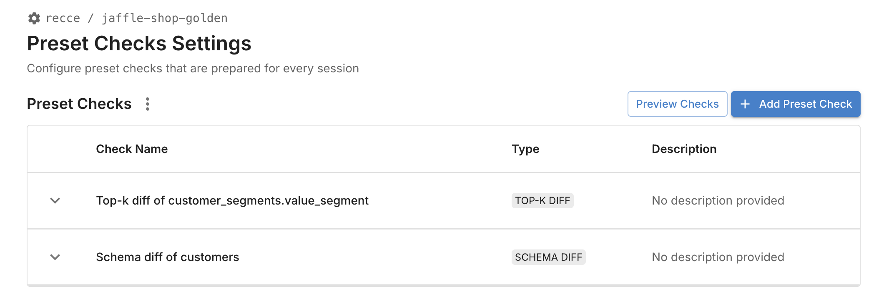
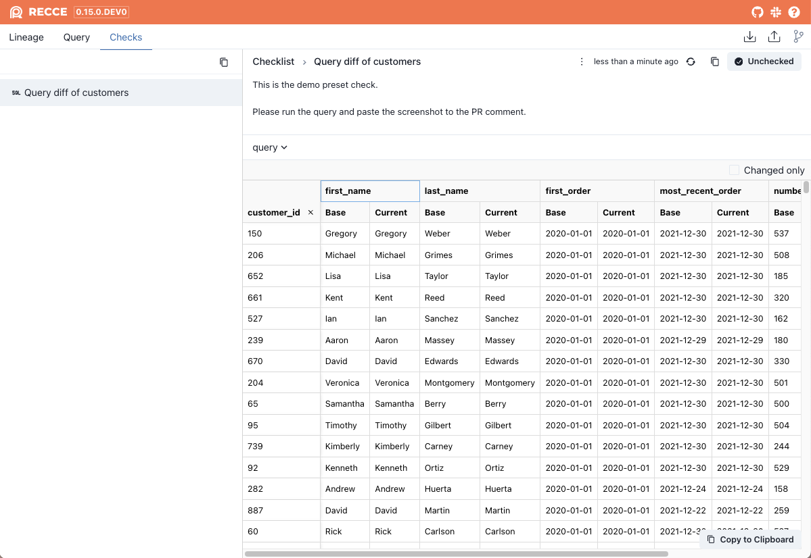
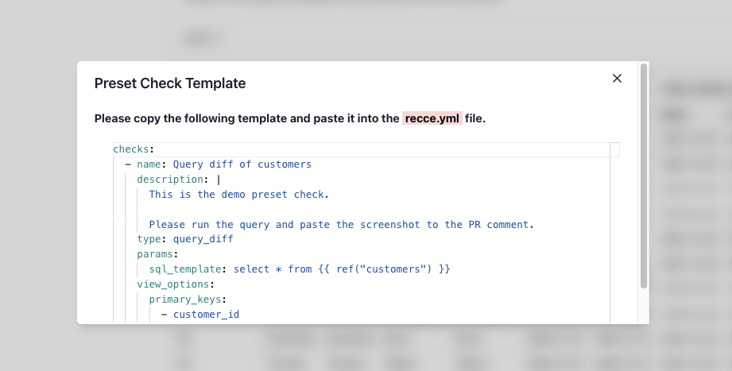
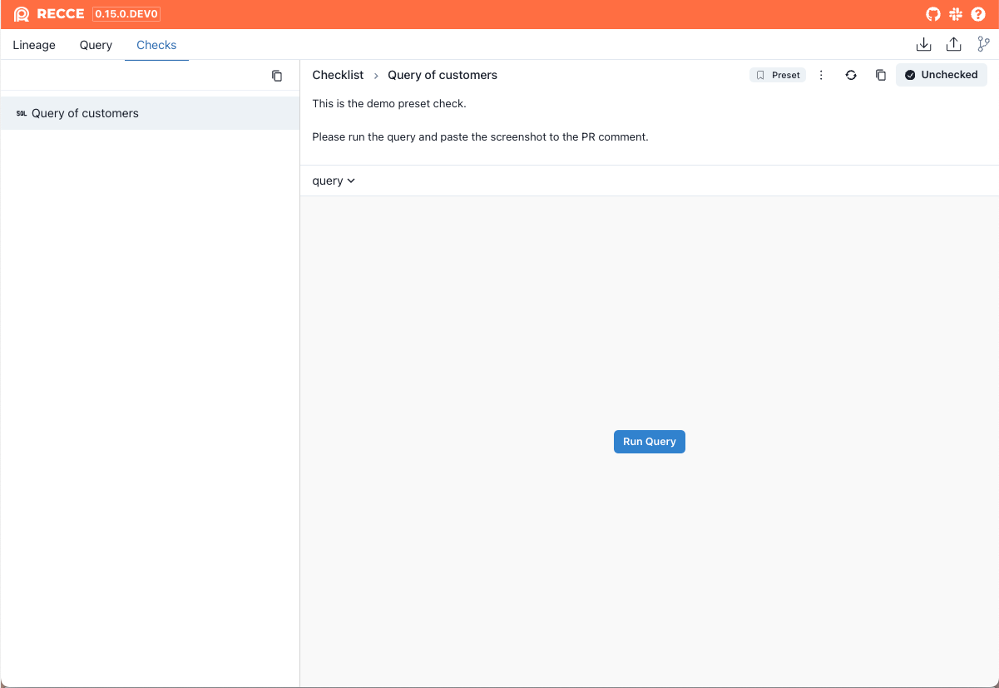

# Preset Checks

Define validation checks that run automatically for every PR. Preset checks ensure consistent validation across your team.

**Goal:** Configure recurring checks that execute automatically when Recce runs.

## Prerequisites

- [x] Recce Cloud account or Recce installed in your dbt project
- [x] At least one validation check you want to automate

## Recce Cloud

Create preset checks directly in the Recce Cloud interface. When a PR is created, preset checks run automatically.

### From the checklist

Mark any existing check as a preset check:

1. Run a diff or query in your Recce session
2. Add the result to your checklist
3. Open the check menu and select **Mark as Preset Check**

{: .shadow}

### From project settings

Create preset checks directly in your project configuration:

1. Navigate to your project's **Preset Checks** page
2. Click **Add Preset Check**
3. Configure the check type and parameters

{: .shadow}

{: .shadow}

When preset checks are configured, they run automatically each time a PR is created.

## Recce OSS

For local Recce, configure preset checks in `recce.yml` and run them manually or in CI.

### Configure in recce.yml

1. Start by adding a check to your checklist manually:

    1. Run a diff or query in Recce
    2. Add the result to your checklist

        {: .shadow}

    3. Open the check menu and select **Get Preset Check Template**
    4. Copy the YAML config from the dialog

        {: .shadow}

2. Paste the config into `recce.yml` at your project root:

    ```yaml
    # recce.yml
    checks:
      - name: Query diff of customers
        description: |
          This is the demo preset check.

          Please run the query and paste the screenshot to the PR comment.
        type: query_diff
        params:
          sql_template: select * from {{ ref("customers") }}
        view_options:
          primary_keys:
            - customer_id
    ```

### Run preset checks

#### In Recce server

When you launch Recce, preset checks appear in your checklist automatically (but not yet executed):

{: .shadow}

Click **Run Query** to execute each check.

#### With recce run

Execute all preset checks from the command line:

```bash
recce run
```

Output:
```
───────────────────────────────── DBT Artifacts ─────────────────────────────────
Base:
    Manifest: 2024-04-10 08:54:41.546402+00:00
    Catalog:  2024-04-10 08:54:42.251611+00:00
Current:
    Manifest: 2024-04-22 03:24:11.262489+00:00
    Catalog:  2024-04-10 06:15:13.813125+00:00
───────────────────────────────── Preset checks ─────────────────────────────────
                            Recce Preset Checks
──────────────────────────────────────────────────────────────────────────────
Status      Name                 Type         Execution Time   Failed Reason
──────────────────────────────────────────────────────────────────────────────
[Success]   Query of customers   Query Diff   0.10 seconds     N/A
──────────────────────────────────────────────────────────────────────────────
The state file is stored at [recce_state.json]
```

View results by launching the server with the state file:

```bash
recce server recce_state.json
```

### Verification

Confirm preset checks work:

1. Add a check config to `recce.yml`
2. Run `recce run`
3. Verify the check appears in output with `[Success]` status
4. Launch `recce server recce_state.json` and confirm the check appears in your checklist

### Troubleshooting

| Issue | Solution |
|-------|----------|
| Check not appearing | Verify `recce.yml` is in project root and YAML syntax is valid |
| Check fails to run | Check that the SQL template references valid models |
| Wrong results | Ensure base and current artifacts are up to date |

## Related

- [Checklist](checklist.md) - Manually add checks during development
- [Configuration](../technical-concepts/configuration.md) - Full recce.yml reference
