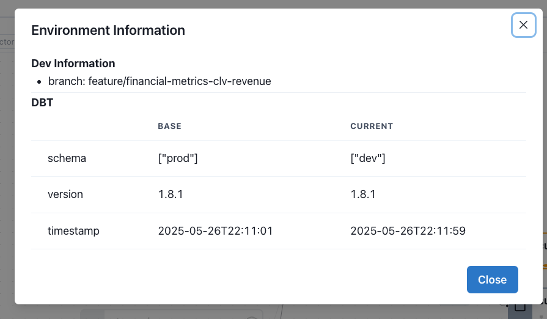

# Configure Diff

To compare changes, Recce needs a baseline. This guide explains the concept of Diff in Recce and how it fits into data validation workflows. Setup steps vary by environment, so this guide focuses on the core ideas rather than copy-paste instructions.

For a concrete example, refer to the [5-minute Jaffle Shop tutorial](./get-started-jaffle-shop/).

## Diff requires a comparison

To configure a comparison in Recce, two components are required:

### 1. Artifacts

Recce uses dbt [artifacts](https://docs.getdbt.com/reference/artifacts/dbt-artifacts) to perform diffs. These files are generated with each dbt run and typically saved in the `target/` folder.

In addition to the current artifacts, a second set is needed to serve as the baseline for comparison. Recce looks for these in the `target-base/` folder.

- `target/` – Artifacts from the current development environment
- `target-base/` – Artifacts from a baseline environment (e.g., production)

For most setups, retrieve the existing artifacts that generated from the main branch (usually from a CI run or build cache) and save them into a `target-base/` folder.

### 2. Schemas

Recce also compares the actual query results between two dbt [environments](https://docs.getdbt.com/docs/core/dbt-core-environments), each pointing to a different [schema](https://docs.getdbt.com/docs/core/connect-data-platform/connection-profiles#understanding-target-schemas). This allows validation beyond metadata by comparing the data itself.

For example:

- `prod` schema for production
- `dev` schema for development

These schemas represent where dbt builds its models.

!!! tip

    In dbt, an environment typically maps to a schema. To compare data results, separate schemas are required. Learn more in [dbt environments](https://docs.getdbt.com/docs/core/dbt-core-environments).

Schemas are typically configured in the `profiles.yml` file, which defines how dbt connects to the data platform. Both schemas must be accessible for Recce to perform environment-based comparisons.

Once both artifacts and schemas are configured, Recce can surface meaningful diffs across logic, metadata, and data.

## Verify your setup

There are two ways to check that your configuration is complete:

### 1. Debug Command (CLI)

Run `recce debug` from the command line to verify your setup before launching the server:

```bash
recce debug
```

This command checks artifacts, directories, and warehouse connection, providing detailed feedback on any missing components.

### 2. Environment Info (Web UI)

Use **Environment Info** at the top-right corner of the Recce web interface to verify your configuration.

A correctly configured setup will display two environments:

- **Base** – the reference schema used for comparison (e.g., production)
- **Current** – the schema for the environment under development (e.g., staging or dev)

This confirms that both the artifacts and schemas are properly connected for diffing.

