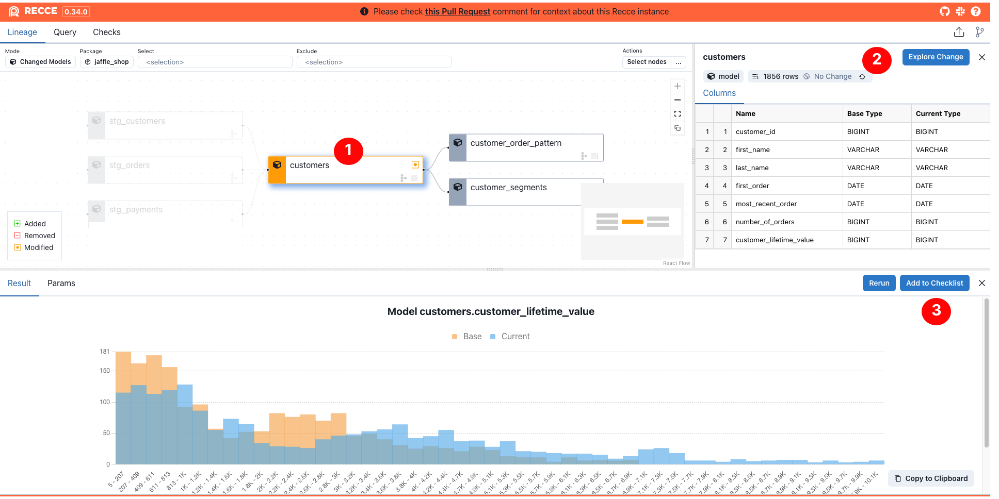

# Getting Started

## Prerequisites
Recce requires that your dbt project has two [environments](https://docs.getdbt.com/docs/environments-in-dbt) to compare. For example, one for production and another for development. 

Prepare two targets with separate [schemas](https://docs.getdbt.com/docs/core/connect-data-platform/connection-profiles#understanding-target-schemas) in your dbt profile. Your `profiles.yml` might look something like this:

```yaml
jaffle_shop:
  target: dev
  outputs:
    dev:
      type: duckdb
      path: jaffle_shop.duckdb
      schema: dev
    prod:
      type: duckdb
      path: jaffle_shop.duckdb
      schema: main
```

## Install Recce

Install Recce using `pip`:
```shell
pip install -U recce
```

## Use Recce in your dbt project

The following instructions give an overview of the process of using Recce in your dbt project. For a hands-on tutorial, please check the [Jaffle Shop Tutorial](./get-started-jaffle-shop.md).

Navigate to your dbt project.

```shell
cd your-dbt-project/
```

### Prepare dbt artifacts

Recce expects two sets of dbt [artifacts](https://docs.getdbt.com/reference/artifacts/dbt-artifacts) to be present:

- `target-base/` - dbt artifacts for to be used as the base for the comparison e.g. production
- `target/` - dbt artifacts for your development branch

#### Generate artifacts for the `base` environment

Checkout the `main` branch of your project and generate the required artifacts into `target-base`. You can skip `dbt build` if this environment already exists. 

```shell
git checkout main

dbt run --target prod
dbt docs generate --target prod --target-path target-base/
```

#### Generate artifacts for the `target` environment

```shell
git checkout feature/my-awesome-feature

dbt run
dbt docs generate
```


## Start the Recce server
Start the Recce server with the follow command:

```shell
recce server
```

Recce use dbt [artifacts](https://docs.getdbt.com/reference/artifacts/dbt-artifacts), which is generated when every invocation. You can find these files in the `target/` folder.

| artifacts     | dbt command                        |
| ------------- | ---------------------------------- |
| manifest.json | `dbt docs generate`, `dbt run`, .. |
| catalog.json  | `dbt docs generate`                |

!!! tip

    The regeneration of the `catalog.json` file is not required after every `dbt run`. it is only required to regenerate this file when models or columns are added or updated.

## First Time Guide for Recce instance
After you start the Recce server, you can see the Recce instance, the Web UI of the active Recce server. 

Here are the 3 steps to use Recce: (see the image below)

1. Click the model you want to check
1. Click “Explore Change”
1. Click “Add to Checklist”
