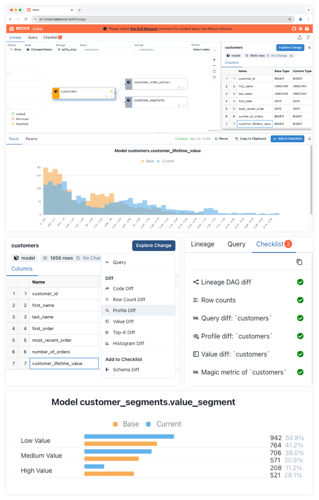

# What is **Recce**?

**Recce** is a data validation toolkit designed to enhance the pull request (PR) review process for dbt projects. **Recce** provides enhanced visibility into the data impact from dbt modeling changes by comparing the data in dev and prod environments. Using Recce for data impact assessment before merging a PR ensures that production data remains stable and accurate.

## Key Features

### Manual and Automated Data Checks

**Recce** checks help you to assess data impact and explore data change both manually and automatically. 

- **Manual checks** - Create a **Recce** <a href="https://medium.com/inthepipeline/build-a-checklist-for-better-dbt-pr-review-913906ff11dd" target="blank">Checklist</a> of data checks that help to validate your data modeling work during development, including data profile comparisons, structural comparisons, and row-level data checks.
- **Automated checks** - Integrate **Recce** Checks into your CI process and post a data impact summary automatically to your PR thread when opening a PR.

### Collaboration and Replication

Share **Recce** checks with your team for stakeholder and PR review. Checks results can be either [shared individually](features/lineage.md#screenshot), or your full **Recce** <a href="https://medium.com/inthepipeline/enhanced-dbt-pr-review-with-reproducible-data-validation-environments-e6c37a15908f" target="_blank">environment can be exported</a> and [replicated with one command](features/state-file.md#review-the-state-file).


## Why Recce

dbt has brought software engineering best practices to data projects, but “bad merges” still happen, allowing erroneous data and silent errors to make their way into prod data.

### Understand data impact

**Recce** provides data and analytics engineers with a toolkit to explore data impact caused by dbt data modeling changes. The varying levels of **Recce** checks enable holistic or fine grained impact assessment so you can drill down to find the root cause of data change.

### Improved confidence merging

The improved visibility into data impact gives PR reviewers the confidence to sign-off PRs knowing that prod data will not change unexpectedly.


<div style="position: relative; padding-bottom: 71.68758716875871%; height: 0;"><iframe src="https://www.loom.com/embed/f6ea8a9b37964cbd9821bb6896d3206f?sid=9c701279-08cd-45c5-b12d-e7967d8f898d" frameborder="0" webkitallowfullscreen mozallowfullscreen allowfullscreen style="position: absolute; top: 0; left: 0; width: 100%; height: 100%;"></iframe></div>


## How **Recce** Works

**Recce** compares dbt environments using the dbt artifacts from both **dev** and **prod** environments. 

1. Generate artifacts for the **prod** environment:

    ```
    # Build prod and generate dbt docs into ./target-base
    dbt seed --target prod
    dbt run --target prod
    dbt docs generate --target prod --target-path ./target-base
    ```

2. Switch to your **dev** branch and generate dev artifacts:

    ```
    # Switch to your dev branch
    git switch my-awesome-branch

    # build your dev environment
    dbt seed
    dbt run
    dbt docs generate
    ```

3. Start your **Recce** Instance:

    ```
    recce server
    ```

Open your the **Recce** web UI to start exploring and understanding data impact, and validating your work.

## What you get

### Interactive impact assessment environment

`recce server` launches a web UI with an [**interactive impact assessment environment**](features/lineage.md). Use the tools in **Recce** to explore the impact to your data models from your branch changes.

### Focused data impact exploration

The main interface to **Recce** is the [lineage DAG](features/lineage.md#node-summary), which shows modified nodes and potentially impacted downstream nodes. You can quickly see if critical nodes are within the impact radius and focus your data validation efforts.


<figure markdown>
  
  <figcaption>	</figcaption>
</figure>

## Getting Started

Try the [5-minute tutorial](get-started-jaffle-shop.md) that uses dbt’s Jaffle Shop project, or take the [online demo](docs/demo.md) for a test run, which includes an actual PR and related Recce Instance.


## What does **Recce** mean?

**Recce** (/ˈrɛki/), pronounced 'reh-kee', is short for 'reconnaissance'. We chose this name as it's the perfect fit for a tool you'll use to perform a 'data reconnaissance' to discover and assess the impact of data modeling changes. Add a **Data Recce** to your pull request workflow and stop pushing breaking changes to production!