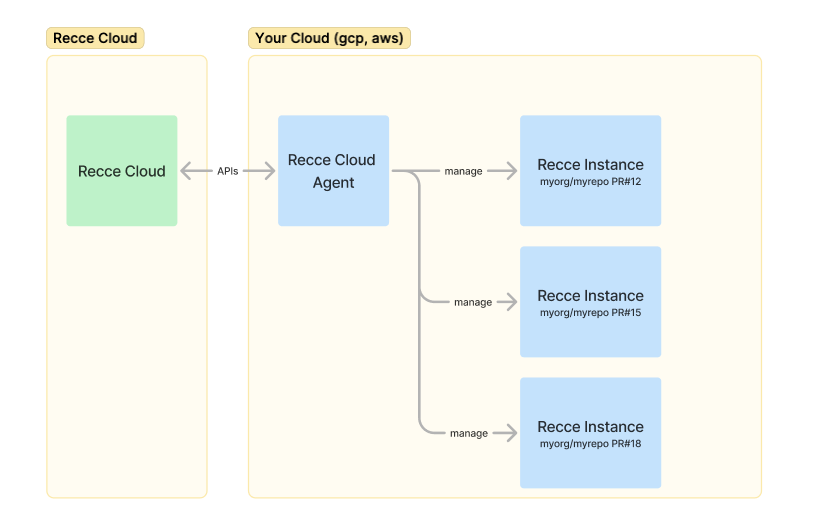
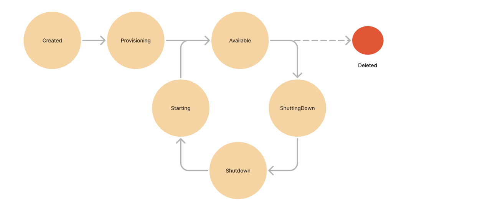

!!! Note

    The Self-Hosted Recce Instance is currently under development.

# Self-Hosted Recce Instance
In a collaborative dbt project, we often want each in-progress PR to have a corresponding recce server for review, which we call a **recce instance**. There are three solutions to create a recce instance.

- **GitHub Codespaces**: Run the recce instance in the user's GitHub Codespace. Due to design limitations of codespaces, each codespace must be opened under a specific user, so each user needs to launch their own recce instance. This method also requires every user to have a GitHub account, which might not be suitable for some teams.

- **Self-Hosted Recce Instance**: Run the recce instance on your own cloud infrastructure (AWS, GCP, Azure, or on-premise machines). Since it is self-hosted, it offers greater flexibility compared to codespaces, and because the server is hosted on your own infrastructure, it can provide better privacy and security. However, this comes at the cost of additional management overhead.

- **Recce-Managed Recce Instance**: We would host the recce instance on Recce's own cloud infrastructure, directly connecting to your warehouse. The advantage is minimal setup cost, but there are privacy and security considerations. Currently, we do not offer this method.

In this document, we will explain the design and architecture of the **Self-hosted Recce Instance** solution.

## Components

{: .shadow }

1. **Recce Cloud**: Provides an API to manage instances through a user interface.
2. **Recce Cloud Agent**: A service running on your own cloud infrastructure. It communicates with Recce Cloud and creates and manages recce instances. The agent requires configuration with the Recce Cloud API token and the necessary data warehouse credentials for the recce instances.
3. **Recce Instance**: An instance running recce that requires a publicly accessible URL.

## Recce Cloud Agent Type
- **Docker**: The Docker agent runs instances within Docker containers, making it suitable for a single VM serving multiple recce instances through different ports. However, if too many instances are run concurrently, it may lead to insufficient VM resources.

- **GCP Cloud Run**: This approach runs the Recce instances on GCP Cloud Run. Since GCP Cloud Run can scale the number of instances based on demand, it avoids the resource limitations faced by a single VM with Docker agents.

## Recce Instance Lifecycle
{: .shadow }

1. The user creates a recce instance for a PR.
1. The agent receives the request and provisions the recce instance.
1. Once the instance is ready, the URL endpoint becomes accessible.
1. The user can stop or start an instance as needed.
1. The user can delete a recce instance, and the agent will handle the deletion of the underlying container.

## Access Control
Recce Instances allow you to connect directly to the database through the interface, making access control a key consideration. Here are several options:

- **Virtual Private Network**: If your recce instance is running inside a VPC and is not accessible externally, this is the most secure and reliable approach.
- **Basic Authentication**: The Recce Instance is publicly accessible but protected via HTTP Basic Authentication. Accessing the recce instance requires providing a user/password.
- **Tunnel-based Authentication**: The Recce Instance runs within a VPC but can be exposed for external access using services such as [ngrok](https://ngrok.com/) or [Tailscale](https://tailscale.com/). These services provide access control features to secure the instance.
- **Recce Cloud Authentication**: Utilize Recce Cloud's login state to access the recce instance. The recce instance acts as an OIDC app within Recce Cloud, authenticating users through the OIDC protocol.

## FAQ
### Q: Does Recce Cloud make requests to the Agent's endpoint?
No. All actions are initiated by the agent making requests to the Recce Cloud API.

### Q: Do I need to store my credentials in Recce Cloud?
No. All credentials are configured within the agent, which uses these settings to start a recce instance. This ensures you do not encounter any credential leakage issues.

### Q: Does Recce Agent manage the entire organization or a single repository?
It manages the entire organization. However, support for single repository configurations may be available in the future.

### Q: Do I need to define what container image the Recce Instance uses? Can I customize my own container image?
We provide an official Recce container that will check out your branch and install the necessary dependencies. You can also customize your own container image to speed up startup times or provide more flexible initialization processes.

### Q: How do I run a Recce Cloud Agent? Where should my Cloud Run Agent be hosted?

The Recce Cloud Agent is a Python application. The recommended execution method varies depending on the agent type. The Docker agent runs within a Docker container, while the GCP Cloud Run agent runs within a Cloud Run container.
