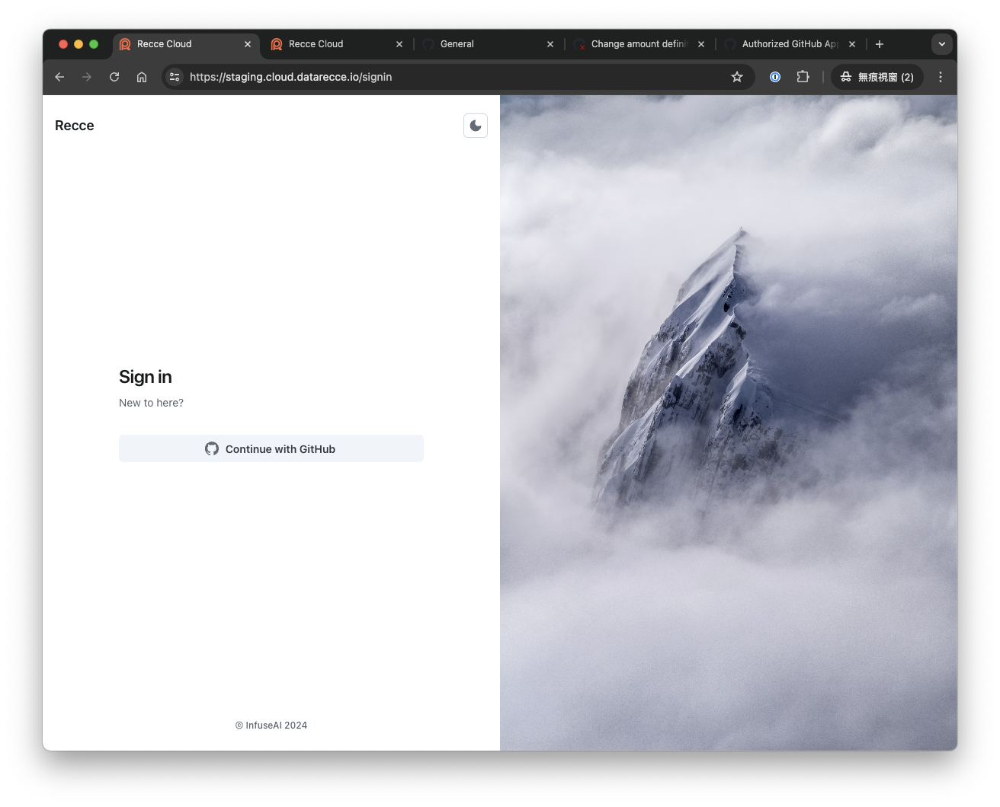

**Jaffle Shop** is an example project officially provided by dbt-labs. This document uses [jaffle_shop_duckdb](https://github.com/dbt-labs/jaffle_shop_duckdb) to enable you to start using **recce cloud** from scratch within five minutes.

## Clone Jaffle Shop to your Private Repositroy
1. [Create a private repository](https://github.com/new) in your github account.
1. Clone the **Jaffle Shop** dbt data project
   ```shell
   git clone git@github.com:dbt-labs/jaffle_shop_duckdb.git
   cd jaffle_shop_duckdb
   ```
1. Change the remote url. Change the remote url to your repository.
   ```
   git remote set-url origin git@github.com:<owner>/<repo>.git
   ```
1. Push to your new created repository.   
   ```
   git push
   ```
## Authorize the repository to the Recce Cloud.
1. Go to the [recce cloud](https://cloud.datarecce.io/). If it is your first time to login, please click the **Continue with Github** and authorize your github account to the **Recce Cloud** GitHub App.
    
    
1. Click the **Install** button to install **Recce Cloud** github app to your personal or organization account.
    
1. In the app installation page in GitHub, authorize the new created repository to the app.    
    
1. Then it will show up all the authorized repositories.
        

## Prepare the base environment
1. Prepare virtual env
   ```shell
   python -m venv venv
   source venv/bin/activate
   ```
1. Installation
   ```shell
   pip install -r requirements.txt
   pip install recce
   ```
1. Provide additional environment to compare. Edit `./profiles.yml` to add one more target.
   ```diff
   jaffle_shop:
     target: dev
     outputs:
       dev:
         type: duckdb
         path: 'jaffle_shop.duckdb'
         threads: 24
   +   prod:
   +     type: duckdb
   +     path: 'jaffle_shop.duckdb'
   +     schema: prod
   +     threads: 24
   ```
1. Add dbt packages for recce. Add `./packages.yml`
   ```
   packages:
   - package: dbt-labs/audit_helper
     version: 0.12.0
   - package: data-mie/dbt_profiler
     version: 0.8.2     
   ```
   and run
   ```
   dbt deps
   ```
1. Prepare production environment
   ```shell
   dbt seed --target prod
   dbt run --target prod
   dbt docs generate --target prod --target-path ./target-base
   ```
1. Add `target-base/` folder to `.gitignore`
   ```diff
    target/
   +target-base/
    dbt_packages/
    dbt_modules/
    logs/
   ```
1. Remove the existing github action workflow.
   ```
   rm -rf .github/
   ```
1. Push to remote
   ```
   git add .
   git commit -m 'Add recce changes'
   git push
   ```   

## Prepare the review state for the PR
As a PR author, you can prepare the recce review state and persist it in the recce cloud.

1. Checkout a branch
   ```
   git checkout -b feature/recce-getting-started
   ```

1. Prepare development environment. First, edit an existing model `./models/staging/stg_payments.sql`.
   ```diff
   ...

   renamed as (
            payment_method,

   -        -- `amount` is currently stored in cents, so we convert it to dollars
   -        amount / 100 as amount
   +        amount

            from source
   )
   ```
   run on development environment.
   ```shell
   dbt seed
   dbt run
   dbt docs generate
   ```

1. Commit the change
   ```
   git add models/staging/stg_payments.sql  
   git commit -m 'Update the model'
   git push
   ```

1. Create a pull request for this branch in your github repository.
1. Prepare a [github token](https://github.com/settings/tokens) in your account. You have to provide the `repo` permission.
   
      
1. Ensure you have configured these environment variables.
   ```shell
   export GITHUB_TOKEN=<github-token>
   export RECCE_STATE_PASSWORD=mypassword
   ```
1. Run recce server in the cloud mode
   ```
   recce server --cloud
   ```
   Open the link http://0.0.0.0:8000, you can see the lineage diff
   
1. Switch to the **Query** tab, run this query
   ```sql
   select * from {{ ref("orders") }} order by 1
   ```
   Click the `Run Diff` button
1. Click the `+` button to add the query result to checklist

1. Terminate the server. It would store the state to the recce cloud.

## Review the PR
As a PR author, you can review the PR by using the state stored in the recce cloud.

1. Checkout the PR branch
   ```
   git checkout feature/recce-getting-started
   ```
1. Ensure you have configured these environment variables.
   ```shell
   export GITHUB_TOKEN=<github-token>
   export RECCE_STATE_PASSWORD=mypassword
   ```
1. Run the recce server
   ```   
   recce server --cloud --review
   ```
1. You can see the lineage diff and the checklist prepared by the PR author.


!!! Note

    In this tutorial, we use duckdb as the warehouse, which is a file-based warehouse. The reviewer needs to have the same duckdb file to run the query.