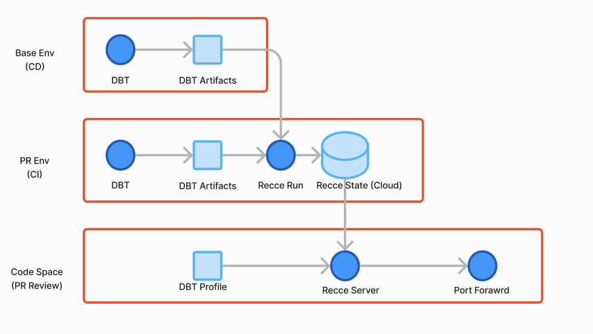
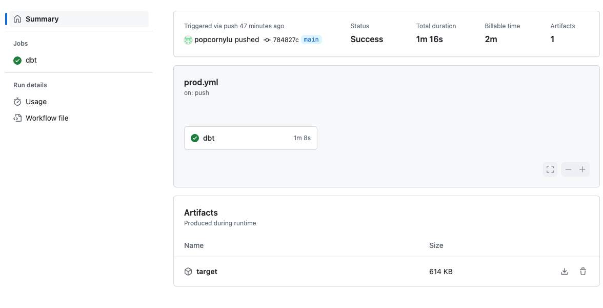

!!! Note

    Recce Cloud is currently in **private alpha** and scheduled for general availability later this year.  [Sign up](../../index.md#signup) to the Recce newsletter to be notified, or email [product@datarecce.io](mailto:product@datarecce.io) to join our design partnership program for early access.

[Continuous Integration(CI)](https://en.wikipedia.org/wiki/Continuous_integration) and [Continuous Delivery(CD)](https://en.wikipedia.org/wiki/Continuous_delivery) are best practices in software development. Through CI automation, a dbt project can systematically and continuously deliver and integrate high-quality results.

To automate the process, we can use [GitHub Actions](https://github.com/features/actions) and [GitHub Codespaces](https://github.com/features/codespaces) to provide an automated and reusable workspace. The following diagram describes the entire ci/cd architecture.

{: .shadow}

We suggest setting up two GitHub Actions workflows in your GitHub repository. One for the base environment and another for the PR environment.

- **Base environment workflow**: Triggered on every merge to the `main branch`. This ensures that base artifacts are readily available for use when a PR is opened.

- **PR environment workflow**: Triggered on every push to the `pull-request branch`. This workflow will compare base models with the current PR environment.

## Prerequisites

1.  **Per-PR Enviornment**: To ensure that each PR has its own isolated environment, it is recommended to put `profile.yml` under source control in the repository and use environment variables to change the schema name. In the workflow, we can generate the corresponding schema name based on the PR number.

    ```yaml
    myprofile:
      outputs:
        pr:
          type: snowflake
          ...
          schema: "{{ env_var('DBT_SCHEMA') | as_text }}"
        prod:
          type: snowflake
          ...
          schema: PUBLIC        
    ```

2. **GitHub Token** and **Recce State Password**: As mentioned [here](index.md#prerequisite), please ensure that the two secrets are available when running recce commands. You can add `GH_TOKEN` and `RECCE_STATE_PASSWORD` to the [GitHub Actions Secrets](https://docs.github.com/en/actions/security-guides/using-secrets-in-github-actions). Then we can use them in the Github Actions workflow file.
   ```yaml
   env:
     GITHUB_TOKEN: ${{ secrets.GH_TOKEN }}
     RECCE_STATE_PASSWORD: ${{ secrets.RECCE_STATE_PASSWORD }}
   ```

!!!warning

    You cannot use the [automatic generated token](https://docs.github.com/en/actions/security-guides/automatic-token-authentication) here, because we need the personal access token (PAT) to verify if the user has PUSH permission of the repository.

    ```yaml    
    env:
      GITHUB_TOKEN: ${{ secrets.GITHUB_TOKEN }} # Don't use 'secrets.GITHUB_TOKEN' here
    ```

## Set up Recce with GitHub Actions


### Base Workflow (Main Branch)

This workflow will perform the following actions:

1. Run dbt on the base environment.
2. Upload the generated DBT artifacts to [github workflow artifacts](https://docs.github.com/en/actions/using-workflows/storing-workflow-data-as-artifacts) for later use.

!!! note

    Please place the above file in `.github/workflows/dbt_base.yml`. This workflow path will also be used in the next PR workflow. If you place it in a different location, please remember to make the corresponding changes in the next step.

```yaml
name: Daily Job

on:
  workflow_dispatch:
  schedule:
    - cron: '0 0 * * *'  
  push:
    branches:
      - main      

concurrency:
  group: recce-ci-base
  cancel-in-progress: true
env:
  # Credentials used by dbt profiles.yml
  DBT_USER: ${{ secrets.DBT_USER }}
  DBT_PASSWORD: ${{ secrets.DBT_PASSWORD }}
jobs:
  build:
    runs-on: ubuntu-latest

    steps:
      - uses: actions/checkout@v4

      - name: Set up Python
        uses: actions/setup-python@v5
        with:
          python-version: "3.10.x"
          cache: 'pip'

      - name: Install dependencies
        run: |
          pip install -r requirements.txt

      - name: Run DBT
        run: |
          dbt deps
          dbt seed --target ${{ env.DBT_BASE_TARGET }}
          dbt run --target ${{ env.DBT_BASE_TARGET }}
          dbt docs generate --target ${{ env.DBT_BASE_TARGET }}
        env:
          DBT_BASE_TARGET: "prod"

      - name: Upload DBT Artifacts
        uses: actions/upload-artifact@v4
        with:
          name: target
          path: target/
```

If executed successfully, the dbt target will be placed in the run artifacts and will be named **target**.
{: .shadow}


### PR Workflow (Pull Request Branch)

This workflow will perform the following actions:

1. Run dbt on the PR environment.
2. Download previously generated base artifacts from base workflow.
3. Use Recce to compare the PR environment with the downloaded base artifacts.
4. Use Recce to generate the summary of the current changes and post it as a comment on the pull request. Please refer to the [Recce Summary](../features/recce-summary.md) for more information.

````yaml
name: Recce CI PR Branch

on:
  pull_request:
    branches: [main]

env:
  WORKFLOW_BASE: ".github/workflows/dbt_base.yml"
  # Credentials used by dbt profiles.yml
  DBT_USER: ${{ secrets.DBT_USER }}
  DBT_PASSWORD: ${{ secrets.DBT_PASSWORD }}
  DBT_SCHEMA: "PR_${{ github.event.pull_request.number }}"
  # Credentials used by recce
  GITHUB_TOKEN: ${{ secrets.GH_TOKEN }}
  RECCE_STATE_PASSWORD: ${{ secrets.RECCE_STATE_PASSWORD }}
jobs:
  check-pull-request:
    name: Check pull request by Recce CI
    runs-on: ubuntu-latest
    steps:
      - name: Checkout repository
        uses: actions/checkout@v4
        with:
          fetch-depth: 0
      - name: Set up Python
        uses: actions/setup-python@v5
        with:
          python-version: "3.10.x"
          cache: pip
      - name: Install dependencies
        run: |
          pip install -r requirements.txt
          pip install recce
      - name: Download artifacts for the base environment
        run: |
          gh repo set-default ${{ github.repository }}
          base_branch=${{ github.base_ref }}
          run_id=$(gh run list --workflow ${WORKFLOW_BASE} --branch ${base_branch} --status success --limit 1 --json databaseId --jq '.[0].databaseId')
          echo "Download artifacts from run $run_id"
          gh run download ${run_id} -n target -D target-base
      - name: Prepare the PR environment
        run: |
          dbt deps
          dbt seed --target ${{ env.DBT_CURRENT_TARGET}}
          dbt run --target ${{ env.DBT_CURRENT_TARGET}}
          dbt docs generate --target ${{ env.DBT_CURRENT_TARGET}}
        env:
          DBT_CURRENT_TARGET: "pr"
      - name: Run Recce
        run: |
          recce run --cloud
      - name: Upload DBT Artifacts
        uses: actions/upload-artifact@v4
        with:
          name: target
          path: target/

      - name: Prepare Recce Summary
        id: recce-summary
        run: |
          recce summary --cloud > recce_summary.md
          cat recce_summary.md >> $GITHUB_STEP_SUMMARY
          echo '${{ env.NEXT_STEP_MESSAGE }}' >> recce_summary.md

          # Handle the case when the recce summary is too long to be displayed in the GitHub PR comment
          if [[ `wc -c recce_summary.md | awk '{print $1}'` -ge '65535' ]]; then
            echo '# Recce Summary
          The recce summary is too long to be displayed in the GitHub PR comment.
          Please check the summary detail in the [Job Summary](${{github.server_url}}/${{github.repository}}/actions/runs/${{github.run_id}}) page.
          ${{ env.NEXT_STEP_MESSAGE }}' > recce_summary.md
          fi
          

        env:
          RECCE_STATE_PASSWORD: ${{ secrets.RECCE_STATE_PASSWORD }}
          NEXT_STEP_MESSAGE: |
            ## Next Steps          
            If you want to check more detail information about the recce result, please follow this instruction.

            ```bash
            # Checkout to the PR branch
            git checkout ${{ github.event.pull_request.head.ref }}

            # Launch the recce server based on the state file
            recce server --cloud --review

            # Open the recce server http://localhost:8000 by your browser
            ```
      - name: Comment on pull request
        uses: thollander/actions-comment-pull-request@v2
        with:
          filePath: recce_summary.md
          comment_tag: recce
````

## Review the Recce State File

**Review locally**

```bash
git checkout <pr-branch>
recce server --cloud --review
```

**Review in the GitHub codespace**

Please see [GitHub Codespaces](./setup-gh-codespaces.md) integration