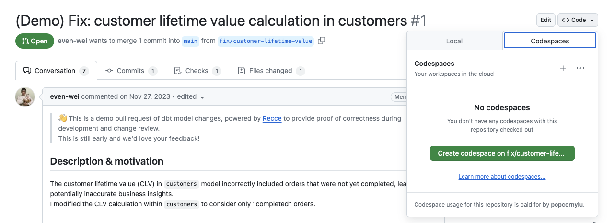

GitHub Codespaces is a development environment provided by GitHub that allows developers to have identical and isolated environments for development. The GitHub Codespaces uses VS Code Server technology. We can launch it from a GitHub pull request page, and once it is started, the Recce server will run and port forwarding will be set up.

{: .shadow}
## Setup Recce Cloud in GitHub Codespaces


1. Prepare the two files in your repository
    ```
    .devcontainer
    ├── Dockerfile
    └── devcontainer.json
    ```
1. Configure the `.devcontainer/devcontainer.json`
    ```json
    {
        "name": "Recce CodeSpace",
        "build": {
            "dockerfile": "Dockerfile",
        },
        "containerEnv": {
            "ENV_1": "env_1",
            "ENV_2": "env_2",            
        },
        "postStartCommand": "recce server --cloud --review"
    }
    ```
1. Prepare the `.devcontainer/Dockerfile`
    ```
    FROM mcr.microsoft.com/vscode/devcontainers/python:3.11

    RUN pip install dbt-bigquery~=1.7.0 recce
    ```
1. **Prepare the credential for dbt.** We recommend using the source-controlled `profiles.yml` in conjunction with environment variables to provide the credentials for connecting to the warehouse. There are two ways to provide environment variables

    - Define environment variable in the `devcontainer.json`
    - Provide environment by the [Codespace secrets](https://docs.github.com/en/codespaces/managing-your-codespaces/managing-your-account-specific-secrets-for-github-codespaces).

    ```
    myprofile:
        target: dev
        outputs:
            dev:
                type: bigquery                
                ...
                password: "{{ env_var('DBT_PASSWORD') }}" 
                dataset: "{{ env_var('DBT_SCHEMA') }}"
                ...
                threads: 32
        ```


## Verify the Codespaces Setup

Here, we [use GutHub Codespaces for pull requests](https://docs.github.com/en/codespaces/developing-in-a-codespace/using-github-codespaces-for-pull-requests)

1. Go a PR page. Please make sure that there is recce state for this PR
   ```
   gh pr checkout <pr number>
   gh pr view -w  
   ```
1. Click the **Code** button and create codespace on the PR branch
   {: .shadow}
1. Starting a Codespace instance usually takes one to several minutes.
1. When the recce server is started, there is a Open Browser notification appears. Click the button to open recce web UI in a new tab
1. Or you can go to the **PORTS** tab to open the page.
