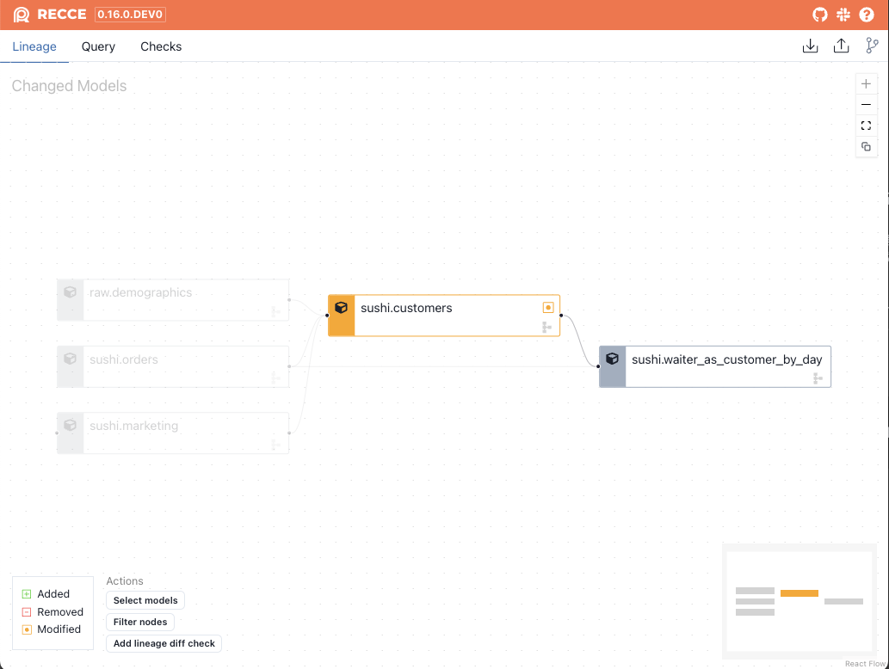
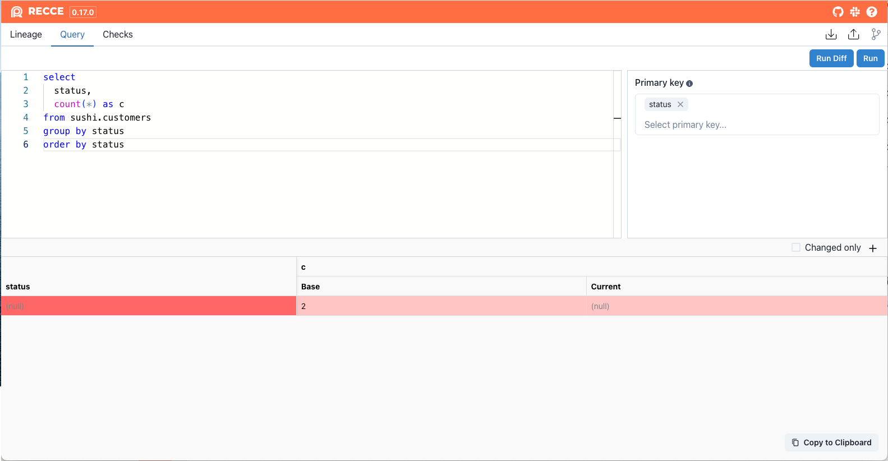

!!! Note

    The integration of SQLMesh is still in the experimental stage, and some features are not yet fully supported.

[SQLMesh](https://sqlmesh.com/) is an alternative to dbt. Unlike dbt, it records the state of each environment within the data warehouse. This feature simplifies the use of Recce.


## Usage


```shell
pip install -U recce
```

Start the `Recce` server with the follow command:

```shell
recce server --sqlmesh --sqlmesh-envs prod:dev
```

Start with specific config name
```shell
recce server --sqlmesh --sqlmesh-envs prod:dev --sqlmesh-config local_config
```


## Tutorial: The Sushi Example Project

Here, the official [example project](https://github.com/TobikoData/sqlmesh/tree/main/examples/sushi) from SQLMesh was used to demonstrate how to use recce.

1. Clone the SQLMesh repo
    ```shell
    git clone git@github.com:TobikoData/sqlmesh.git
    cd sqlmesh/examples/sushi   
    ```

1. Prepare the python venv and install the SQLMesh.

    ```shell
    python -m venv venv
    source ./venv/bin/activate
    pip install sqlmesh
    ```

1. Plan the **prod** environment

    ```
    sqlmesh --config local_config plan
    ```

1. Modify the model `models/customers.sql` model

    ```diff
      
      ...
      SELECT DISTINCT
        o.customer_id::INT AS customer_id, -- customer_id uniquely identifies customers
        m.status,
        d.zip
      FROM sushi.orders AS o
      LEFT JOIN current_marketing AS m
        ON o.customer_id = m.customer_id
      LEFT JOIN raw.demographics AS d
        ON o.customer_id = d.customer_id
    + WHERE status is not NULL
    ```
   and apply this change to the **dev** environment
    ```shell
    $ sqlmesh --config local_config plan dev    
    New environment `dev` will be created from `prod`
    Summary of differences against `dev`:
    Models:
    ├── Directly Modified:
    │   └── sushi__dev.customers
    └── Indirectly Modified:
        └── sushi__dev.waiter_as_customer_by_day
    ---

    +++

    @@ -31,3 +31,5 @@

    ON o.customer_id = m.customer_id
    LEFT JOIN raw.demographics AS d
    ON o.customer_id = d.customer_id
    +WHERE
    +  NOT status IS NULL
    Directly Modified: sushi__dev.customers (Breaking)
    └── Indirectly Modified Children:
        └── sushi__dev.waiter_as_customer_by_day (Indirect Breaking)
    Apply - Virtual Update [y/n]:
    ```

1. Use `sqlmesh table-diff` to check the change.
    ```shell
    $ sqlmesh --config local_config table_diff prod:dev sushi.customers    
    Schema Diff Between 'PROD' and 'DEV' environments for model 'sushi.customers':
    └── Schemas match


    Row Counts:
    ├──  COMMON: 55 rows
    ├──  PROD ONLY: 18 rows
    └──  DEV ONLY: 0 rows

    COMMON ROWS column comparison stats:
            pct_match
    status      100.0
    zip         100.0
    ```    


1. Install Recce
    ```shell
    pip install recce    
    ```
1. Launch the recce server
    ```shell
    recce server --sqlmesh --sqlmesh-envs prod:dev --sqlmesh-config local_config   
    ```

    You can see the lineage DAG diff 

    {: .shadow}

1. In the **Query** page, you can diff with [ad-hoc query](./features/query.md). Enter the following SQL script and click the **Run Diff** button.
  
    ```sql
    select 
      status,
      count(*) as c
    from sushi.customers
    group by status
    order by status
    ```
    
    Click the **KEY** icon in the query result to show the result grouped by `status` column.    
    {: .shadow}


## Supported Recce Features

- **Web UI**: For SQLMesh integration, Recce currently supports [lineage diff](features/lineage.md#lineage-diff), [schema diff](features/lineage.md#schema-diff), [row count diff](features/lineage.md#row-count-diff), and [query diff](features/query.md)

- **Command line interface**: Not supported yet


