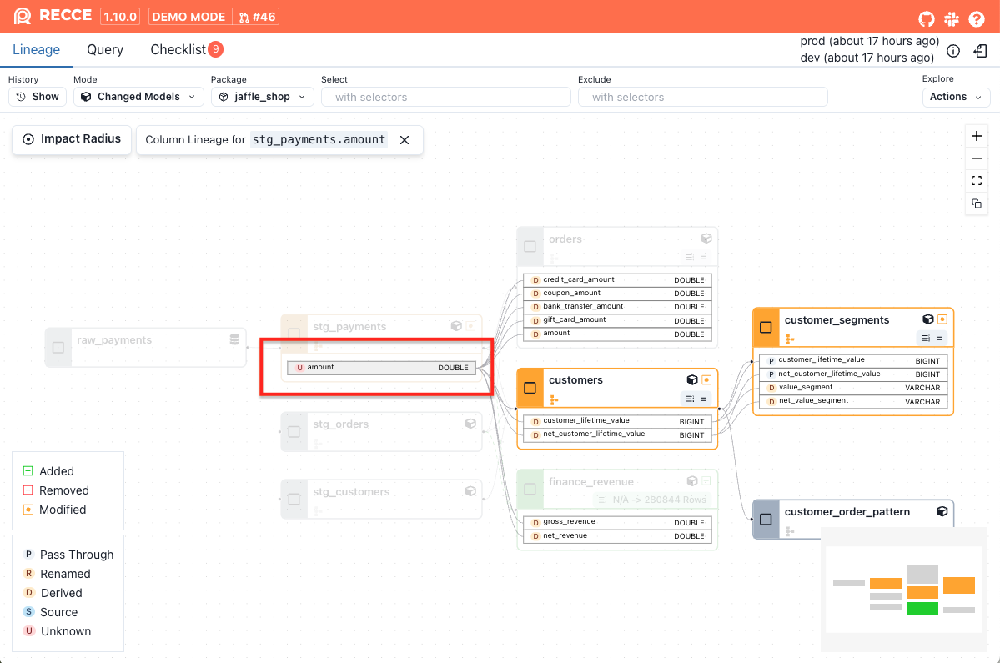
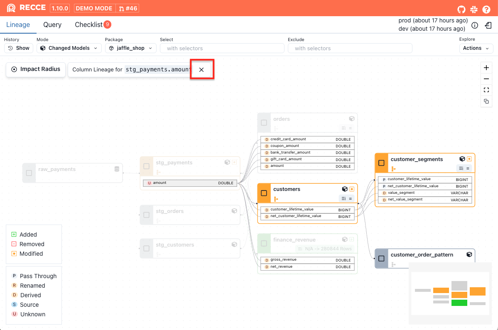

Column-Level Lineage provides visibility into the upstream and downstream relationships of a column. 

Common use-cases for column-level lineage are

1. **Source Exploration**: During development, column-level lineage helps you understand how a column is derived.
2. **Impact Analysis**: When modifying the logic of a column, column-level lineage enables you to assess the potential impact across the entire DAG.
3. **Root Cause Analysis**: Column-level lineage helps identify the possible source of errors by tracing data lineage at the column level.

## Usage

1. Select a node in the lineage DAG, then click the the column you want to view.

    {: .shadow}

1. The column-level lineage for the selected column will be displayed.

    {: .shadow}

1. To exit column-level lineage view, click the close button in the upper-left corner.
    
    {: .shadow}

## Transformation Types

The transformation type is also displayed for each column, which will help you understand how the column was generated or modified.

| Type | Description  |
|------|--------------|
| Pass-through  |The column is directly selected from the upstream table. |
| Renamed | The column is selected from the upstream table but with a different name. |
| Derived | The column is created through transformations applied to upstream columns, such as calculations, conditions, functions, or aggregations. |
| Source | The column is not derived from any upstream data. It may originate from a seed/source node, literal value, or data generation function. |
| Unknown | We have no information about the transformation type. This could be due to a parse error, or other unknown reason. | 


## Impact Radius of a Column

The **right side of the Column-Level Lineage (CLL)** graph represents the **impact radius** of a selected column.
This view helps you quickly understand what will be affected if that column changes.

### What does the impact radius include?

- **Downstream columns** that directly reference the selected column
- **Downstream models** that directly depend on the selected column
- **All indirect downstream columns and models** that transitively depend on it

This helps you evaluate both the direct and downstream effects of a column change, making it easier to understand its overall impact.


### Example: Simplified Model Chain
{: .shadow}

The following dbt models represent a simplified version of the CLL graph above:
```sql
-- stg_orders.sql
select
  order_id,
  customer_id,
  status,
  ...
from {{ ref("raw_orders") }}


-- orders.sql
select
  order_id,
  customer_id,
  status,
  ...
from {{ ref("stg_orders") }}


-- customers.sql
select
  c.customer_id,
  ...
from {{ ref("stg_customers") }} as c
join {{ ref("stg_orders") }} as o
  on c.customer_id = o.customer_id
where o.status = 'completed'
group by c.customer_id


-- customer_segments.sql
select
  customer_id,
  ...
from {{ ref("customers") }}
```

